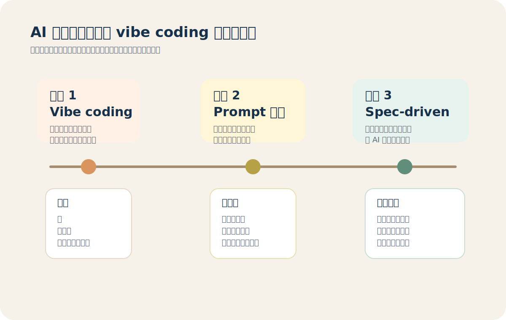
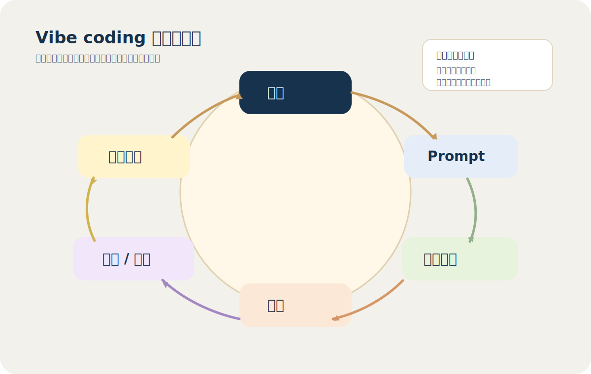
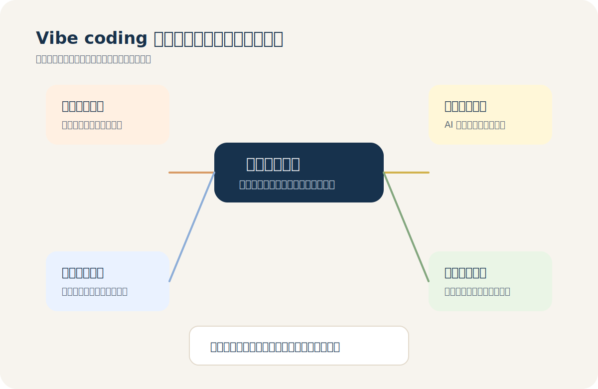
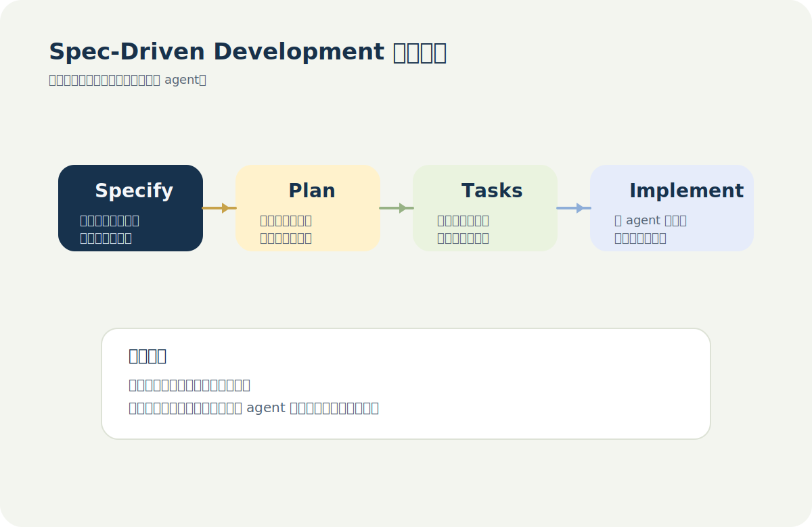
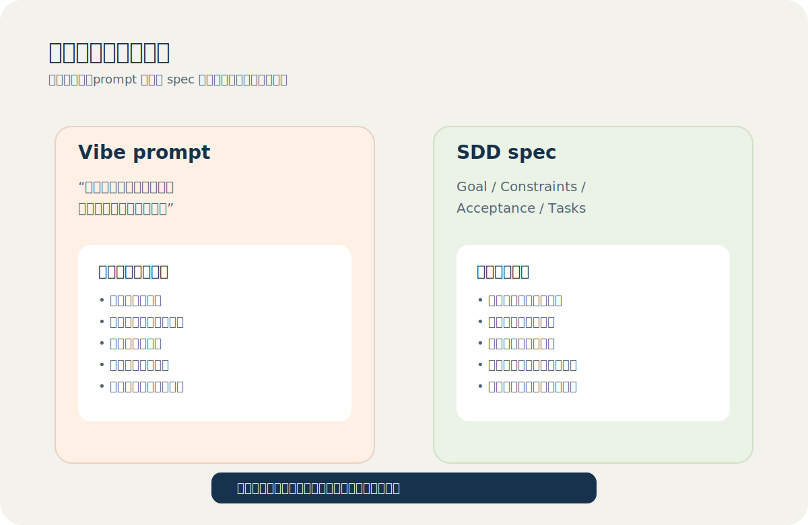
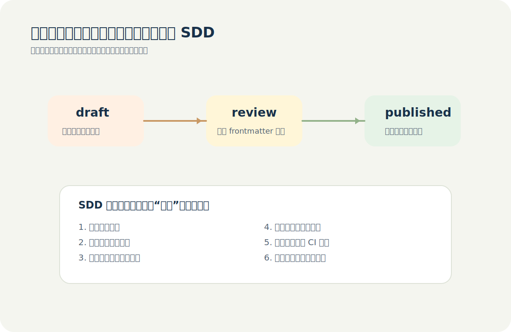
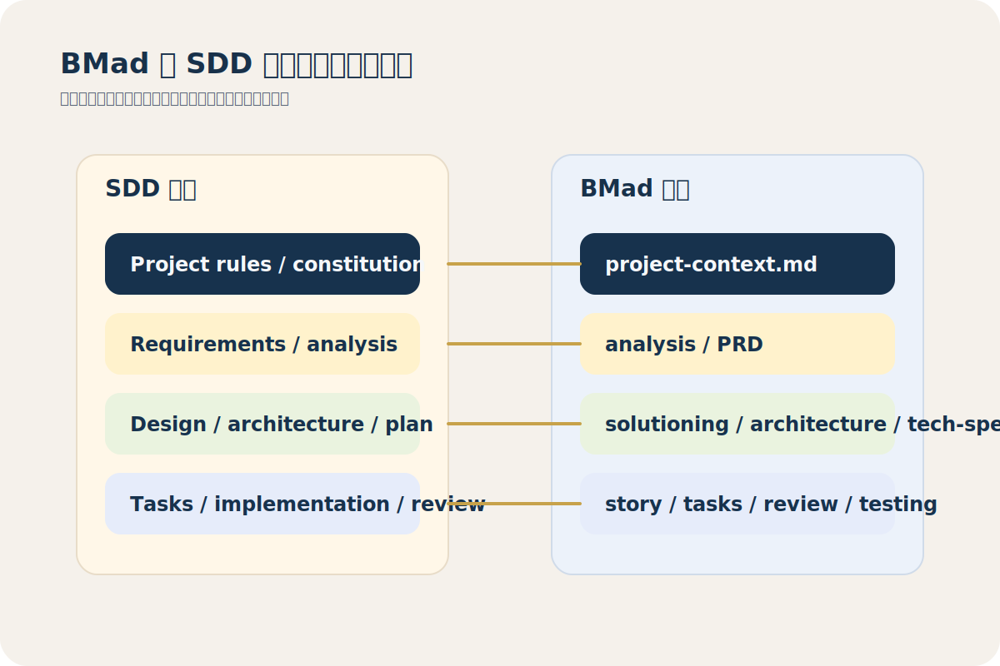
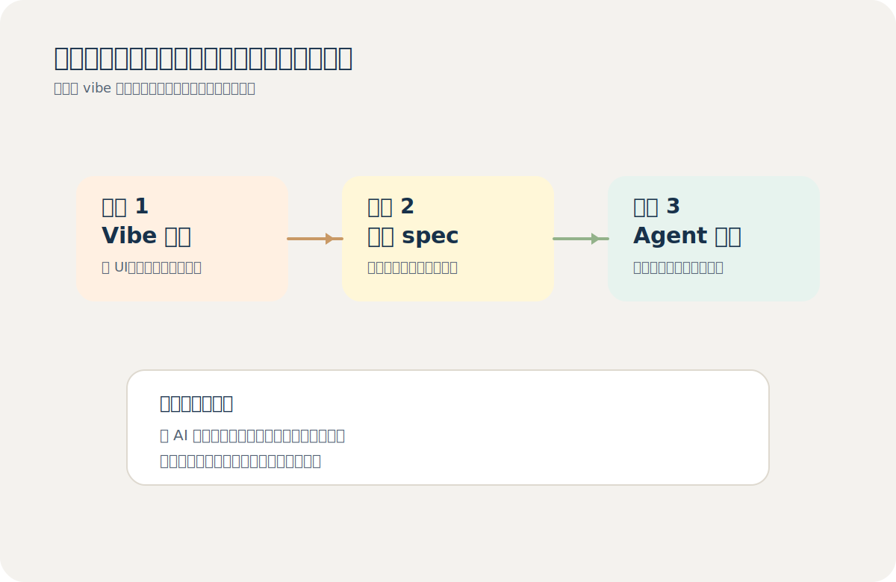

# 从 Vibe Coding 到 Spec-Driven Development：AI 编程为什么从感觉对走向规格先行

如果你在 `2025年` 之后持续使用过 AI 写代码，你大概率已经经历过一次很明显的
心理变化。

最开始，最让人兴奋的是 `vibe coding`。你只要把想法说出来，模型就能生成一段
看起来像样的实现。你不需要先画图，不需要先写设计，不需要先拆任务。你只要不
断描述目标，AI 就会不断把“感觉差不多对了”的东西推到你面前。这种体验第一次
让很多人真切感受到，软件开发正在从“手工实现”转向“意图驱动”。

但只要项目开始变长、变复杂、变多人协作，这套方法就会迅速撞墙。你会发现，
真正稀缺的已经不是“写几行代码”的速度，而是“把目标、边界、约束和验收条件
写清楚”的能力。也正是在这里，`Spec-Driven Development`，下文简称 `SDD`，
开始接管 AI 编程的主舞台。

这篇文章不打算把 `vibe coding` 写成反面教材，也不打算把 `SDD` 写成银弹。
更准确的看法是：`vibe coding` 是 AI 编程进入大众阶段后的第一种自然工作方
式，而 `SDD` 是 AI 编程进入工程阶段之后必须补上的那套秩序。



## 一、什么是 vibe coding，它为什么会在 2025 年突然爆红

`vibe coding` 这个说法通常追溯到 `2025年2月2日` Andrej Karpathy 的那条
帖子。它的核心意思很简单：开发者主要通过自然语言告诉模型要做什么，然后看着
模型生成、修补、运行，再继续用新的 prompt 往前推。这个过程中，开发者不再以
逐行阅读和逐行理解代码为中心，而更像是在调度一个会写代码的执行者。

这个概念之所以火，不只是因为它新鲜，而是因为它准确说中了当时的真实体验。
大多数人第一次用 coding agent 时，最深的感受都不是“它很严谨”，而是“它真的
能很快把一个想法变成能运行的东西”。这对原型开发、页面搭建、脚本拼装、小工
具实验和周末项目来说，几乎是压倒性的优势。

从工程史的角度看，`vibe coding` 的价值在于它把软件开发的入口从代码语法往上
提了一层。以前你必须先会一种语言，才能开始构建；现在你可以先会描述问题，再
逐步逼近实现。这种门槛下降是真实的，它不应该被嘲笑，也不应该被轻易抹掉。



## 二、为什么 vibe coding 会很快撞墙

问题不在于 `vibe coding` 不能产出代码，而在于它很难稳定地产出“可维护、可审
查、可协作、可验证”的代码。Simon Willison 在 `2025年3月19日` 的文章里专门
强调过，不是所有 AI 辅助编程都该被叫作 `vibe coding`。更严格地说，只有当你
开始接受自己并不真正理解生成结果，只要它眼下能跑就继续往前推进时，你才进入
了 `vibe coding` 的语境。

一旦进入真实项目，这种工作方式会连续遇到几个问题。第一，需求边界隐含在对话
里，不在系统里。换一次会话、换一个 agent、换一个模型，很多前提就蒸发了。第
二，架构约束没有显式化。AI 会自动补全缺失前提，而补全得越快，偏航也可能越
快。第三，验收标准往往在结果出来之后才被补写，导致你不是在“执行方案”，而
是在“追着 bug 倒推方案”。第四，安全性、性能、回归影响和多人协作边界通常不
会在第一轮 prompt 里自然出现。

这种判断并不只是经验之谈。`2026年` 一篇关于 `vibe coding` 的研究把它概括为
“主要依靠自然语言描述目标、迭代 prompt、仅做最少代码审查”的实践模式；另
一篇安全基准论文在 `200` 个真实工程任务上评估 agent 时发现，一些系统即使能
达到可观的功能正确率，也很难同时保证安全实现比例。换句话说，AI 已经足够擅
长“写出东西”，但还没有天然擅长“把东西写进工程边界里”。



## 三、Spec-Driven Development 到底改变了什么

`SDD` 最重要的变化，不是让你多写几份文档，而是把“规格”重新定义成 AI 编程
的起点。GitHub 在 `2025年9月2日` 发布 `Spec Kit` 时，把这件事说得很清楚：
模型非常擅长模式补全，但不擅长读心。只要目标含糊、约束缺席、成功标准未定
义，AI 就会自己把这些空白补上，而这恰恰是工程失控的来源。

所以 `SDD` 的核心不是“先写需求文档，再把文档丢给开发”，而是把 `spec` 变成
贯穿全流程的 source of truth。需求先冻结理解，设计先显式化约束，任务先拆成
可验证单元，然后才进入实现。这种顺序看起来更慢，实际上是在把返工、歧义和大
量隐式沟通前置消化。

如果用一句话概括，我会这样理解：

> `vibe coding` 是先让 AI 动手，再通过结果倒逼需求澄清；  
> `SDD` 是先把需求和边界澄清，再让 AI 放大执行速度。

这不是一个“谁取代谁”的关系。更现实的情况是：你可以先用 `vibe coding` 探索
问题空间，但一旦方向稳定，就应该尽快把模糊对话沉淀为 `spec`，再进入
`plan -> tasks -> implementation -> review` 的闭环。



## 四、例子一：给博客加搜索，vibe prompt 和 SDD spec 有什么不同

先看一个很小但非常真实的功能：给 VitePress 博客加全文搜索。

如果用 `vibe coding`，很多人会直接这样问：

```text
帮我给这个博客加一个全文搜索，最好支持中文，界面别太丑，能直接用。
```

这句话的问题不是它太短，而是它把太多关键决策都留给了模型自己补全。模型可能
会在 `Pagefind`、`Algolia`、主题内置方案、第三方脚本之间任意选择；也可能忽略
构建体积、移动端交互、无结果状态、搜索结果排序和离线部署限制。你得到的不是
“错误实现”，而是“一个没有被明确约束的实现”。

如果换成 `SDD`，同一个需求会更像下面这样：

```md
# Feature spec: 文档站内搜索

## Goal
- 为博客增加本地全文搜索能力，提升历史文章可发现性。

## Constraints
- 必须使用静态站点可部署方案，不能依赖外部 SaaS。
- 继续兼容现有 `pnpm build` 流程。
- 首屏新增脚本体积应尽量控制，避免明显拖慢文章页打开速度。
- 移动端必须可用。

## Acceptance criteria
1. 首页和文章页都能打开搜索入口。
2. 中文标题与正文都可以检索。
3. 搜索无结果时有明确反馈。
4. 搜索结果点击后能跳转到对应文章。

## Tasks
1. 评估本地静态搜索实现方案。
2. 接入 UI 并适配当前主题。
3. 验证构建产物和索引生成流程。
4. 在桌面端与移动端做回归检查。
```

这时你会发现，`SDD` 的价值根本不在“写得更正规”，而在“把歧义显式化”。AI
仍然可以写大量代码，但它开始在一个边界清楚的盒子里工作。你和 agent 的协作
对象也从“单轮 prompt”升级成了“可审查、可迭代、可传递的规格”。



## 五、例子二：做一个文章发布工作流，为什么 SDD 更像工程方法

再看一个更接近生产环境的例子：做一个文章发布工作流。很多人第一次会这样说：

```text
帮我做一个发文章的工作流，能自动检查 frontmatter、构建、预览，
最后能发到线上。
```

这类需求在 `vibe coding` 阶段也能很快做出一个“看起来差不多”的版本，但它很
容易把关键问题留空。比如失败时是中断还是回滚，哪些字段是必须的，草稿状态能
否跳过发布，构建产物放在哪里，预览是否需要独立链接，哪些步骤只在 CI 中执
行，哪些步骤在本地也必须跑。

如果把它写成 `SDD`，就会明显更像一个可落地的工程合同：

```md
# Feature spec: 文章发布工作流

## Actors
- 作者
- CI 工作流

## States
- draft
- review
- published

## Required fields
- title
- tags
- status

## Rules
- `status=draft` 时禁止进入发布步骤。
- 缺失必填 frontmatter 时构建失败并返回明确错误。
- `pnpm build` 失败时不得生成发布产物。
- 只有默认分支上的成功构建才触发线上发布。

## Acceptance criteria
1. 本地可执行校验和预览。
2. CI 会阻止不合规文章进入部署。
3. 发布失败时能明确定位到是 frontmatter、构建还是部署阶段。
4. 作者可以从日志中快速复现问题。
```

写到这里，`SDD` 的优势就很明显了。它不是帮你“写得更像产品经理”，而是帮你
把系统行为、状态转换和失败路径都提前摆上桌面。对 agent 来说，这种输入远比
“帮我做一个工作流”更接近可执行合同。对人来说，它也大幅降低了协作误差。



## 六、BMad 为什么会让我觉得它更接近工程化的 SDD

我现在使用的 `BMad Method` 并不等于 GitHub 的 `Spec Kit`，这点需要先说清
楚。两者的术语、流程切分和产物命名都不完全一样。但如果只看它们在解决什么问
题，你会发现方向是高度一致的：都在把“模糊任务”改写成“带上下文、带约束、
带产物接力的执行系统”。

按 `BMad` 官方文档的结构来看，`Workflow Map` 把项目工作拆成了
`Analysis`、`Planning`、`Solutioning`、`Implementation` 四段；`project-context`
负责沉淀项目级规则；`Quick Flow` 在小任务场景下会先生成并确认 `tech-spec`，
再进入实现和校验。也就是说，它并没有把 prompt 丢掉，而是把 prompt 上移成了
项目上下文、规格文档、任务工单和审查规则的一部分。

如果借用 `SDD` 的语言来理解，你可以大致把它们映射成下面这样：

- `project-context.md`：长期有效的项目宪法和协作边界
- `PRD / analysis`：业务目标和范围确认
- `architecture / solutioning`：技术约束和关键设计
- `tech-spec`：功能级执行合同
- `story / tasks / review`：可分派、可追踪、可验证的执行单元

这也是为什么我会觉得，真正成熟的 AI 编程不是“把 prompt 写得越来越神”，而是
把 prompt 逐步沉淀进可复用的系统里。你越往后走，越会意识到 AI 时代最稀缺的
能力，不是“怎么把代码敲出来”，而是“怎么把意图变成高质量上下文”。



## 七、真正实用的做法，不是二选一，而是从 vibe 走向 spec

现实里最有效的做法，通常不是纯粹的 `vibe coding`，也不是一上来就把规格写到
极重。更实用的路线是分阶段切换。

在陌生问题上，你完全可以先用 `vibe coding` 做探索。它适合快速试 UI、试交
互、试技术栈、试接口方向。这个阶段的目标不是收敛工程质量，而是快速缩小问题
空间。

当你确认方向以后，就应该尽快切换到 `SDD`。把试出来的结论收束成一份 `spec`，
把关键约束列清楚，把验收标准写出来，把任务拆分成 agent 可以稳定执行的单元。
这时候 AI 的价值才会真正从“会写代码”升级到“会在边界内持续交付”。

如果要给一条非常简化的实践建议，我会这样分：

- 原型、实验、小脚本：以 `vibe coding` 为主
- 单仓库功能开发：先 `vibe` 探索，再尽快冻结成 `spec`
- 多人协作、线上系统、长期维护项目：默认 `spec first`

这条迁移路线的本质，是把 AI 从“即时创作工具”变成“工程执行系统”。前者靠灵
感驱动，后者靠上下文驱动。前者解决的是“快点做出来”，后者解决的是“持续做
对”。



## 结语

如果一定要用一句话总结这次范式变化，我会这样说：`vibe coding` 让我们第一次
体会到“会说就能做软件”，而 `Spec-Driven Development` 则让我们开始认真面对
另一件事，只有当意图被写成可验证、可传递、可复用的规格时，AI 编程才真正具
备工程化能力。

未来最强的开发者，未必是打字最快的人，而是最能把业务目标、系统约束和质量标
准翻译成执行上下文的人。代码正在变便宜，歧义正在变昂贵。这大概就是从
`vibe coding` 走向 `SDD` 的真正含义。

## 参考资料

下面这些资料构成了这篇文章的主要来源，也适合作为继续扩写时的阅读入口。

- [Andrej Karpathy 关于 vibe coding 的帖子（2025 年 2 月 2 日）](https://x.com/karpathy/status/1886192184808149383)
- [Merriam-Webster: What is vibe coding?](https://www.merriam-webster.com/wordplay/what-is-vibe-coding)
- [Simon Willison: Not all AI-assisted programming is vibe coding](https://simonwillison.net/2025/Mar/19/vibe-coding/)
- [Vibe Coding in Practice（ICSE SEIP 2026）](https://kblincoe.github.io/publications/2026_ICSE_SEIP_vibe-coding.pdf)
- [Is Vibe Coding Safe? Evaluating Safety in AI Agents via Real World Engineering Tasks](https://arxiv.org/abs/2512.03262)
- [GitHub Blog: Spec-driven development with AI](https://github.blog/ai-and-ml/generative-ai/spec-driven-development-with-ai-get-started-with-a-new-open-source-toolkit/)
- [GitHub Spec Kit](https://github.com/github/spec-kit)
- [BMad Workflow Map](https://docs.bmad-method.org/reference/workflow-map/)
- [BMad Quick Flow](https://docs.bmad-method.org/explanation/quick-flow/)
- [BMad Project Context](https://docs.bmad-method.org/explanation/project-context/)
