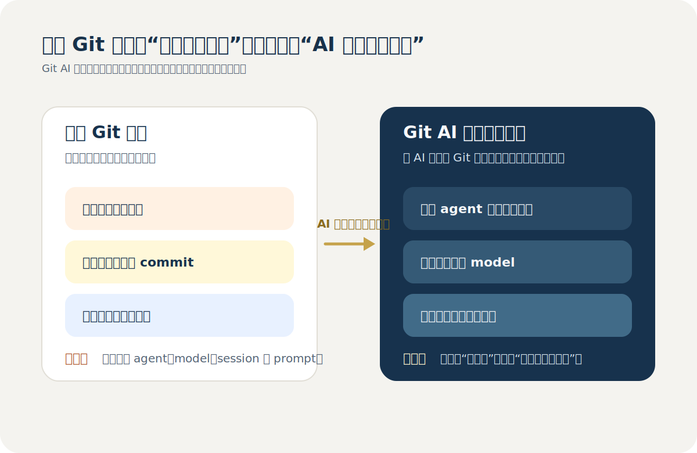
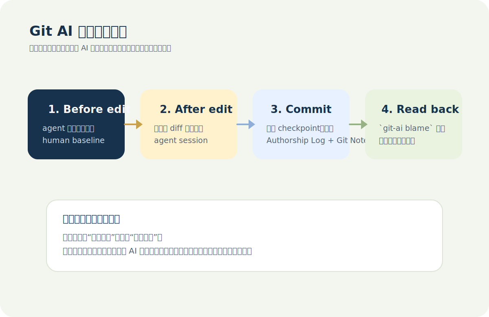
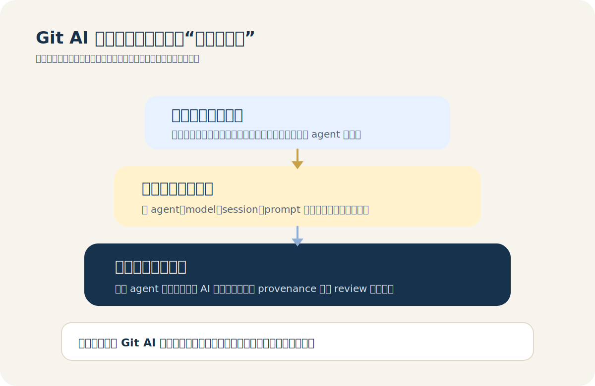
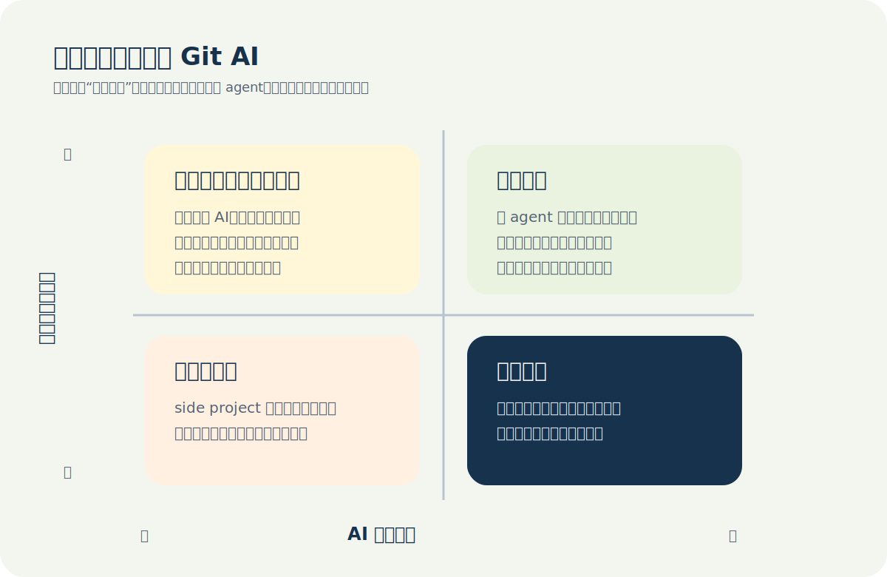

# Git AI 是什么？AI 写的代码，应该如何进入 Git 历史

如果你在 `2025年` 之后持续使用过 `Cursor`、`Claude Code`、`Codex`、
`GitHub Copilot` 这类工具，你很快就会遇到一个以前并不存在的问题。

代码确实被写出来了，提交也确实进了仓库，但 Git 历史里几乎看不出这段代码是
谁写的，更看不出它背后是哪一个 agent、哪一个模型、哪一次对话，甚至看不出
后来这段 AI 生成代码到底是被接受、被改写，还是被彻底删除了。

`Git AI` 想解决的就是这个问题。它不是新的代码生成器，也不是更聪明的
`git blame` 包装层，而是一套把 AI 代码归因信息持续附着在 Git 历史上的机
制。换句话说，它关心的不是“帮你写”，而是“帮你记住这段代码是怎么来的”。

这篇文章会把几个问题放到一条主线上一起讲清楚：

- `Git AI` 到底是什么。
- 它为什么不是一个“可有可无的小插件”。
- 它的实现原理是什么。
- 它现在的市场位置、受众和评价如何。
- 以及最关键的，你到底需不需要装它。

## 为什么这个问题会突然变重要

传统的 `git blame` 已经足够回答很多问题，比如某一行最后是谁改的、改动发生在
哪次提交、什么时候进入了分支历史。但在 AI 编程时代，这套信息开始明显不够。

它只能告诉你“这行代码最后是谁提交的”，却无法告诉你下面这些更关键的问题：

- 这段实现最初是人写的，还是 agent 写的。
- 如果是 agent 写的，具体来自哪个工具和模型。
- 这段代码背后的原始意图、约束和 prompt 是什么。
- 这段 AI 代码在进入主干之前经历过多少人工改写。
- 团队到底在用哪些 agent，哪些 agent 的产出真正被接受了。

一旦团队里开始混用多个 agent，这个问题会变得更明显。你看到的是同一个仓
库，但仓库背后其实已经不是“一个作者和一份代码”，而是“人类工程师和多个
agent 共同演化的结果”。

也正因为这样，AI 代码归因并不是一个小众的情绪化需求，它本质上是在补 Git 对
新型开发工作流的盲区。

## Git AI 到底是什么

`Git AI` 的官方定义很直接：它是一个开源的 Git 扩展，用来跟踪仓库里的
AI-generated code，并把每一段 AI 写入的代码关联到对应的 agent、model 和
transcript 上。[GitHub 仓库](https://github.com/git-ai-project/git-ai)

它的定位可以用一句话概括：

> 它不是代码生成工具，而是 AI 代码的 provenance 和 attribution 工具。

这里的关键词有两个。

第一个是 `attribution`。也就是归因。你需要知道代码是谁写的，是人写的、AI
写的，还是人和 AI 混合完成的。

第二个是 `provenance`。也就是来历。你不只需要知道“是谁写的”，还需要知道
“它是通过哪次会话、哪种约束、哪种意图产生的”。

这也是为什么 `Git AI` 和一般意义上的“commit message 生成器”完全不是一类
产品。后者帮助你更快提交，前者帮助你在几周或几个月之后还能追溯那段代码的
来源和上下文。

## 它的原理到底是什么

`Git AI` 最值得注意的一点，是它并不尝试“猜代码像不像 AI 写的”。官方文档
明确把这种做法称为一种反模式。它采用的是另一条路线：让支持的 agent 在修改
代码时显式打点，然后把这些打点和 Git 历史绑定起来。

整个过程可以拆成四步来看。

### 第一步：在 agent 改代码前后记录 checkpoint

当支持的 agent 修改文件时，`Git AI` 会在修改前后各做一次
`git-ai checkpoint`。文档里给出的 Claude Code hook 示例就体现了这一点：
编辑前先记录一次 checkpoint，编辑后再记录一次带 agent 信息的 checkpoint。
[How Git AI Works](https://usegitai.com/docs/cli/how-git-ai-works)

这样做的意义很关键：

- 编辑前的 checkpoint 用来把这段时间内的人类改动记成 human。
- 编辑后的 checkpoint 用来把新插入的部分记成 AI authored。

这些临时信息先存在 `.git/ai` 里，直到你真正提交。

### 第二步：提交时把增量信息压缩成 Authorship Log

当你执行 `git commit` 时，`Git AI` 会把前面那一连串 checkpoint 压缩成一份
按文件和行号组织的 `Authorship Log`。这份日志会记录某个文件的哪些区间来自
哪个 agent session，同时保存对应的 JSON 元数据，比如 agent、model、human
author 以及会话的 `messages_url`。

文档里给出的示例说明得很清楚：上半部分是“文件和行范围映射到 session id”，
下半部分是“session id 对应的完整元数据”。这比“粗略估算本次提交里有多少行
看起来像 AI 写的”要严谨得多。[How Git AI Works](https://usegitai.com/docs/cli/how-git-ai-works)

### 第三步：把归因信息挂到 Git Notes 上

这些 `Authorship Log` 不会直接写进 commit message，也不会污染正常的 diff。
`Git AI` 采用的是 `Git Notes`。也就是说，归因信息仍然跟着 commit 走，但不
会挤占日常的代码历史视图。

这是一种很“Git-native”的实现方式。官方文档和 README 都把这一点当成核心设
计选择之一：既尽量保留 Git 的原始工作流，又把 AI 归因信息作为额外层挂在提
交之上。[GitHub 仓库](https://github.com/git-ai-project/git-ai)
[How Git AI Works](https://usegitai.com/docs/cli/how-git-ai-works)

### 第四步：在 blame 阶段把 Git Notes 重新叠加回来

`git-ai blame` 的思路不是重新分析一遍代码，而是先借助 `git blame` 找到每一
行最早对应的 commit 和原始位置，再去读取那个 commit 上的 Authorship Log，
最后把 agent、model、session 等信息叠加显示出来。

因此它本质上不是一个“猜测器”，而是一个“历史映射器”。这也是为什么它能比很
多宣传里的 AI 统计更接近真实结果。它关心的不是“AI 曾经生成过多少代码”，而
是“有多少 AI 生成代码最终穿过了开发流程，真的留在了仓库里”。

## Git AI 解决的到底是什么问题

我认为 `Git AI` 解决的不是一个单点问题，而是三个层次的问题。

### 第一层：补齐行级归因

这是最直观的一层。你终于可以回答“这段代码最初是不是 AI 写的”。如果你经常
接手 agent 改过的文件，这件事的价值非常直接。

### 第二层：补齐意图链路

代码本身只会告诉你“它做了什么”，不会告诉你“为什么这样做”。而 AI 会话里往
往带着原始需求、边界、权衡和限制。`Git AI` 想保留的，正是这部分“why”。

官方甚至专门围绕这件事做了 `/ask` 能力。它的核心假设很合理：一个能读到原始
对话和上下文的 agent，和一个只能读代码的 agent，给出的解释质量不会是同一
个量级。[GitHub 仓库](https://github.com/git-ai-project/git-ai)

### 第三层：补齐团队治理视角

一旦你不再只看单个文件，而是看整个仓库、整个 PR 流和整个团队，问题就从
“谁写了这段代码”升级成了：

- 哪个 agent 的代码接受率更高。
- 哪个模型更容易留下可维护的实现。
- 团队到底有多少代码是 AI 主导完成的。
- AI 生成的代码在 review 和合并后还有多少真正活了下来。

`Git AI` 的 `stats` 和团队侧产品，明显就是奔着这类问题去的。这不是单纯的
开发者玩具，而是有平台工程和研发管理味道的基础设施。

## 截至 2026 年 3 月，Git AI 现在处在什么位置

如果你问我它现在是不是主流工具，我的判断是：还不是。

但如果你问我这个方向是不是伪需求，我的判断也是：不是。

截至 `2026年3月19日`，`Git AI` 在公开层面至少有几个比较明确的信号：

- GitHub 仓库大约有 `1.4k stars`、`106 forks`、`2,337 commits`。
- 仓库发布页显示已经有 `111` 个 release，最新版本是
  `v1.1.15`，发布时间是 `2026年3月17日`。
- VS Code / Cursor 扩展公开页显示大约 `4,695 installs`。
- 官方 README 里已经把 `Codex` 放进了支持 agent 列表，和
  `Claude Code`、`Cursor`、`GitHub Copilot` 并列展示。

这些数字说明了两件事。

第一，它已经不是概念 demo 了。更新频率、仓库活跃度和 agent 支持面，都说明
这个项目在快速推进。

第二，它也还远远没到“大众开发者标配”的阶段。`1.4k stars` 和不到五千的扩
展安装量，决定了它目前更像是早期采用者工具，而不是面向所有开发者的基础软
件。

但行业信号并不只来自它自己。`2026年2月4日`，InfoQ 报道了 Cursor 提出的
`Agent Trace` RFC，目标就是给 AI 代码归因定义一种供应商中立的开放格式。这
说明“AI attribution”已经从单个产品特性，开始上升到“值得标准化”的层面。
[InfoQ 报道](https://www.infoq.com/news/2026/02/agent-trace-cursor/)

同样值得注意的是，Earthly Lunar 的 AI guardrail 也已经把
`Git AI standard` 作为一种可验证的 AI authorship annotation 方案接了进
去。这意味着 AI 归因正在从“开发者好奇心”慢慢走向“工程流程中的可检查项”。
[Earthly Lunar](https://earthly.dev/lunar/guardrails/ai-use/ai-authorship-annotated/)

所以我对它当前市场位置的概括是：

> 它不是大热消费级工具，但它已经站在了一个可能变成工程基础设施的方向上。

## 这个工具真正的好处是什么

如果只用一句话回答，我会说它最大的好处不是“更方便写代码”，而是“更可靠地
理解代码从哪里来”。

具体展开，我最看重下面几点。

### 1. 它比“插入时统计”更接近真实开发结果

很多 AI coding 产品喜欢报告“生成了多少行代码”，但这个指标天然会高估影响
力，因为它不会跟踪代码后续是不是被撤销、改写、挪走，或者在合并前就已经死
掉了。

`Git AI` 的路线更克制。它试图沿着 Git 历史去看哪部分 AI 代码真的穿过了开
发生命周期，最后还留在仓库里。这个视角对工程团队有意义得多。

### 2. 它能把“代码是谁写的”升级成“代码为什么这样写”

如果只看行级 attribution，它已经有价值；如果再把 transcript 和上下文挂进
来，它的价值会再上一个台阶。很多时候真正难追的不是实现本身，而是当时做决
策时的约束和意图。

### 3. 它适合多 agent 混用的现实环境

官方文档明确强调“多 agent 世界”是它要解决的前提。这个判断我认同。未来的
工程现实，大概率不是所有人统一用一家工具，而是每个人在不同场景下调用不同
agent。归因层天然就该尽量 vendor-neutral。

### 4. 它尽量不改变现有 Git 工作流

这一点很重要。很多团队工具死掉，不是因为方向错，而是因为太强行改变工程师
日常习惯。`Git AI` 一直强调“no workflow changes”，包括通过 Git 扩展和
symlink 代理 git 调用、自动装 hooks、把信息写到 Git Notes 而不是硬塞进
commit history。这些都是为了把摩擦降到最低。

## 它的问题和限制也不能回避

如果只讲优点，这篇文章就会变成宣传稿。更现实的看法是，`Git AI` 今天确实有
价值，但也确实有成本和边界。

### 1. 它不是零侵入

官方文档写得很直白，安装脚本会下载二进制、创建 symlink，把 `git` 调用导向
`git-ai`，同时给支持的 agent 装 hooks。[How Git AI Works](https://usegitai.com/docs/cli/how-git-ai-works)

这当然换来了自动化，但也意味着它不是“装一个插件看看”的轻量小物件。你需要
接受它进入你的 Git 调用路径。

### 2. Git Notes 的宿主平台支持并不统一

文档里也提到，`GitHub` 和 `Bitbucket` 都支持 push notes，但 web UI 不会直
接展示；`GitLab` 的支持会更友好一些。这意味着如果你团队主要依赖 GitHub Web
界面，不借助它自己的 CLI、插件或团队产品，很多价值不会天然显现出来。
[How Git AI Works](https://usegitai.com/docs/cli/how-git-ai-works)

### 3. 历史改写问题虽然处理了，但不是所有边角都完美

文档明确列出了已知限制。比如 `git mv` 目前仍然是一个缺口，某些格式化场景下
行级 attribution 也可能出现少量偏差。它确实已经覆盖了 `rebase`、
`cherry-pick`、`squash` 等常见路径，但离“毫无边角”还有距离。
[How Git AI Works](https://usegitai.com/docs/cli/how-git-ai-works)

### 4. 它解决的是治理问题，不是生成问题

如果你的期待是“装了以后 AI 写代码更强”，那你很可能会失望。它不提高模型智
能，不改善上下文压缩，不优化自动补全，也不直接提升 agent 的规划能力。它提
供的是另一种价值：记录、追溯、审计和分析。

## 到底推荐谁用，不推荐谁用

如果一定要给结论，我的建议会分三类。

### 第一类：普通个人开发者

如果你主要是自己写点 side project，偶尔用一下 `Codex` 或 `Cursor`，没有审
计需求，也不关心跨会话追因，那我不推荐你默认安装。

原因很简单：它带来的治理收益，大于它带来的直接编码收益。对轻量个人项目来
说，这个账不一定划算。

### 第二类：AI 重度使用者

如果你已经大量依赖 coding agent，尤其经常在一个仓库里切换多个 agent，或者
经常在几周后回头看某段 AI 改过的代码，那我认为它值得试一试。

即使你不做团队级分析，单是“看懂这段代码最初来自哪次会话”这一点，也可能已
经值回折腾成本。

### 第三类：团队负责人、平台工程、合规场景

这一类我反而最推荐。原因不是它已经足够完美，而是你们最容易真正从中拿到结
构化收益。

你们更可能关心这些问题：

- 团队现在到底有多少 AI 代码进入主干。
- 不同 agent 或模型的接受率有没有差异。
- Review 和发布链路里能不能保留 AI 来历。
- 将来如果要做审计、复盘或事故追因，有没有一条完整链路可查。

这恰好就是 `Git AI` 最擅长的方向。

## 我的总体评价

如果你问我对这个工具的评价，我会给出一句比较克制的话：

> 方向很强，问题真实，产品仍然偏早期，但已经值得认真关注。

它最打动我的地方，不是某个单点功能，而是它对问题的定义是对的。它没有把 AI
代码归因理解成“识别味道”，也没有把它做成纯云端平台，而是试图用 Git 原生
方式把 attribution 这件事嵌回现有工程系统。

这件事一旦做对，价值不会只停留在一个工具层面。它可能会进一步影响 review、
observability、团队治理，甚至影响未来关于 AI 代码 provenance 的行业标准。

而它现在还不够成熟的地方，也同样明显：生态仍早、平台支持不齐、很多价值还
需要依赖自己的 CLI 和插件来承接。它不是一个已经彻底跑通的大众产品，更像是
一项正在快速生长的工程基础设施。

## 结语：AI 写的代码，确实应该进入 Git 历史

过去我们默认把代码提交看作最终结果，所以 Git 历史只记录“变了什么”。但在
AI 编程时代，这已经不够了。我们越来越需要同时记录“是谁通过什么方式把它变
成这样的”。

`Git AI` 给出的答案并不是终局，但它至少把问题问对了。它提醒我们，真正需要
补课的也许不是“怎么让 AI 再多写一点代码”，而是“怎么让这些代码在进入工程
系统之后依然可追溯、可解释、可治理”。

如果你只想知道一句结论，那就是：

- 如果你只是偶尔用 AI 写点代码，不必急着装。
- 如果你已经进入多 agent 协作阶段，它值得试。
- 如果你在做团队治理，这类工具大概率会越来越重要。

## 参考资料

- [Git AI GitHub 仓库](https://github.com/git-ai-project/git-ai)
- [How Git AI Works](https://usegitai.com/docs/cli/how-git-ai-works)
- [git-ai VS Code Marketplace](https://marketplace.visualstudio.com/items?itemName=git-ai.git-ai-vscode)
- [InfoQ: Agent Trace: Cursor Proposes an Open Specification for AI Code Attribution](https://www.infoq.com/news/2026/02/agent-trace-cursor/)
- [Earthly Lunar: AI Authorship Annotated](https://earthly.dev/lunar/guardrails/ai-use/ai-authorship-annotated/)
