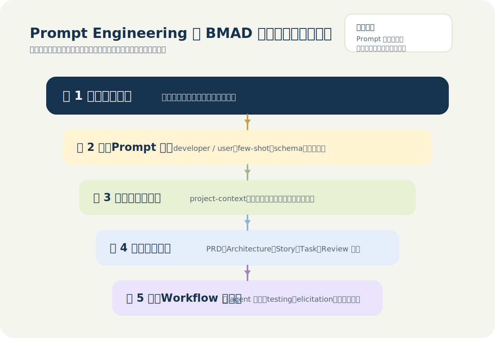
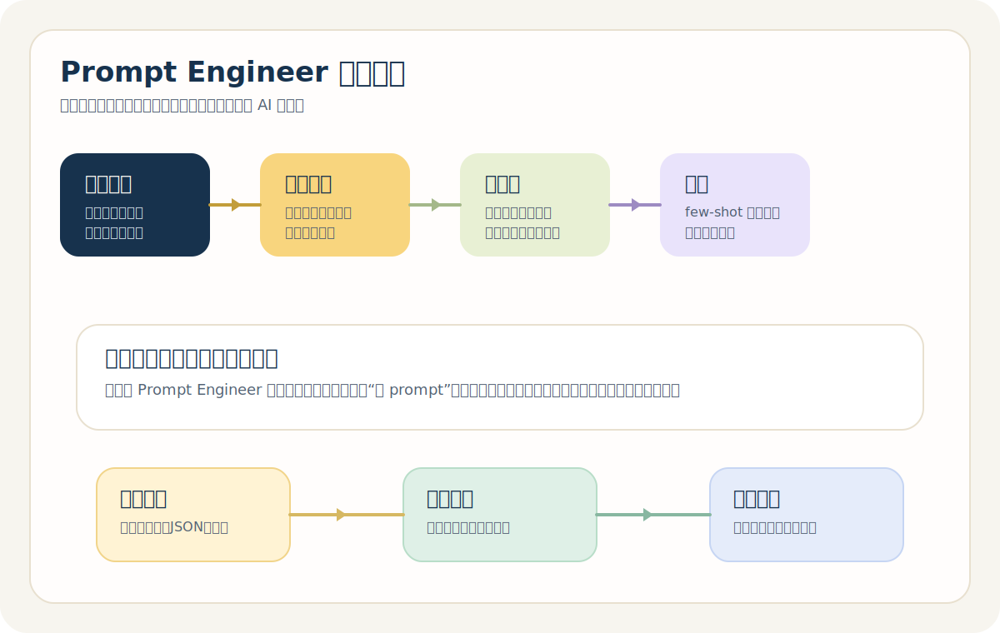
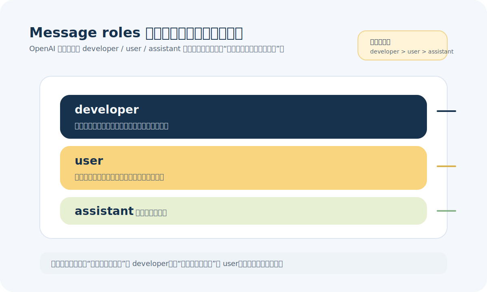
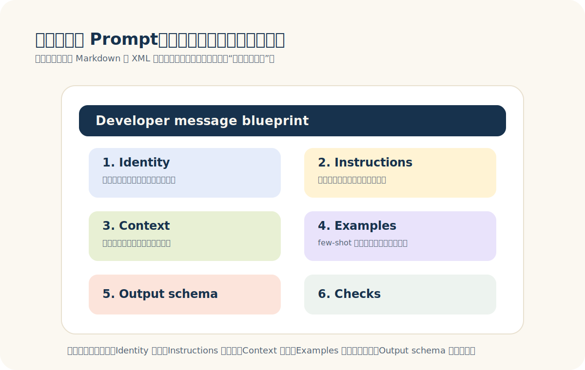
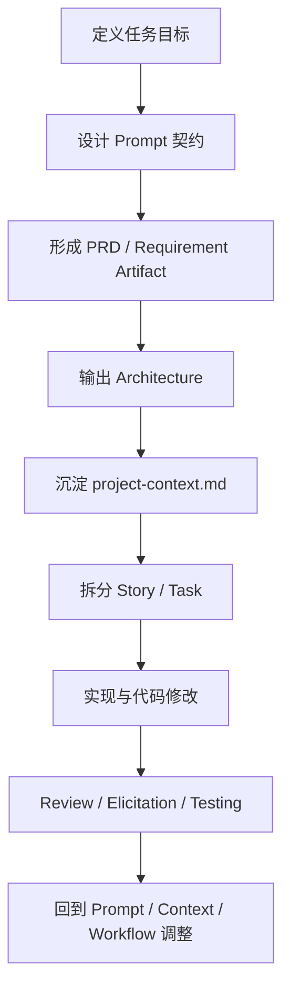
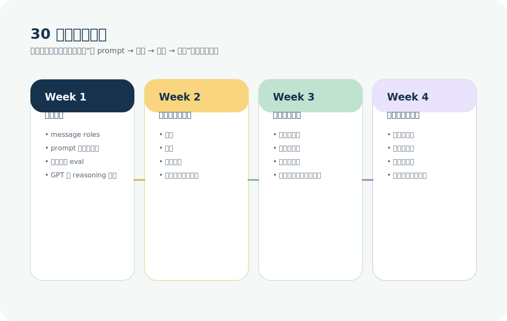

# 把 Prompt Engineering 和 BMAD 融成一套方法：从提示词到上下文工程的完整指南

很多人在学 AI 开发时，会先学两套看起来不同的东西。

第一套叫 `Prompt Engineering`。它通常以提示词技巧、few-shot、结构化输出、
message roles、工具调用这些概念出现。第二套叫 `BMAD Method`。它通常以
agents、workflow、PRD、architecture、story、project-context、review、
testing 这些概念出现。

问题恰恰出在这里。很多人会下意识把这两套东西分开学，甚至把它们理解成两种
路线：

- 要么认真写 prompt
- 要么上 BMAD 这种流程框架

这个理解不准确。

如果把它们放回真实工程场景里看，会更接近下面这个判断：

> Prompt Engineering 负责把任务说清楚。
>
> BMAD 负责让这些任务在一个长期项目里，带着上下文、产物和质量门禁持续流动。

也就是说，BMAD 不是 Prompt Engineering 的替代品，而是 Prompt Engineering
在更高层的组织方式。Prompt 没有消失，它只是从“聊天窗口里的一段话”，逐步变
成了“任务契约、项目上下文、工作流入口和产物模板”的一部分。

这篇文章不再按博客那种轻量方式来写，也不打算写成真正的论文。我会把它写成
一篇篇幅更长、信息量更高、结构更完整的长文，专门回答这几个问题：

1. Prompt Engineering 在现代 AI 开发里到底负责什么。
2. BMAD Method 到底把哪些东西接管了。
3. 两者应该如何融合，而不是互相替代。
4. 如果你想真正学会这套方法，应该按什么顺序去训练。

## 一、先把误区拆掉：为什么“只学 prompt”不够，“只学 BMAD”也不够

这件事最容易走偏的地方，不在于工具太多，而在于抽象层次混淆。

如果只学 prompt，很容易掉进两个问题。

第一个问题是视野太低。你会越来越关注一句话怎么写，却不太关心这些内容如何
在项目里持续生效。第二个问题是上下文太脆弱。很多规则只存在于会话中，一旦
换聊天窗口、换模型、换 agent，之前那些约束就蒸发了。

反过来，如果只学 BMAD，也一样会出问题。

因为 BMAD 不是魔法工作流。它不会自动替你定义目标，也不会自动知道什么叫成
功，更不会自动把模糊问题变清楚。你如果本来就说不清楚任务，只是把它塞进
workflow，最后得到的只会是结构化的混乱。

所以真正的问题不是“学 prompt 还是学 BMAD”，而是：

- 在一项真实工作里，哪些内容应该放在 prompt 层解决；
- 哪些内容应该上移到项目上下文层；
- 哪些内容应该进入 workflow 和 artifacts 层。

只有把这三层关系弄清楚，学习路径才会真正稳定下来。

## 二、Prompt Engineering 在这套统一方法里，到底负责什么

如果把 Prompt Engineering 从各种流行术语里剥离出来，它最核心的职责其实很简
单：把一个任务定义成模型可以稳定执行的契约。

这里的“契约”，不是法律意义上的契约，而是工程意义上的任务协议。它至少要回
答下面几个问题：

1. 这个任务到底要做什么。
2. 允许使用哪些输入。
3. 不能做什么。
4. 信息不足时应该怎么处理。
5. 输出应该长成什么结构。

这套任务契约设计，才是 Prompt Engineering 最硬的部分。不是套模板本身，而是
能不能把问题讲清楚。

### 1. Prompt 首先是任务契约，不是文学创作

很多人一开始学 prompt，容易把注意力放在措辞上，比如：

- 这句话是不是更“强”
- 这个角色设定是不是更“聪明”
- 加一句 `step by step` 会不会更厉害

这些都不是主问题。

在真实工程中，prompt 最重要的价值不是“让模型听起来更聪明”，而是让任务边界
足够清楚，让结果足够稳定，让输出足够可验证。只要这三件事做到了，prompt 就
已经是高质量 prompt。反过来，如果这三件事没做到，哪怕 prompt 看起来很长，
也只是描述噪声。

这也是为什么 OpenAI 官方文档会反复强调 message roles、结构化分隔、few-shot
示例和输出 schema。它真正想教的不是“修辞学”，而是“任务协议设计”。

### 2. `developer` 和 `user` 不是格式要求，而是优先级设计

OpenAI 文档里一个非常关键但经常被低估的点，是 `developer` message 和
`user` message 的区分。

如果把它讲白一点：

- `developer` 负责写长期成立的规则
- `user` 负责写本次任务的具体输入

长期规则包括什么？通常包括：

- 角色定义
- 输出格式
- 不允许做的事情
- 缺信息时怎么处理
- 用工具的规则

本次输入包括什么？通常包括：

- 原始材料
- 这次任务的参数
- 用户提出的局部变化
- 当前场景的上下文

这层分离极其重要。它会直接决定你后面能不能把 prompt 变成模板、能不能做评
测、能不能在不同任务之间复用。

如果你把所有东西都写在一大段自然语言里，结果通常是：

- 规则越来越乱
- 测试越来越难
- 修改时不知道该动哪一层

Prompt Engineering 一旦进入项目实践，这种混乱几乎必然出现。所以从一开始就把
长期规则和即时输入拆开，是最划算的习惯之一。

### 3. 高质量 prompt 更像说明书，而不是聊天记录

真正稳定的 prompt，往往不是一句话，而是一组有清晰结构的说明。通常至少包括
这些部分：

- 角色
- 目标
- 输入
- 约束
- 输出格式
- 校验规则

也正因为这样，复杂 prompt 更适合写成带小标题、带分块、带结构的文本，而不
是一段长长的散文。模型并不怕长，它怕混。

下面这张图就是一个很好的理解方式。

如果你把这套结构真正用起来，你会发现一个变化：prompt 不再像聊天时临时打出
来的一段话，而更像一个最小规格说明书。

### 4. Few-shot 的本质是在教模型边界

很多人知道 few-shot，但经常把它用成“加几个例子看看能不能更准”。这当然不算
完全错，但还不够。

Few-shot 真正重要的地方，不是让模型“见过类似题”，而是让模型知道：

- 什么样的输出是对的
- 什么样的输出是错的
- 哪些字段不能混
- 哪些细节必须保留
- 哪些信息宁可留空，也不能瞎编

因此，few-shot 最有价值的任务通常不是常识题，而是边界微妙的任务，比如：

- 风险和建议容易混在一起的分析任务
- 分类标签边界不明显的质检任务
- 多个 JSON 字段容易错位的抽取任务
- 风格统一但颗粒度必须稳定的改写任务

Few-shot 的数量并不重要。重要的是示例本身是否能稳定代表你的真实判断标准。

### 5. 输出结构决定了结果能不能进入系统

Prompt Engineering 最容易被忽略的一点，是很多人太关注回答“看起来好不好”，
却不够关注回答“能不能接进系统”。

这在日常聊天里问题不大，但在 AI 应用开发里是硬问题。因为模型输出最终往往
要进入下游流程，比如：

- 给前端展示
- 进入数据库
- 触发工具调用
- 成为下一阶段 artifact 的输入
- 被测试用例校验

一旦你开始从这个角度看 prompt，你就会自然更重视：

- JSON schema
- 枚举值
- 缺省策略
- 错误处理
- 可解析性

这时，Prompt Engineering 就从“提示词技巧”进入了“接口设计”的范畴。

### 6. Eval 意识本来就属于 Prompt Engineering

很多人把评测理解成模型工程的事情，觉得和 prompt 没有直接关系。实际上，只要
你认真做过 prompt 迭代，就会知道这完全分不开。

原因很简单：如果没有一组固定样本，你根本无法判断一版 prompt 到底是变好了，
还是只是碰巧在当前案例上看起来更顺。

所以 Prompt Engineering 真正成熟以后，几乎一定会自然走向这些实践：

- 建立样本集
- 记录失败类型
- 对比版本
- 决定回滚
- 根据失败原因修改规则、示例或上下文

一旦进入这一步，Prompt Engineering 本质上就已经不是聊天技巧，而是一种轻量
的工程活动了。

## 三、BMAD 在这套统一方法里，负责把“即时上下文”升级成“持续上下文”

如果说 Prompt Engineering 负责的是“把任务说清楚”，那么 BMAD 负责的是“让
这套清楚的任务定义，在一个项目里持续有效”。

这正是很多人第一次接触 BMAD 时最容易忽略的地方。表面上看，它像是在给 AI
配很多角色和菜单；但从工程角度看，它真正做的是上下文编排。

具体来说，BMAD 把原来散落在会话里的信息，逐步搬进了这些东西：

- agent persona
- workflow 顺序
- PRD / architecture / story 这类 artifacts
- `project-context.md`
- review / testing / elicitation 机制

这意味着 BMAD 的价值并不是“让你不用写 prompt”，而是“让你不用每次从零开始
解释同一批规则”。

### 1. Agent 不是角色扮演，而是职责边界容器

BMAD 的 agent 看起来像角色，其实更像职责边界的容器。比如：

- PM 关注需求、目标和产品边界
- Architect 关注方案和技术决策
- Dev 关注实现
- QA 或 TEA 关注验证和质量

这件事的重要性在于，它把“谁应该决定什么”先分清楚了。很多 AI 工程里的混乱，
不是模型不够强，而是同一个 agent 被要求在没有足够上下文的情况下同时扮演产
品、架构、开发、测试四种角色，结果自然会漂移。

BMAD 把这些职责边界拆开，减少的是角色混乱。

### 2. Workflow 的核心不是流程感，而是上下文接力

BMAD 的 workflows 最关键的地方，也不是流程图本身，而是阶段之间的上下文接力。

一个长期项目通常不会只经历一次对话，而是会经历多个阶段：

1. 需求分析
2. 规划与拆解
3. 方案设计
4. story 化
5. 实现
6. review
7. testing

如果这些阶段都只靠聊天历史接住，上下文很快就会丢失。BMAD 通过 artifacts
做的事情，是把上一阶段的重要信息沉淀下来，成为下一阶段的显式输入。

这个思路和 Prompt Engineering 并不冲突。它只是把 prompt 原来承担的“把任务
说清楚”的职责，进一步扩展成“把任务之间的关系也说清楚”。

### 3. `project-context.md` 本质上是长期有效的高级 prompt

BMAD 里我最看重的一个东西，就是 `project-context.md`。

这个文件的重要性在于，它把项目中那些：

- 会反复出现
- 又不应该每次重写
- 但模型又无法自动推断

的规则，抽成了一份长期有效的上下文资产。

这类内容通常包括：

- 技术栈和版本
- 目录结构约束
- 命名习惯
- 不允许打破的架构边界
- 团队已有偏好
- 实现时必须关注的历史约束

从 Prompt Engineering 的角度看，这其实非常重要。因为它说明了一件事：

Prompt 没有消失，它只是从“会话消息”搬到了“项目上下文文件”。

也正因为这样，写 `project-context.md` 本身就是高级 Prompt Engineering。你
仍然需要判断：

- 哪些信息值得长期放进去
- 哪些信息只属于局部 story
- 哪些信息太泛，放进去只会污染上下文

### 4. Architecture、Story、Task 这些 artifact，让规则不靠记忆存活

很多人看 BMAD 的时候，只关注 agent 和 workflow，反而低估了 artifacts 的作
用。实际上，它们是整个体系里最关键的“上下文存储介质”。

举个很现实的例子。

如果没有 architecture 文档，不同 agent 在不同 story 上可能会做出相互冲突
的技术决策。一个选 REST，一个选 GraphQL；一个假设同步处理，一个假设异步队
列；一个按单体思路写，一个按模块化思路拆。最后问题并不在任何一个局部实现
上，而在项目整体失去了统一的技术叙事。

BMAD 通过 architecture 和 story 的价值，恰恰在于它把这些决策显式化了。后
续实现不是从零猜，而是在已有决策上执行。

### 5. Advanced elicitation 和 testing，让质量不只靠“再试一次”

BMAD 的另一层价值，是它不把质量理解成“生成代码以后再看一眼”。它在文档里明
确把 advanced elicitation 和 testing 放到流程里，而不是把它们留给临场发挥。

这意味着，质量增强不再只是：

- 再改一版 prompt
- 再让模型想一想
- 再多问一轮

而是进入更结构化的做法，比如：

- pre-mortem
- first principles
- red team / blue team
- 分层 testing
- 明确的验证路径

换句话说，BMAD 并不是替代 prompt，而是在 prompt 之外，把“如何进一步逼近高
质量结果”也流程化了。

## 四、把两者真正融合起来后，这套方法应该怎么理解

如果上面两部分单独看都成立，那么接下来最重要的问题就是：把 Prompt
Engineering 和 BMAD 放在一起时，到底应该怎样理解它们的关系。

我更推荐的理解方式，不是“谁替代谁”，而是“它们位于同一方法栈的不同层级”。

这套统一方法至少可以拆成五层。

### 第 1 层：任务契约层

这是最底层，也是最不能省略的一层。它负责回答：

- 目标是什么
- 输入是什么
- 成功标准是什么
- 输出应该长成什么样

如果这一层模糊，后面所有上层机制都会一起模糊。

### 第 2 层：Prompt 结构层

这一层把任务契约具体写成模型能稳定执行的格式。这里会涉及：

- `developer` / `user`
- 结构化分块
- few-shot
- output schema
- 异常处理规则

这层仍然是 Prompt Engineering 的核心。

### 第 3 层：上下文沉淀层

这一层把会反复出现的规则抽离出来，变成长期有效的上下文资产。这里通常会用
到：

- `project-context.md`
- architecture 文档
- 代码库约束说明
- 团队偏好

这一步就是从 Prompt Engineering 走向 Context Engineering 的分界点。

### 第 4 层：Artifact 接力层

这一层关注上下文如何在阶段之间流动。PRD、Architecture、Story、Task、Review
记录，都是为了让上一阶段的产出变成下一阶段的显式输入。

### 第 5 层：Workflow 与验证层

这一层负责组织执行顺序、角色分工、review、testing 和回滚。它不再直接处理
单句 prompt，而是在管理整个项目如何稳定运行。

如果把这五层放在一起，你会发现一个很重要的事实：

Prompt 并没有在进入 BMAD 之后消失，而是从底层任务描述，一路向上延伸到上下
文文件、artifact 模板和 workflow 入口。

## 五、真正实用的问题不是“学哪个”，而是“在哪一层解决哪个问题”

一旦把这套方法看成统一栈，很多混乱就会消失。因为你开始能判断，某个问题应
该在哪一层被解决，而不是本能地全部塞进一个 prompt，或者本能地全部扔给一套
workflow。

下面这张表，就是一个非常实用的判断方式。

| 你遇到的问题 | 更适合在哪一层解决 | 为什么 |
| --- | --- | --- |
| 任务目标说不清楚 | 任务契约层 | 先把问题定义清楚，别急着上流程 |
| 输出老是飘，字段不稳定 | Prompt 结构层 | 需要补 schema、few-shot、异常处理 |
| 同样的规则总要重复解释 | 上下文沉淀层 | 应该抽成长期上下文，而不是每次重写 |
| 不同 agent 做法互相冲突 | Artifact 接力层 | 缺架构和 story 级显式交接 |
| 项目阶段很多，容易丢上下文 | Workflow 层 | 需要显式阶段顺序和质量门禁 |
| 改了一版结果变好还是变坏说不清 | 验证层 | 需要样本、review、testing、回滚 |

这个判断表很重要，因为它会帮你摆脱两个常见极端：

- 什么问题都靠一条 prompt 解决
- 什么问题都想开一整套流程解决

真正成熟的做法，是按问题所属层次处理。

## 六、一个完整例子：如果要做一个 AI 功能，这套融合方法会怎么跑

讲方法论最容易空，所以这里给一个更具体的例子。假设你要做一个“技术文档整理
与摘要系统”，目标是把技术文档转成结构化摘要、风险点和后续行动建议。

如果只用最基础的 Prompt Engineering，你通常会这样起步：

1. 写一版 `developer` message，定义角色、输出结构、禁止幻觉。
2. 用 `user` message 传入原文档。
3. 设计 JSON 输出结构。
4. 用 10 到 20 份样本文档做测试。
5. 根据失败案例调整规则、示例和 schema。

这一步没有任何问题，它本来就应该这么做。因为项目一开始，你首先需要一个可
用的任务契约。

但如果这个系统要继续往前走，比如：

- 需要拆需求
- 需要设计接口
- 需要考虑前后端结构
- 需要拆成 stories 去实现
- 需要做 code review 和 testing

那么单靠 prompt 已经不够了。此时你会自然进入 BMAD 更擅长的层次。

一个更完整的融合式流程，通常会长成这样：

1. 先用 Prompt Engineering 把“这个系统到底要做什么”定义清楚。
2. 把需求沉淀成 PRD，让目标、范围、边界不再只存在于聊天里。
3. 基于 PRD 输出 architecture，让后续实现不至于各自为政。
4. 生成或维护 `project-context.md`，把技术栈、结构偏好和实现约束固定下来。
5. 把需求拆成 story，让每个实现任务都带着准确上下文。
6. 让 Dev agent 在 story 和 project context 的约束下实现。
7. 用 review、elicitation 和 testing 去验证结果，而不是只看“好像能跑”。

这时候你会发现，Prompt Engineering 和 BMAD 并不是两条路线，而是一条链的前
后段。

下面这张流程图，可以帮助你快速理解它们是怎么接在一起的。

这个流程有一个非常关键的特点：

最开始是 prompt，后面是 context，最后是 workflow 和验证。它们不是互斥关系，
而是递进关系。

## 七、为什么很多人会在这里学偏

真正让人走偏的，通常不是信息不够，而是抽象层次混乱。下面这些问题非常常见。

### 1. 把 Prompt Engineering 学成“提示词收藏学”

这是最常见的偏法。不断收集模板、不断收藏“神 prompt”，但很少去分析：

- 这个 prompt 解决的到底是什么任务
- 它依赖了哪些隐含上下文
- 它为什么在这个任务有效
- 它换任务后为什么会失效

最后学到的是句子，而不是方法。

### 2. 把 BMAD 学成“菜单驱动的自动化”

另一种偏法是把 BMAD 理解成：选个 agent、走个菜单、等结果出来。这会漏掉它最
重要的一层，也就是上下文和 artifacts。

如果没有 PRD、architecture、project context 这些东西，BMAD 就会退化成“多角
色轮流猜你的意思”。

### 3. 不愿意把规则外化

很多人脑子里知道很多规则，但不愿意花时间把它们写成 context 文件或 artifact。
短期看这似乎更快，长期看则极其昂贵。因为 AI 永远只能拿到你显式提供的规则，
拿不到你脑子里的默认约定。

### 4. 不做样本、不做评测

无论是 prompt 还是 workflow，只要不做样本和验证，所谓“效果更好”通常都只是
感觉。没有对比就没有迭代，没有失败分类就没有真正的方法论。

### 5. 把所有任务都套进同一个强度的流程

有些任务只需要一个清晰 prompt，有些任务只需要 Quick Flow，有些任务才值得开
完整 BMAD 流程。把所有任务都推到同一个复杂度层级，既浪费时间，也会让方法
本身显得笨重。

## 八、如果你真的想学这套方法，应该怎么练

如果今天让我重新设计一条学习路线，我不会再把“学 prompt”和“学 BMAD”拆成
两门课，而会按能力层次来练。

### 第 1 阶段：先练任务契约能力

这个阶段不要急着碰复杂 workflow。你先把这几件事练熟：

- 用一句话说清任务目标
- 写清禁止事项
- 设计输出 schema
- 学会区分长期规则和本次输入
- 用 10 组样本去看结果稳不稳定

这一步不花哨，但它是所有上层能力的基础。

### 第 2 阶段：再练上下文打包能力

当你发现同样的规则会反复出现时，就开始练习把它们从会话里抽出来，变成长期
上下文。比如：

- 项目约束
- 技术栈偏好
- 目录结构
- 命名方式
- 架构边界

你会慢慢发现，很多“prompt 难写”的问题，本质上不是 prompt 难写，而是上下文
没有被正确打包。

### 第 3 阶段：再练 artifact 思维

这一步很关键。你要开始习惯问：

- 这一阶段应该产出什么
- 哪个产物会被下一阶段继续消费
- 如果没有这个产物，下一阶段会丢什么信息

一旦开始这样想，你就不再只是“跟模型对话”，而是在设计一条上下文接力链。

### 第 4 阶段：最后再练 workflow 和质量闭环

等前面三层都有了，再上 BMAD 的 workflows、advanced elicitation、testing，
效果会好得多。因为这时候你已经知道：

- prompt 在哪里起作用
- context 在哪里起作用
- artifact 在哪里起作用
- workflow 在哪里起作用

你用的就不再是一套神秘框架，而是一套你能解释清楚的系统。

## 九、一个更准确的结论：Prompt Engineer 真正应该学的，已经不是“提示词”，而是“任务到系统”的过渡能力

如果把今天这篇长文压缩成一句最重要的话，我会这样说：

> Prompt Engineering 负责把任务说清楚，BMAD 负责让这些任务在一个项目里带着
> 上下文持续运转。

所以，真正值得学习的能力，不再是“会不会写几条好看的 prompt”，而是下面这四
类能力：

1. 任务契约设计能力
2. 上下文沉淀能力
3. artifact 接力设计能力
4. workflow 与验证能力

当你把这四类能力接起来时，Prompt Engineering 和 BMAD 就不再是两套割裂的知
识，而是一整套连续的方法。

Prompt 是起点，但不是终点。

BMAD 是扩展，但不是替代。

真正成熟的 AI 开发方法，应该是：先用 prompt 把任务说对，再用 context 把规
则沉淀下来，再用 artifact 和 workflow 把这些规则跨阶段传下去，最后用 review、
testing 和 eval 把结果关起来反复验证。

## 参考资料

这篇文章主要基于以下官方资料整理。

1. [OpenAI Prompt engineering](https://platform.openai.com/docs/guides/prompt-engineering)
2. [Welcome to the BMad Method](https://docs.bmad-method.org/)
3. [Workflow map](https://docs.bmad-method.org/reference/workflow-map/)
4. [Project context](https://docs.bmad-method.org/explanation/project-context/)
5. [Manage project context](https://docs.bmad-method.org/how-to/project-context/)
6. [Why solutioning matters](https://docs.bmad-method.org/explanation/architecture/why-solutioning-matters/)
7. [Advanced elicitation](https://docs.bmad-method.org/explanation/advanced-elicitation/)
8. [Testing options](https://docs.bmad-method.org/reference/testing/)
