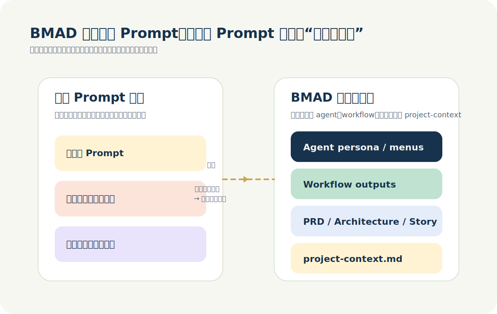

# 从 Prompt Engineering 到 Context Engineering：BMad 为什么值得一起学

如果你最近在认真用 AI 写代码，你大概率已经碰到过同一种瓶颈。

问题往往不是模型不会写，也不是 prompt 不够长，而是你没有把任务边界、项目规
则、上下文资产和阶段产物提前组织好。结果就是：一轮对话看起来很聪明，换个会
话就开始漂；一个功能能跑起来，第二个功能又和前面的决策打架。

这也是为什么很多人学完 `Prompt Engineering` 之后，最后还是会走到
`BMad Method`、`project-context.md`、artifact、workflow、review、testing
这些东西上来。不是 prompt 过时了，而是它不该独自承担整个项目的复杂度。

我现在更愿意这样理解它们的关系：

> Prompt Engineering 负责把单个任务说清楚。  
> BMad 负责让这些清楚的任务，在一个长期项目里持续成立。

这篇文章不打算把它们讲成两条路线，而是把它们接回一条连续的升级路径。你会看
到四件事：

1. 为什么只会写 prompt 很快就会撞到上限。
2. Prompt Engineering 真正负责的是哪一层。
3. BMad 到底接管了哪些 prompt 不擅长的部分。
4. 什么时候只用 prompt，什么时候必须上 context、artifact 和 workflow。

## 一、先看一个具体例子：同一个需求，为什么会走向两种完全不同的实现方式

讲方法论最容易空，所以先看一个真实一点的例子。假设你要做一个“技术文档整理
与摘要系统”，输入是一篇技术文档，输出是结构化摘要、风险点和后续行动建议。

如果你只用基础的 Prompt Engineering，通常会这样起步：

1. 写一条 `developer` message，定义角色、输出结构、禁止幻觉。
2. 用 `user` message 传入原文档。
3. 设计 JSON schema。
4. 用十几份样本去测结果稳不稳定。
5. 根据失败案例继续补规则、补示例、补异常处理。

这一步完全没问题，而且本来就应该这么做。因为项目一开始，你首先需要的是一个
可执行的任务契约。

但只要系统继续往前走，问题就变了。比如你开始需要：

- 把需求拆成多个功能点；
- 设计前后端接口；
- 沉淀历史约束和输出风格；
- 把功能拆成 story 分派给不同 agent；
- 让 review、testing 和回归检查变成固定流程。

这时你就会发现，只靠一条 prompt 已经不够了。因为 prompt 擅长定义一次任务，
却不擅长管理“多个任务之间如何持续共享同一套理解”。

于是，方法自然会升级成下面这条链：

1. 先用 prompt 把任务目标、输入、输出和禁止事项定义清楚。
2. 把反复出现的规则抽出来，沉淀到 `project-context.md`。
3. 把需求写成 PRD 或 requirement artifact，让目标不再只存在于聊天里。
4. 输出 architecture 或 `tech-spec`，让后续实现不靠猜。
5. 把工作拆成 story 和 task，让执行能分派、能追踪、能复核。
6. 用 review、elicitation 和 testing 把质量门禁前置。

到这里，Prompt Engineering 和 BMad 的关系就很清楚了。它们不是互斥关系，而是
一条链的前后段。前者负责把局部任务说清楚，后者负责把这些局部任务接成系统。

## 二、为什么只会写 prompt，很快就会撞到上限

很多人把 prompt 写不好，归因于技巧不够多。但在真实项目里，prompt 的上限往
往不是技巧上限，而是承载上限。

一条 prompt 再完整，本质上也还是一次性的任务描述。它最容易遇到的是下面三类
问题。

### 1. 重复规则会越写越乱

很多规则其实是长期有效的，比如：

- 技术栈和版本限制；
- 目录结构和命名约定；
- 不允许打破的架构边界；
- 团队已经确认的实现偏好；
- 某些历史包袱和兼容性要求。

如果这些信息一直写在聊天里，你就会反复重写，反复漏写，反复和模型重新对齐。
短期看像是在“补 prompt”，长期看其实是在拿会话窗口硬扛项目规则。

### 2. 阶段一多，上下文就会断

一个真实功能通常不会只经历一次对话。它会经历需求分析、方案设计、任务拆分、
实现、审查、测试、回归。这些阶段如果都只靠聊天历史接住，上下文迟早会断。

问题不在模型记不住，而在你没有把上一阶段真正重要的东西沉淀成下一阶段的显式
输入。只要缺少 artifact 接力，项目就会不断退回“重新解释背景”的状态。

### 3. 质量闭环很难只靠 prompt 建出来

很多人会把“质量增强”理解成：

- 再改一版 prompt；
- 再让模型多想一步；
- 再多给一点上下文；
- 再问一轮看看。

这对单任务优化有用，但它不等于稳定的工程质量。真正的质量闭环需要样本、验
收标准、review、testing、失败分类和回滚判断。这些东西一旦出现，就已经不只
是 Prompt Engineering 了，而是在往 workflow 和验证体系走。

## 三、Prompt Engineering 真正负责什么

讲到这里，最容易出现的误解是：那是不是 prompt 已经不重要了。不是。Prompt
仍然是起点，而且是不能省掉的起点。真正需要修正的，不是它的重要性，而是它的
职责边界。

如果把各种流行术语剥掉，Prompt Engineering 真正负责的是三件事。

### 1. 把任务定义成契约

高质量 prompt 不是文学创作，而是任务契约。它至少要回答下面几个问题：

1. 这个任务到底要做什么。
2. 允许使用哪些输入。
3. 不能做什么。
4. 信息不足时应该怎么处理。
5. 输出应该长成什么结构。

这也是为什么很多看起来“很神”的 prompt，真正有效的地方并不在语气，而在边
界清不清楚、输出可不可验证、失败时有没有默认处理方式。

### 2. 把契约写成模型可稳定执行的结构

任务定义清楚以后，还要把它写成模型能稳定消费的格式。这里最关键的不是词藻，
而是结构，比如：

- `developer` 和 `user` 的分层；
- 输入材料和规则说明的分块；
- few-shot 的边界示例；
- output schema；
- 异常和缺信息时的处理规则。

这一步做得好不好，会直接影响模型输出能不能进入系统，而不只是“看起来回答得
不错”。

### 3. 用样本和评测让优化变得可判断

Prompt Engineering 一旦认真做，很快就会自然走到 eval。

因为只要没有固定样本，你就无法判断：

- 一版 prompt 到底是变好了，还是只是碰巧在当前案例上更顺；
- 某个字段更稳定，是因为规则更清楚，还是因为样本太少；
- 一次修改带来的提升，是普遍提升，还是局部过拟合。

所以真正成熟的 Prompt Engineering，本质上已经是一种轻量工程活动。它不是
“聊天技巧收藏学”，而是任务协议设计加上最小验证闭环。

## 四、BMad 接管了 prompt 不擅长的四件事

如果说 Prompt Engineering 负责把一次任务说清楚，那么 BMad 的价值，在于把这
种“清楚”从一次对话升级成一套可以持续运转的项目机制。

我觉得 BMad 最重要的，不是它有多少 agent，也不是菜单长得多完整，而是它接管
了四件 prompt 单独很难做好、但项目一复杂就一定会遇到的事情。

### 1. 把长期规则从会话里搬出来

`project-context.md` 是我最看重的 BMad 产物之一。它的作用不是多写一份文档，
而是把那些：

- 会反复出现；
- 不应该每次重写；
- 但模型又无法自动推断；

的规则抽成长期有效的上下文资产。

从方法论上说，这其实就是 Prompt Engineering 的升级版。Prompt 没有消失，它只
是从聊天消息里搬进了项目级上下文文件。

### 2. 用 artifact 做阶段之间的上下文接力

很多人看 BMad 时只盯着 agent，反而低估了 artifact。实际上，PRD、
architecture、story、task、review 记录，才是整套体系里最关键的“上下文存储
介质”。

它们的作用非常现实：把上一阶段真正重要的结论，变成下一阶段的显式输入。这样
后续实现不是从零猜，而是在已有决策上执行。

### 3. 用 agent 拆开职责边界

BMad 里的 agent，不只是角色扮演，更像职责容器。PM、Architect、Dev、QA 这些
划分的价值，在于先把“谁应该决定什么”分清楚。

很多项目里的漂移，不是模型不够强，而是同一个 agent 在没有足够上下文的情况
下，同时被要求扮演产品、架构、开发、测试四种角色。边界一混，结果自然会漂。

### 4. 把质量增强从“再试一次”升级成固定机制

BMad 另一层很重要的价值，在于它不把质量理解成“生成代码以后再看一眼”。它会
把 elicitation、review、testing 放进流程，而不是留给临场发挥。

也就是说，质量增强不再只是：

- 再改一版 prompt；
- 再让模型想一想；
- 再多问一轮；

而是进入更结构化的做法，比如 pre-mortem、first principles、review、分层
testing 和明确的验证路径。

## 五、把 Prompt Engineering 和 BMad 接成一套系统，最容易理解的方式是什么

我最推荐的理解方式，不是“谁替代谁”，而是“它们位于同一方法栈的不同层级”。

如果压缩成一张脑图，我会把它拆成五层。

### 第 1 层：任务契约层

这一层回答最基础的问题：目标是什么，输入是什么，成功标准是什么，输出应该长
成什么样。如果这一层模糊，后面所有上层机制都会一起模糊。

### 第 2 层：Prompt 结构层

这一层把任务契约具体写成模型可以稳定执行的格式。这里会出现 `developer` /
`user`、few-shot、schema、异常处理规则这些典型做法。

### 第 3 层：上下文沉淀层

这一层把会反复出现的规则抽离出来，变成长期有效的上下文资产。`project-context.md`、
架构约束、代码库规则、团队偏好，基本都属于这一层。

### 第 4 层：artifact 接力层

这一层解决的是“上下文如何跨阶段流动”。PRD、architecture、story、task、
review 记录，都是让上一阶段的输出变成下一阶段的显式输入。

### 第 5 层：workflow 与验证层

这一层开始组织执行顺序、角色分工、review、testing 和回滚。它不再直接关心单
条 prompt，而是在管理整个项目如何稳定运行。

如果把这五层放在一起，你会发现一个很重要的事实：Prompt 进入 BMad 之后并没
有消失，而是从底层任务描述，一路延伸到了上下文文件、artifact 模板和 workflow
入口。

## 六、真正实用的问题不是“学哪个”，而是“在哪一层解决哪个问题”

一旦把这套方法看成统一栈，很多混乱就会消失。因为你开始能判断，一个问题更适
合在哪一层被解决，而不是本能地把所有东西都塞进同一条 prompt，或者反过来，
什么都想上完整流程。

下面这张表，就是我觉得最实用的判断方式。

| 你遇到的问题 | 更适合在哪一层解决 | 为什么 |
| --- | --- | --- |
| 任务目标说不清楚 | 任务契约层 | 先把问题定义清楚，别急着上流程 |
| 输出老是飘，字段不稳定 | Prompt 结构层 | 需要补 schema、few-shot、异常处理 |
| 同样的规则总要重复解释 | 上下文沉淀层 | 应该抽成长期上下文，而不是每次重写 |
| 不同 agent 做法互相冲突 | artifact 接力层 | 缺少架构和 story 级显式交接 |
| 项目阶段很多，容易丢上下文 | workflow 层 | 需要显式阶段顺序和质量门禁 |
| 改了一版到底变好还是变坏说不清 | 验证层 | 需要样本、review、testing、回滚判断 |

换一种更贴近实际开发的说法，也可以这样分：

- 原型、小脚本、单次分析任务：先把 prompt 写清楚。
- 单仓库持续开发：除了 prompt，还要开始补 `project-context.md` 和关键约束。
- 多人协作、长期维护、线上系统：默认需要 artifact 接力和 workflow 验证。

真正成熟的做法，不是所有任务都上同一个强度的流程，而是按问题所属层次处理。

## 七、如果你真的想学这套方法，应该按什么顺序练

如果今天让我重新设计学习路线，我不会再把“学 prompt”和“学 BMad”拆成两门
课，而会按能力层次来练。

### 第 1 阶段：先练任务契约能力

先把这几件事练熟：

- 用一句话说清任务目标；
- 写清禁止事项；
- 设计输出 schema；
- 区分长期规则和本次输入；
- 用十组样本判断结果稳不稳定。

这一步不花哨，但它是所有上层能力的基础。

### 第 2 阶段：再练上下文打包能力

当你发现同样的规则会反复出现时，就开始练习把它们从会话里抽出来，变成长期上
下文。比如技术栈偏好、目录结构、命名方式、架构边界、实现禁区。

你会慢慢发现，很多“prompt 难写”的问题，本质上不是 prompt 难写，而是上下文
没有被正确打包。

### 第 3 阶段：再练 artifact 思维

这一阶段要开始习惯问三个问题：

1. 这一阶段应该产出什么。
2. 哪个产物会被下一阶段继续消费。
3. 如果没有这个产物，下一阶段会丢什么信息。

一旦开始这样想，你就不再只是“跟模型对话”，而是在设计一条上下文接力链。

### 第 4 阶段：最后再练 workflow 和质量闭环

等前面三层都有了，再上 BMad 的 workflows、elicitation、review、testing，
效果会好得多。因为这时候你已经知道：

- prompt 在哪里起作用；
- context 在哪里起作用；
- artifact 在哪里起作用；
- workflow 在哪里起作用。

这时你用的就不再是一套神秘框架，而是一套你能解释清楚的系统。

## 结语

如果一定要把这篇文章压成一句最重要的话，我会这样说：

> Prompt Engineering 负责把任务说清楚，BMad 负责让这些清楚的任务在项目里持
> 续成立。

所以，真正值得学习的能力，已经不只是“会不会写几条好看的 prompt”，而是下面
这四类能力：

1. 任务契约设计能力；
2. 上下文沉淀能力；
3. artifact 接力设计能力；
4. workflow 与验证能力。

Prompt 还是起点，但它不该再独自承担整个项目的复杂度。你越早把 prompt 升级
成 context，把 context 接成 artifact，把 artifact 放进 workflow，AI 编程的结
果就越稳定，协作成本也越低。

## 参考资料

下面这些资料构成了本文的主要参考入口。

1. [OpenAI Prompt engineering](https://platform.openai.com/docs/guides/prompt-engineering)
2. [Welcome to the BMad Method](https://docs.bmad-method.org/)
3. [Workflow map](https://docs.bmad-method.org/reference/workflow-map/)
4. [Project context](https://docs.bmad-method.org/explanation/project-context/)
5. [Manage project context](https://docs.bmad-method.org/how-to/project-context/)
6. [Why solutioning matters](https://docs.bmad-method.org/explanation/architecture/why-solutioning-matters/)
7. [Advanced elicitation](https://docs.bmad-method.org/explanation/advanced-elicitation/)
8. [Testing options](https://docs.bmad-method.org/reference/testing/)
