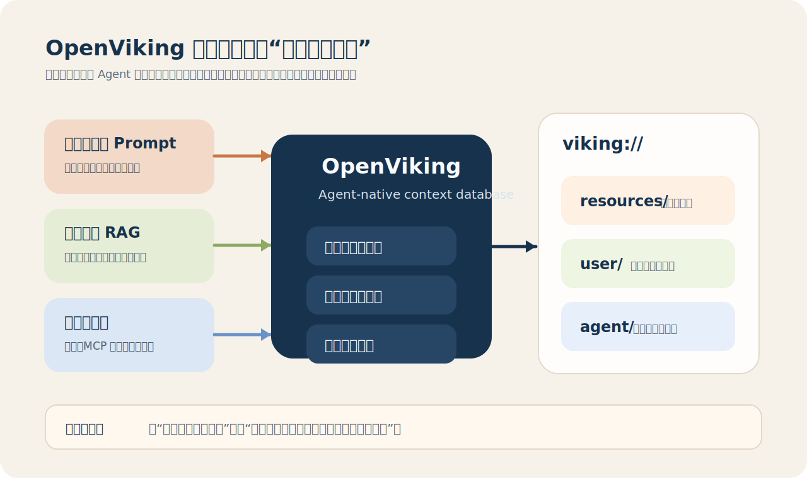
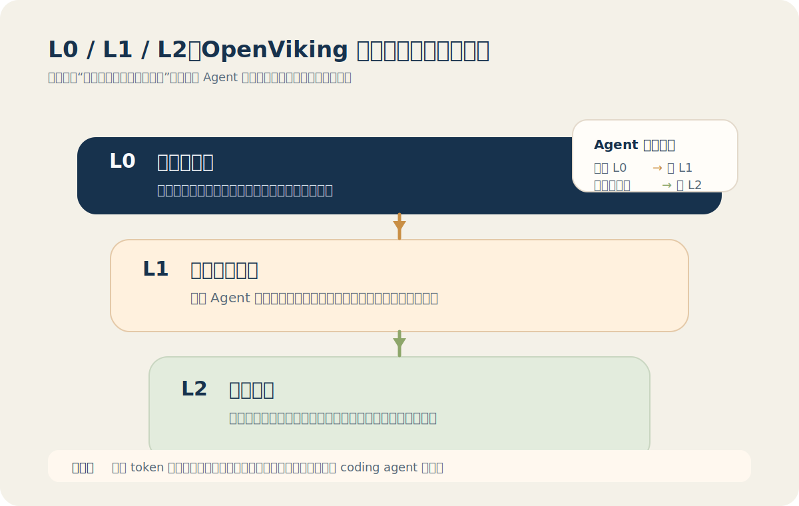
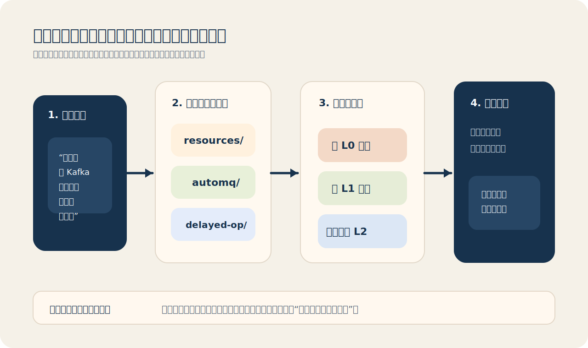
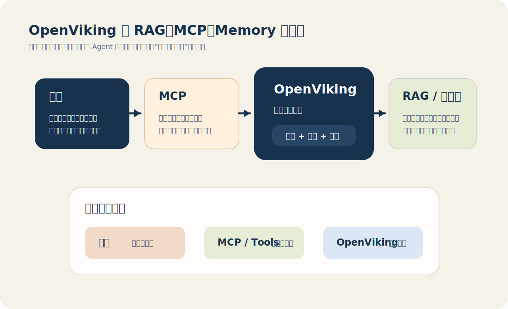
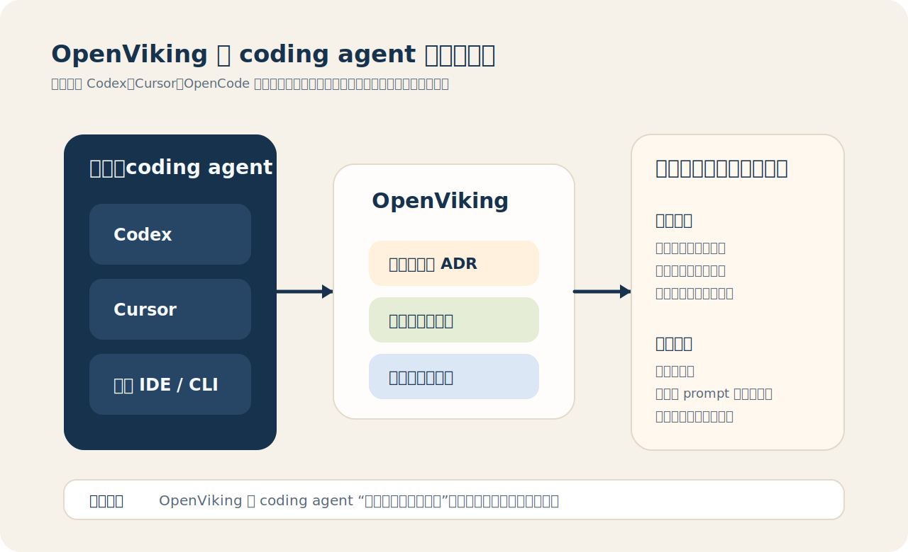

# OpenViking 学习与介绍：给 AI Agent 一套可生长的上下文系统

如果你最近在关注 AI Agent、coding agent、memory system 或者 context
engineering，大概率会碰到一个问题：模型本身越来越强，但 Agent 在长任务、
多轮协作、跨项目复用里的“记性”依然不够稳定。

Prompt 可以写得更好，RAG 可以堆得更深，向量库也可以召回更多切片，但这些手
段并没有真正解决一个更底层的问题：

- 上下文是碎的；
- 上下文是黑箱的；
- 上下文很难随着任务持续生长。

OpenViking 想解决的就是这件事。

它不是一个新模型，也不是一个 IDE 插件。从官方定位看，它是一个面向 AI
Agent 的开源上下文数据库。更具体一点，它想把 Agent 需要的 `memory`、
`resources`、`skills`，从分散的文件、向量库、工具配置里抽出来，统一放进一
个类似文件系统的上下文空间里管理。

截至 `2026年3月17日`，OpenViking 在 PyPI 上的最新版本是 `0.2.6`，发布于
`2026年3月11日`。如果你只想先抓住一句话理解它，我会这样概括：

> OpenViking 不是在替 Agent 多塞一点资料，而是在给 Agent 建一套更像“脑
> 内文件系统”的上下文基础设施。



## 一、OpenViking 到底是什么

OpenViking 官方给自己的定位很清楚：`The Context Database for AI Agents`。
PyPI 上的描述更短，叫 `An Agent-native context database`。这两个说法合起
来，其实已经把它和传统的“知识库”区分开了。

传统知识库更关心的是“怎么把文本存进去”和“怎么把相似片段搜出来”。而
OpenViking 更关心的是：

- Agent 的上下文到底有哪些类型；
- 这些类型之间怎么组织；
- 检索为什么命中；
- 会话结束后哪些东西应该沉淀成长期记忆。

所以它不是把向量数据库重新包装一遍，而是试图给 Agent 的上下文层做一次更高
抽象的统一。

在它的设计里，上下文不再只是一个个切片，而是一个虚拟文件系统。官方使用
`viking://` 这样的 URI 来表示上下文位置。你可以把它理解成：Agent 面前不只
有“搜一段文本”的能力，而是多了“定位目录、浏览结构、递归下钻、读取摘要、
按需读全文”这整套操作方式。

## 二、它为什么会出现

OpenViking README 里把 Agent 开发里最典型的五类问题列得很直白。我按更工程化
的方式重述一下。

### 1. 上下文碎片化

很多 Agent 项目都会把不同类型的信息分别塞进不同系统里：

- 用户偏好在聊天历史里；
- 项目文档在仓库或网页里；
- 技能说明在 prompt 或工具配置里；
- 经验记忆散落在日志、总结和历史任务里。

这样做的问题不是“存不下”，而是 Agent 很难把这些东西当成一个统一的上下文
空间来使用。

### 2. 长任务会不断生产新上下文

Agent 和普通对话模型的差别之一，是它经常会执行长链路任务。每跑一次任务，
它都可能产生：

- 新的工具调用经验；
- 新的用户偏好判断；
- 新的知识索引；
- 新的失败案例和修复经验。

如果只是简单截断，信息会丢；如果只是压缩，很多结构关系也会丢。

### 3. 扁平 RAG 很难表达“信息在什么上下文里”

很多 RAG 系统的检索目标是找最相似的片段，但 Agent 很多时候需要的不只是“哪
一句最像”，而是“这段内容属于哪个模块、这个模块在什么目录下、我还要不要继
续往下读”。

也就是说，Agent 真正需要的不只是相似度，还需要结构感。

### 4. 检索过程往往不可观察

你在传统 RAG 里经常能看到结果，却很难看见路径。召回错了，到底是 embedding
不行、索引策略有问题、还是切片本身就切坏了，排查并不轻松。

对于需要稳定演进的 Agent 系统来说，这是一类非常实际的维护成本。

### 5. Memory 不该只是一段聊天记录

很多所谓“长期记忆”最后只是把对话存起来。OpenViking 的思路更接近：

- 用户要有用户记忆；
- Agent 要有任务经验记忆；
- 资源要有资源目录；
- 技能要有技能上下文。

这意味着它在谈的不是“聊天记录持久化”，而是“Agent 上下文系统化”。

## 三、OpenViking 的核心设计，强在什么地方

我觉得 OpenViking 最值得学的，不是某个 API，而是它把上下文问题拆成了五个
非常明确的机制。

### 1. 文件系统范式：先把上下文组织起来

这是 OpenViking 最核心的设计。它不再把上下文看成扁平文本，而是统一映射到
一个虚拟文件系统里。

一个简化后的理解可以长这样：

```text
viking://
├── resources/      # 项目文档、网页、代码仓库、数据资料
├── user/           # 用户偏好、写作习惯、工作方式
└── agent/          # 技能、指令、任务经验、执行记忆
```

这套设计的意义不在“长得像文件树”，而在于它让 Agent 的上下文操作从“模糊语
义匹配”变成了“可定位、可浏览、可递归探索”的结构化行为。

### 2. L0 / L1 / L2 三层上下文：先看摘要，再决定要不要深读

OpenViking 写入上下文后，会把内容处理成三层：

- `L0`：一句话摘要，用来快速判断相关性；
- `L1`：概览层，用来帮助 Agent 做规划和决策；
- `L2`：完整细节，只有真的需要时才读取。

这个设计非常适合 coding agent，因为写代码时真正稀缺的往往不是信息量，而是
模型上下文窗口和检索噪声控制。

如果你把一整个仓库文档直接塞进 prompt，模型大概率会“知道很多，但抓不住重
点”。而先读 `L0/L1`，再决定是否钻进 `L2`，更像一个有层次的技术调研流程。



### 3. 目录递归检索：不是只找句子，而是先找位置

OpenViking 官方把它叫做 `Directory Recursive Retrieval Strategy`。简单说，
它不是一上来就在全局里捞最终文本，而是：

1. 先根据意图做初始定位；
2. 找到高分目录；
3. 再在那个目录里继续细化检索；
4. 如果还有子目录，再继续递归下钻；
5. 最后返回最相关的上下文。

这个思路很像人类查资料。你不是直接在全世界的所有段落里找答案，而是先找到
正确的书架，再找到正确的章节，最后才翻到正确的那一页。



### 4. 可观察检索轨迹：知道它为什么找到了这里

这是我非常看重的一点。很多所谓 memory 或 knowledge layer 的短板，不在“取
不到”，而在“取错了之后你不知道怎么修”。

OpenViking 会保留目录浏览和文件定位的轨迹。这意味着你不只是拿到结果，还能
看到它是怎么一步步走到这个结果的。对于调优上下文系统来说，这种可观察性是
非常关键的。

### 5. 会话后记忆提炼：让上下文随着任务迭代

官方在 README 里明确提到，它有会话结束后的记忆提炼机制，会把任务执行结果、
用户反馈、工具使用经验等内容提取后写回 `user` 和 `agent` 相关目录。

这件事的价值在于：Agent 的成长不再只依赖人工维护文档，而是能在实际任务里
持续积累可复用经验。

当然，这种“自动变聪明”并不意味着完全不用治理。你依然需要控制记忆质量、避
免污染和错误沉淀。但至少在架构方向上，OpenViking 把这件事当成一等公民来设
计了。

## 四、它和 RAG、向量数据库、MCP、Memory 的关系

如果不把边界讲清楚，OpenViking 很容易被误解成“又一个 RAG 项目”。我自己的
理解是下面这样。

### 它不是在替代模型

OpenViking 不会直接提升模型的推理上限，也不会让模型凭空更会写代码。模型强
不强，仍然取决于你用的是什么模型。

它提升的是另一个维度：让模型在需要上下文时，更稳定地取到正确的东西。

### 它也不是“只有向量召回”的数据库

从官方描述看，它并没有抛弃 embedding 和语义检索，而是把这件事放进了一个更
有结构的检索框架里。换句话说，它不是反对向量检索，而是不满足于“只有向量检
索”。

### 它不是 MCP，但很适合和 MCP 搭配

MCP 解决的是“模型怎么接外部工具和数据源”的问题。OpenViking 解决的是“外部
上下文到底如何组织、检索和沉淀”的问题。

所以二者的关系更像：

- MCP 是接入协议；
- OpenViking 是上下文后端。

如果你的 IDE、CLI 或 agent 平台支持 MCP，那么把 OpenViking 的能力封装成
MCP server 或 MCP tool，会是一条很自然的工程路线。

### 它谈的 memory，比聊天历史更广

很多产品说 memory，本质上是“把聊天存起来”。OpenViking 的 memory 观念更广：

- 用户记忆；
- Agent 经验记忆；
- 资源上下文；
- 技能和指令上下文。

这也是它更像“上下文数据库”而不是“会话记忆插件”的原因。



## 五、它能增强 Codex 或 Cursor 吗

这一节我不想写成“当然可以”的营销句式。我给结论，也给边界。

### 先说结论

能增强，但增强的是“上下文层”，不是“模型能力层”。

更具体地说，如果你在 `Codex`、`Cursor`、OpenCode 这类 coding agent 里最常
遇到的问题是：

- 同一个项目规则每次都要重新解释；
- 项目文档很多，但 agent 老是拿错；
- 任务做完了，经验没有沉淀成长期资产；
- 多轮协作后，之前的重要上下文开始漂移；

那么 OpenViking 是有实际价值的。

### 它可能增强什么

如果把它用作 coding assistant 的长期上下文后端，它比较可能帮到你这些事：

- 管理项目文档、ADR、接口说明和历史决策；
- 记住你的编码习惯、提交偏好和常用修复方式；
- 在大仓库里先读摘要层，再按需读深层文档；
- 把任务执行经验沉淀为后续协作可复用的记忆。

### 它不能替代什么

它不能替代：

- 强模型本身；
- 清晰的工程约束；
- 高质量 prompt；
- 良好的工具链设计；
- 可靠的测试和验证流程。

也就是说，它更像是在给 coding agent 做“记忆和检索基础设施”，不是给模型打
一个智力补丁。

### 对 Codex 和 Cursor 的接入判断

截至 `2026年3月17日`，我在 OpenViking 官方仓库里明确看到的现成集成例子是
`OpenClaw` 和 `OpenCode` 的 memory plugin，没有看到官方的 Cursor 或 Codex
专用插件示例。

这里的工程判断是，不是 OpenViking 官方宣称：

- 如果你的工具支持 MCP 或自定义外部工具，理论上可以把 OpenViking 接进去；
- 但这更像一次集成工程，而不是现成的一键开关。

这也是为什么我会把它定义成“增强上下文系统”，而不是“直接增强 IDE”。



## 六、如果你想上手，最值得先学什么

OpenViking 的价值不在“先装起来”，而在“先理解它到底想替换什么思路”。如果你
现在就想学，我建议按这个顺序来。

### 1. 先理解它的文件系统视角

不要急着把它当数据库用。先理解为什么它要把上下文抽象成 `viking://` 这样的
目录结构。只要这一点想明白了，你就会发现它真正想替代的是“扁平切片思维”。

### 2. 再理解三层上下文

`L0/L1/L2` 是 OpenViking 很关键的一层设计。它决定了 Agent 不是一上来就吞全
量上下文，而是先做轻量判断，再做深读。

这对做 coding agent 特别重要，因为代码和文档天生就有层级结构。

### 3. 然后看它的检索路径设计

目录递归检索是它和很多普通 RAG 方案差异最大的地方之一。你可以重点思考一个
问题：

> 你当前的 agent，是在“找最像的句子”，还是在“找到正确的位置后再理解整块上
> 下文”？

如果答案一直是前者，那 OpenViking 的设计就值得你认真看。

### 4. 最后再决定要不要接进 coding workflow

如果你的项目很小、文档不多、上下文也不跨会话，那你未必需要它。

但如果你做的是：

- 长周期项目；
- 多仓库协作；
- 文档和规范很多的工程；
- 需要记忆沉淀的 coding agent；

那 OpenViking 的价值会明显上升。

## 七、我的判断：它值不值得学

我对 OpenViking 的总体判断是：值得学，而且不是因为它“又是一个热门开源项
目”，而是因为它试图回答一个越来越关键的问题：

> 当模型能力继续上涨之后，Agent 的长期上下文到底该怎么设计，才能既省 token，
> 又可观察，还能持续迭代。

这件事不是单靠 prompt 能解决的，也不是单靠向量数据库能解决的。OpenViking
给出的答案未必已经是最终形态，但它至少把问题重新表述对了。

如果你是普通用户，它能让你更清楚地理解“为什么 agent 老忘事”。如果你是做
agent 基础设施、IDE 增强、coding workflow 的工程师，它更值得你关注，因为它
触达的是一个真正偏底层的设计层。

对我来说，OpenViking 最有启发的地方不只是产品本身，而是它在提醒我们：

- Agent 的上下文不该只是 prompt 附件；
- Memory 不该只是聊天记录；
- 检索不该只是黑箱召回；
- 长期协作一定需要结构化的上下文治理。

如果你正准备给自己的 coding assistant 补一层长期记忆，这个项目很值得作为
研究样本认真拆一遍。

## 八、快速试用入口

如果你想先跑起来，再决定值不值得深入，可以先按官方 README 的最小路径试用：

```bash
pip install openviking --upgrade --force-reinstall

ov add-resource https://github.com/volcengine/OpenViking
ov ls viking://resources/
ov tree viking://resources/volcengine -L 2
ov find "what is openviking"
```

官方还给了 `VikingBot` 的快速入口，以及 `OpenClaw`、`OpenCode` 的 plugin
示例。对学习者来说，这些例子比只看概念更有帮助，因为你能直接看到它如何作
为一个外部上下文层被 Agent 消费。

## 参考资料

- [OpenViking GitHub 仓库](https://github.com/volcengine/OpenViking)
- [OpenViking 官方网站](https://www.openviking.ai/)
- [OpenViking PyPI](https://pypi.org/project/openviking/)
- [OpenClaw Memory Plugin 示例](https://github.com/volcengine/OpenViking/blob/main/examples/openclaw-memory-plugin/README.md)
- [OpenCode Memory Plugin 示例](https://github.com/volcengine/OpenViking/blob/main/examples/opencode-memory-plugin/README.md)
