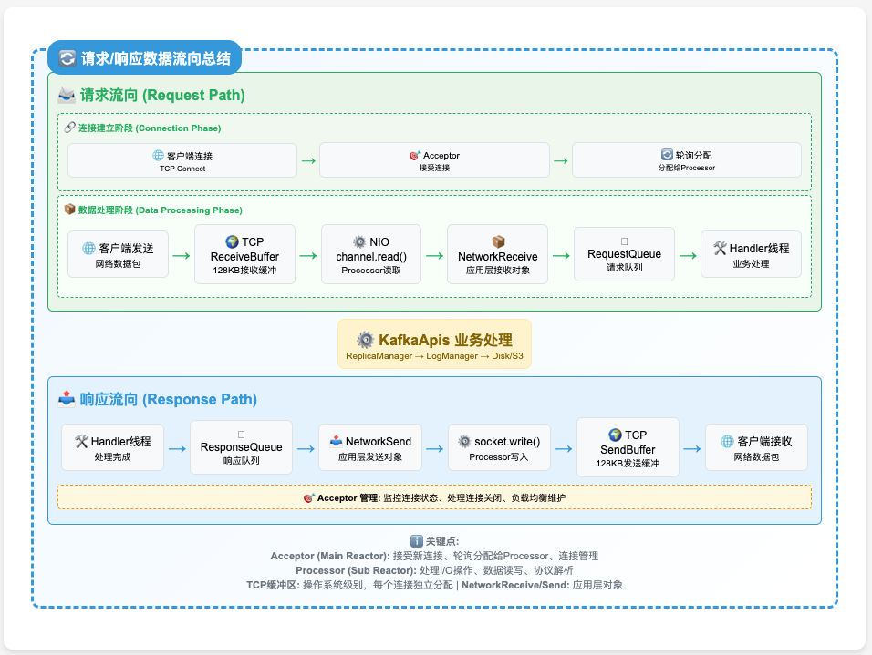

## 1. 概述：四层架构与设计理念

### 1.1 整体架构
AutoMQ SocketServer 采用分层解耦的 Reactor 模式，通过四层架构实现高并发网络处理：





### 1.2 核心设计理念
- **层次化解耦**：连接接受 → I/O处理 → 请求缓冲 → 业务处理，各层职责单一
- **非阻塞并发**：基于 NIO Selector 的事件驱动 + 多线程并行处理
- **多级背压**：连接配额 → I/O流控 → 队列大小 → 内存控制，全链路保护
- **双平面隔离**：数据平面与控制平面分离，避免相互影响

## 2. SocketServer初始化全流程

### 2.1 构造阶段：依赖注入与核心对象创建

```scala
// 位置：core/src/main/scala/kafka/network/SocketServer.scala:76
class SocketServer(
  val config: KafkaConfig,              // 全局配置
  val metrics: Metrics,                 // 指标收集系统
  val time: Time,                       // 时间服务
  val credentialProvider: CredentialProvider, // 认证提供者
  val apiVersionManager: ApiVersionManager    // API版本管理
) {
  // 核心运行时对象
  val connectionQuotas = new ConnectionQuotas(config, time, metrics)
  private val memoryPool = new SimpleMemoryPool(...)
  val dataPlaneRequestChannel = new RequestChannel(...)
  val controlPlaneRequestChannelOpt = Option(new RequestChannel(...))
}
```

**创建的关键对象**：
1. **ConnectionQuotas**：管理连接配额（IP级、监听器级、全局级限制）
2. **MemoryPool**：统一内存管理，减少 GC 压力
3. **RequestChannel**：网络线程与业务线程之间的缓冲队列
   - AutoMQ 扩展：多队列架构 + 内存大小信号量

### 2.2 Acceptor创建：为每个EndPoint构建监听器

```scala
// 数据平面：为 listeners 配置中的每个 EndPoint 创建 DataPlaneAcceptor
config.dataPlaneListeners.foreach { endPoint =>
  val acceptor = new DataPlaneAcceptor(
    socketServer = this,
    endPoint = endPoint,                    // host:port + securityProtocol
    config = config,
    nodeId = nodeId,
    connectionQuotas = connectionQuotas,
    requestChannel = dataPlaneRequestChannel,
    // ... 其他依赖
  )
  
  // 为每个 Acceptor 预创建 N 个 Processor（数量 = num.network.threads）
  acceptor.addProcessors(config.numNetworkThreads)
  
  dataPlaneAcceptors.put(endPoint, acceptor)
}

// 控制平面（可选）：创建专用的 ControlPlaneAcceptor
config.controlPlaneListener.foreach { endPoint =>
  controlPlaneAcceptorOpt = Some(new ControlPlaneAcceptor(...))
  controlPlaneAcceptorOpt.get.addProcessors(1)  // 只有1个Processor
}
```

**设计要点**：
- **EndPoint 隔离**：每个监听端点独立的 Acceptor，避免端口间干扰
- **Processor 预创建**：构造时创建，但尚未启动线程
- **双平面分离**：数据流量与控制流量使用不同的处理器

## 3. 第一层：Acceptor监听与连接分发

### 3.1 角色定位：网络入口的"守门员"

Acceptor 是整个网络栈的第一层，职责非常明确：
- **监听端口**：绑定 ServerSocketChannel，等待客户端连接
- **配额检查**：验证 IP 和监听器级别的连接数限制
- **优雅分发**：将新连接按 Round-Robin 分配给 Processor 池

### 3.2 核心数据结构

```scala
// 位置：core/src/main/scala/kafka/network/SocketServer.scala:569
abstract class Acceptor(...) extends Runnable with Logging {
  private val nioSelector = NSelector.open()            // NIO 选择器
  private var serverChannel: ServerSocketChannel = _   // 服务器通道
  private val processors = ArrayBuffer[Processor]()     // 管理的 Processor 池
  private var currentProcessorIndex = 0                 // Round-Robin 索引
  private val throttledSockets = PriorityQueue[DelayedCloseSocket]()  // 节流连接队列
}

// 两种具体实现
class DataPlaneAcceptor extends Acceptor with ListenerReconfigurable  // 支持动态重配
class ControlPlaneAcceptor extends Acceptor                          // 静态版本
```

### 3.3 启动过程：从构造到监听

```scala
def start(): Unit = synchronized {
  try {
    // 1. 打开并配置 ServerSocketChannel
    if (serverChannel == null) {
      serverChannel = openServerSocket(endPoint.host, endPoint.port, listenBacklogSize)
    }
    
    // 2. 启动所有管理的 Processor 线程
    processors.foreach(_.start())
    
    // 3. 启动 Acceptor 自身的线程
    thread.start()
    
    startedFuture.complete(null)
  } catch {
    case e: Throwable => 
      error(s"Unable to start acceptor for ${endPoint.listenerName}", e)
      startedFuture.completeExceptionally(e)
  }
}

private def openServerSocket(host: String, port: Int, backlog: Int): ServerSocketChannel = {
  val serverChannel = ServerSocketChannel.open()
  serverChannel.configureBlocking(false)  // 关键：非阻塞模式
  
  // 优化 TCP 参数
  if (recvBufferSize != Selectable.USE_DEFAULT_BUFFER_SIZE)
    serverChannel.socket().setReceiveBufferSize(recvBufferSize)  // socket.receive.buffer.bytes
  
  val address = if (Utils.isBlank(host)) new InetSocketAddress(port)
                else new InetSocketAddress(host, port)
  serverChannel.socket.bind(address, backlog)  // socket.listen.backlog.size
  
  info(s"Awaiting socket connections on ${address}")
  serverChannel
}
```

#### 3.3.1 TCP 参数优化详解（recv buffer/backlog/非阻塞）

- 非阻塞模式（configureBlocking(false)）
  - 作用：使 accept/read 写操作不会阻塞线程，配合 Selector 实现单线程管理大量连接的事件驱动模型。
  - 好处：高并发下避免线程被系统调用挂起，提升 CPU 利用率与可伸缩性。

- 接收缓冲区（setReceiveBufferSize）
  - 作用：设定内核为该监听 socket 接收队列分配的缓冲大小（影响每个新建连接默认继承的接收缓冲初值，具体连接也可在 accept 后单独调优）。
  - 场景收益：
    - 高带宽/高时延链路（BDP 大）：更大的接收窗口减少因窗口受限引发的流控，提升吞吐。
    - 大报文/批量场景：单次 read 能得到更大数据块，降低系统调用频率与用户态/内核态切换开销。
  - 注意事项：
    - 实际生效值可能被系统 sysctl 上限约束（如 Mac/Linux 上的 net.core.rmem_max）。
    - 过大缓冲可能增加内存占用并延迟背压触发，需要结合 RequestChannel 的内存信号量一起考虑。

- 监听队列深度（bind(address, backlog) 的 backlog）
  - 作用：控制内核半连接/全连接队列的长度上限，突发连接时减少 SYN flood 之外的合法连接被拒绝的概率。
  - 场景收益：
    - 启动/重平衡/流量峰值时，来连接集中涌入不至于被立即拒绝。
  - 注意事项：
    - 实际可用队列长度也受系统参数影响（如 somaxconn）。

  **TCP 连接建立过程与队列原理**：
  
  TCP 三次握手完成后，服务器端维护两个队列：
  
  ```
  客户端                    服务器
    |                        |
    |------ SYN ----------->|  (1) 客户端发起连接请求
    |                        |  (2) 服务器收到 SYN，放入半连接队列
    |<----- SYN+ACK --------|  (3) 服务器回复 SYN+ACK
    |                        |
    |------ ACK ----------->|  (4) 客户端回复 ACK
    |                        |  (5) 服务器收到 ACK，连接移到全连接队列
    |                        |
    |                        |  (6) 应用程序调用 accept() 从全连接队列取走连接
  ```
  
  **两个关键队列**：
  - **半连接队列**（SYN 队列）：存储收到 SYN 但还没收到最后 ACK 的连接
  - **全连接队列**（Accept 队列）：存储已经完成三次握手，但应用程序还没调用 `accept()` 取走的连接
  
  **backlog 参数主要控制全连接队列的大小**
  
  **实际场景举例**：
  
  1. **Kafka 服务启动时**：
     ```
     大量客户端同时尝试连接
     → 三次握手完成的连接进入全连接队列排队
     → Acceptor 线程循环调用 accept() 取走连接
     → 如果 backlog 太小，后来的连接被拒绝
     ```
  
  2. **生产环境突发流量**：
     ```
     正常时：backlog=50 够用
     流量激增：200个客户端同时连接
     → 前50个进入队列等待处理
     → 后150个被拒绝连接
     ```
  
  **调优指南**：
  
  - **什么时候需要增大 backlog**：
    - 服务重启时：大量客户端重连
    - 负载均衡切换时：流量突然涌入
    - 容器扩容时：新实例承接流量
  
  - **如何判断 backlog 不够**：
    ```bash
    # Linux 查看连接队列状态
    ss -lnt | grep :9092
    
    # 查看连接被丢弃的统计
    netstat -s | grep -i listen
    ```
  
  - **系统限制**：
    ```bash
    # Linux 系统级别的限制
    cat /proc/sys/net/core/somaxconn  # 通常是128
    
    # 实际生效值 = min(应用设置的backlog, somaxconn)
    ```
  
  - **配置示例**：
    ```properties
    # Kafka 配置文件中
    socket.listen.backlog.size=128  # 设置监听队列深度
    
    # 如果经常看到连接被拒绝，可以适当增大
    socket.listen.backlog.size=256
    ```

### 3.4 主事件循环：接受连接与分发

```scala
// Acceptor 线程的主循环
override def run(): Unit = {
  // 注册 ServerSocketChannel 到 Selector，监听 OP_ACCEPT 事件
  serverChannel.register(nioSelector, SelectionKey.OP_ACCEPT)
  
  try {
    while (shouldRun.get()) {
      try {
        acceptNewConnections()      // 接受新连接
        closeThrottledConnections() // 关闭到期的节流连接
      } catch {
        case e: ControlThrowable => throw e
        case e: Throwable => error("Error occurred", e)
      }
    }
  } finally {
    closeAll()
  }
}
```

### 3.5 连接接受：配额检查与优雅分发

```scala
private def acceptNewConnections(): Unit = {
  val ready = nioSelector.select(500)  // 500ms 超时
  if (ready > 0) {
    val keys = nioSelector.selectedKeys().iterator()
    
    while (keys.hasNext && shouldRun.get()) {
      try {
        val key = keys.next()
        keys.remove()
        
        if (key.isAcceptable) {
          accept(key).foreach { socketChannel =>
            // Round-Robin 分配给 Processor
            var retriesLeft = synchronized(processors.length)
            var processor: Processor = null
            
            do {
              retriesLeft -= 1
              processor = synchronized {
                currentProcessorIndex = currentProcessorIndex % processors.length
                processors(currentProcessorIndex)
              }
              currentProcessorIndex += 1
            } while (!assignNewConnection(socketChannel, processor, retriesLeft == 0))
          }
        }
      } catch {
        case e: Throwable => error("Error while accepting connection", e)
      }
    }
  }
}

private def accept(key: SelectionKey): Option[SocketChannel] = {
  val serverSocketChannel = key.channel().asInstanceOf[ServerSocketChannel]
  val socketChannel = serverSocketChannel.accept()
  
  try {
    // 关键：连接配额检查
    connectionQuotas.inc(endPoint.listenerName, socketChannel.socket.getInetAddress, blockedPercentMeter)
    
    // 配置新连接的 TCP 参数
    configureAcceptedSocketChannel(socketChannel)
    Some(socketChannel)
    
  } catch {
    case e: TooManyConnectionsException =>  // max.connections.per.ip
      info(s"Rejected connection from ${e.ip}, max connections ${e.count} exceeded")
      connectionQuotas.closeChannel(this, endPoint.listenerName, socketChannel)
      None
      
    case e: ConnectionThrottledException =>  // max.connections.per.ip.overrides
      // 连接被节流，加入延迟关闭队列
      val endTime = e.startThrottleTimeMs + e.throttleTimeMs
      throttledSockets += DelayedCloseSocket(socketChannel, endTime)
      None
      
    case e: IOException =>
      error("Error configuring connection", e)
      connectionQuotas.closeChannel(this, endPoint.listenerName, socketChannel)
      None
  }
}

protected def configureAcceptedSocketChannel(socketChannel: SocketChannel): Unit = {
  socketChannel.configureBlocking(false)        // 非阻塞模式
  socketChannel.socket().setTcpNoDelay(true)    // 禁用 Nagle 算法
  socketChannel.socket().setKeepAlive(true)     // 启用 TCP KeepAlive
  
  if (sendBufferSize != Selectable.USE_DEFAULT_BUFFER_SIZE)
    socketChannel.socket().setSendBufferSize(sendBufferSize)  // socket.send.buffer.bytes
}
```

### 3.5.1 连接配额检查：多层级限流机制详觢

连接配额检查是 SocketServer 的关键保护机制，实现了**多层级的连接配额控制系统**：

```scala
def inc(listenerName: ListenerName, address: InetAddress, acceptorBlockedPercentMeter: com.yammer.metrics.core.Meter): Unit = {
  counts.synchronized {
    // 第一层：监听器级别的连接槽位控制
    waitForConnectionSlot(listenerName, acceptorBlockedPercentMeter)  // max.connections

    // 第二层：IP级别的连接频率控制
    recordIpConnectionMaybeThrottle(listenerName, address)  // connection.creation.rate.limit

    // 第三层：AutoMQ扩展 - Broker级别的全局控制
    // AutoMQ inject start
    // Record and check broker level quota
    recordIpConnectionMaybeThrottle(listenerName, wildcardIPAddress)  // 全局频率限制
    // AutoMQ inject end

    // 第四层：连接计数更新
    val count = counts.getOrElseUpdate(address, 0)  // 获取当前IP连接数
    counts.put(address, count + 1)                  // IP连接数+1
    totalCount += 1                                 // 总连接数+1
    if (listenerCounts.contains(listenerName)) {
      listenerCounts.put(listenerName, listenerCounts(listenerName) + 1)  // 监听器连接数+1
    }
    
    // 第五层：IP连接数上限检查
    val max = maxConnectionsPerIpOverrides.getOrElse(address, defaultMaxConnectionsPerIp)
    if (count >= max)
      throw new TooManyConnectionsException(address, max)  // max.connections.per.ip
  }
}
```

**多层限流机制详解**：

#### 第一层：监听器级别的连接槽位控制
```scala
waitForConnectionSlot(listenerName, acceptorBlockedPercentMeter)
```
- **作用**：确保当前监听器还有可用的连接槽位
- **行为**：如果监听器的连接数已达上限，这个方法会**阻塞**当前线程
- **指标**：同时记录 Acceptor 被阻塞的时间百分比到指标中
- **配置**：`max.connections`（监听器级别限制）

#### 第二层：IP级别的连接频率控制
```scala
recordIpConnectionMaybeThrottle(listenerName, address)
```
- **作用**：检查特定IP的连接频率，防止连接洪水攻击
- **行为**：如果某个IP连接过于频繁，会抛出 `ConnectionThrottledException`
- **效果**：被节流的连接会被延迟关闭（加入 `throttledSockets` 队列）
- **配置**：`connection.creation.rate.limit`、`connection.creation.rate.window.ms`

#### 第三层：AutoMQ扩展 - Broker级别的全局控制
```scala
// AutoMQ inject start
recordIpConnectionMaybeThrottle(listenerName, wildcardIPAddress)
// AutoMQ inject end
```
- **AutoMQ的创新**：`wildcardIPAddress` 是一个通配IP地址（通常是 `0.0.0.0`）
- **作用**：实现了**整个 Broker 级别**的连接频率控制
- **优务**：即使攻击者使用多个IP，也无法绕过全局频率限制
- **设计思想**：提供更强的系统保护能力

#### 第四层：连接计数更新
```scala
val count = counts.getOrElseUpdate(address, 0)
counts.put(address, count + 1)                  // IP连接数
totalCount += 1                                 // 全局总连接数
listenerCounts.put(listenerName, ...)           // 监听器连接数
```
- **作用**：维护三个层面的计数
- **统计维度**：
  - `counts`：每个IP的连接数
  - `totalCount`：全局总连接数  
  - `listenerCounts`：每个监听器的连接数

#### 第五层：IP连接数上限检查
```scala
val max = maxConnectionsPerIpOverrides.getOrElse(address, defaultMaxConnectionsPerIp)
if (count >= max)
  throw new TooManyConnectionsException(address, max)
```
- **作用**：最后的守卫，检查IP连接数上限
- **特殊配置**：支持为特定IP设置不同的连接数限制
- **行为**：超过限制时立即抛出异常，连接被拒绝
- **配置**：`max.connections.per.ip`、`max.connections.per.ip.overrides`

**完整的限流层次图**：

```
┌─────────────────────────────────────────┐
│1. 监听器级槽位控制 (max.connections)       │
│   waitForConnectionSlot()               │
│   - 监听器连接数上限                       │
│   - 会阻塞线程等待槽位                     │
└─────────────────────────────────────────┘
                        ↓
┌─────────────────────────────────────────┐
│2. IP级连接频率控制 (rate.limit)           │
│   recordIpConnectionMaybeThrottle()     │
│   - 单IP连接频率限制                      │
│   - 抛出 ConnectionThrottledException    │
└─────────────────────────────────────────┘
                        ↓
┌─────────────────────────────────────────┐
│3. Broker级全局频率控制 (AutoMQ)            │
│   recordIpConnectionMaybeThrottle(*)    │
│   - 整个Broker连接频率限制                 │
│   - 防止整体过载                          │
└─────────────────────────────────────────┘
                        ↓
┌─────────────────────────────────────────┐
│4. 连接计数更新                            │
│   counts, totalCount, listenerCounts    │
│   - 维护多维度连接统计                     │
└─────────────────────────────────────────┘
                        ↓
┌─────────────────────────────────────────┐
│5. IP连接数上限检查 (per.ip)               │
│   TooManyConnectionsException           │
│   - 最终的IP连接数守护                    │
└─────────────────────────────────────────┘
```

**不同的限流响应机制**：

1. **阻塞等待**：`waitForConnectionSlot`（监听器槽位不足）
2. **延迟关闭**：`ConnectionThrottledException`（频率过高）
3. **立即拒绝**：`TooManyConnectionsException`（数量超限）

**对应的配置参数**：

```properties
# 监听器连接数限制
max.connections=2147483647

# IP级连接数限制  
max.connections.per.ip=1000                    # 默认单IP连接数上限
max.connections.per.ip.overrides=127.0.0.1:2000  # 特定IP的连接数覆盖

# 连接频率控制
connection.creation.rate.limit=100            # 每秒最大新连接数
connection.creation.rate.window.ms=60000      # 频率统计窗口
```

这个多层级的设计确保了 Kafka/AutoMQ 在面对各种类型的连接攻击时都能保持稳定运行。

### 3.6 Round-Robin 负载均衡策略

```scala
private def assignNewConnection(socketChannel: SocketChannel, processor: Processor, mayBlock: Boolean): Boolean = {
  if (processor.accept(socketChannel, mayBlock, blockedPercentMeter)) {
    debug(s"Accepted connection from ${socketChannel.socket.getRemoteSocketAddress} " +
          s"assigned to processor ${processor.id}")
    true
  } else {
    false  // Processor 的 newConnections 队列已满，尝试下一个
  }
}
```

**负载均衡机制**：
1. 维护 `currentProcessorIndex` 轮询索引
2. 依次尝试每个 Processor 的 `accept()` 方法
3. 如果某个 Processor 队列满，则尝试下一个
4. 最后一个 Processor 可能会阻塞等待（`mayBlock = true`）

#### 3.6.1 Processor.accept 方法详解：连接队列入队策略

`Processor.accept` 是连接分发的关键方法，实现了从 Acceptor 到 Processor 的连接交接：

```scala
/**
 * Queue up a new connection for reading
 */
def accept(socketChannel: SocketChannel,
           mayBlock: Boolean,                             // 是否允许阻塞等待
           acceptorIdlePercentMeter: com.yammer.metrics.core.Meter): Boolean = {
  
  val accepted = {
    // 第一步：尝试非阻塞入队
    if (newConnections.offer(socketChannel))             // 尝试立即放入队列
      true
    else if (mayBlock) {
      // 第二步：如果允许阻塞，则阻塞等待队列有空位
      val startNs = time.nanoseconds
      newConnections.put(socketChannel)                  // 阻塞式放入队列（等待空位）
      acceptorIdlePercentMeter.mark(time.nanoseconds() - startNs)  // 记录阻塞时间
      true
    } else
      // 第三步：不允许阻塞且队列已满，拒绝连接
      false
  }
  
  // 成功接受后唤醒 Processor 线程处理
  if (accepted)
    wakeup()                                           // 唤醒 Processor 的 selector
  accepted
}
```

**方法参数解释**：

- **`socketChannel`**：已经通过配额检查且配置好的客户端连接
- **`mayBlock`**：是否允许在队列满时阻塞等待
  - Round-Robin 轮询中，只有最后一个 Processor 才传入 `true`
  - 其他 Processor 都传入 `false`，即不阻塞尝试
- **`acceptorIdlePercentMeter`**：用于统计 Acceptor 被阻塞时间的指标

**相关配置参数**：

```properties
# 每个 Processor 的新连接队列大小
queued.max.connections=20              # 对应 connectionQueueSize

# Processor 线程数量（影响负载均衡效果）
num.network.threads=8                 # 更多 Processor 意味着更好的负载分散
```

## 4. 第二层：Processor事件循环与I/O处理

### 4.1 角色定位：I/O多路复用的"工作马"

每个 Processor 都是一个独立的 Reactor，负责：
- **连接管理**：维护分配给它的所有客户端连接
- **I/O 多路复用**：使用独立的 Selector 处理读写事件
- **协议解析**：解析请求头，构建 Request 对象
- **流量控制**：实现 mute/unmute 机制，防止过载

### 4.2 核心数据结构

```scala
// 位置：core/src/main/scala/kafka/network/SocketServer.scala:907
class Processor(
  val id: Int,                          // Processor 唯一ID
  requestChannel: RequestChannel,       // 请求通道
  connectionQuotas: ConnectionQuotas,   // 连接配额
  selector: KSelector,                  // Kafka 封装的 NIO Selector
  // ...
) extends Runnable with Logging {
  
  // 新连接队列（来自 Acceptor 的分发）
  private val newConnections = new ArrayBlockingQueue[SocketChannel](connectionQueueSize)  // queued.max.connections
  
  // 待发送响应队列（来自业务线程的响应）
  private val responseQueue = new LinkedBlockingDeque[RequestChannel.Response]()
  
  // 飞行中的响应（已发送但未收到确认）
  private val inflightResponses = new ConcurrentHashMap[Send, RequestChannel.Response]()
  
  // AutoMQ 扩展：每个连接的上下文信息
  private val channelContexts = new ConcurrentHashMap[String, ChannelContext]()
}
```

### 4.3 Processor 主事件循环

```scala
override def run(): Unit = {
  try {
    while (shouldRun.get()) {
      try {
        // 1. 处理来自 Acceptor 的新连接
        configureNewConnections()
        
        // 2. 处理来自业务线程的响应
        processNewResponses()
        
        // 3. NIO 事件轮询（核心）
        poll()
        
        // 4. 处理读取完成的请求
        processCompletedReceives()
        
        // 5. 处理发送完成的响应
        processCompletedSends()
        
        // 6. 处理连接断开
        processDisconnected()
        
        // 7. 关闭超量连接
        closeExcessConnections()
        
      } catch {
        case e: Throwable => processException("Processor got uncaught exception.", e)
      }
    }
  } finally {
    closeAll()
  }
}
```

### 4.4 新连接配置：从队列到Selector

```scala
private def configureNewConnections(): Unit = {
  var connectionsProcessed = 0
  while (connectionsProcessed < connectionQueueSize && !newConnections.isEmpty) {
    val channel = newConnections.poll()
    try {
      debug(s"Processor $id listening to new connection from ${channel.socket.getRemoteSocketAddress}")
      
      // 为连接生成唯一 ID：localAddr:localPort-remoteAddr:remotePort-index
      val connectionId = connectionId(channel.socket)
      
      // 注册到 NIO Selector，开始监听读事件（注意：只注册读事件，不注册写事件）
      selector.register(connectionId, channel)
      connectionsProcessed += 1
      
    } catch {
      case e: Throwable =>
        val remoteAddress = channel.socket.getRemoteSocketAddress
        connectionQuotas.closeChannel(this, listenerName, channel)
        processException(s"Processor $id closed connection from $remoteAddress", e)
    }
  }
}
```

#### 4.4.1 selector.register() 方法深度解析

**重要**：`selector.register(connectionId, channel)` **只注册读事件**，而不是同时注册读写事件。

##### Selector.register() 方法的具体实现

```java
// 位置：clients/src/main/java/org/apache/kafka/common/network/Selector.java:325
public void register(String id, SocketChannel socketChannel) throws IOException {
    ensureNotRegistered(id);  // 确保连接ID未被注册
    
    // 关键：只注册 OP_READ 事件，不注册 OP_WRITE
    registerChannel(id, socketChannel, SelectionKey.OP_READ);
    
    this.sensors.connectionCreated.record();  // 记录连接创建指标
    
    // 注册空的客户端信息（ApiVersionsRequest 不是强制的）
    ChannelMetadataRegistry metadataRegistry = this.channel(id).channelMetadataRegistry();
    if (metadataRegistry.clientInformation() == null)
        metadataRegistry.registerClientInformation(ClientInformation.EMPTY);
}

// 底层注册方法
protected SelectionKey registerChannel(String id, SocketChannel socketChannel, int interestedOps) throws IOException {
    // 调用 Java NIO 的注册方法，这里 interestedOps = SelectionKey.OP_READ
    SelectionKey key = socketChannel.register(nioSelector, interestedOps);
    
    // 创建并附加 KafkaChannel 到 SelectionKey
    KafkaChannel channel = buildAndAttachKafkaChannel(socketChannel, id, key);
    this.channels.put(id, channel);  // 加入连接管理
    
    if (idleExpiryManager != null)
        idleExpiryManager.update(channel.id(), time.nanoseconds());
    return key;
}
```

##### 为什么只注册读事件？

**1. 按需注册的设计哲学**：
- **读事件**：连接建立后立即需要监听，随时准备接收客户端请求
- **写事件**：只在有数据需要发送时才注册，避免不必要的事件触发

**2. 写事件的动态注册机制**：

写事件是在需要发送数据时动态注册的：

```java
// 当有响应需要发送时，KafkaChannel.setSend() 会动态注册写事件
public void setSend(NetworkSend send) {
    if (this.send != null) {
        // 当前正在发送其他数据，将新请求加入等待队列
        this.waitingSend.add(send);
        return;
    }
    
    // 设置当前要发送的数据
    this.send = send;
    
    // 关键：动态注册 OP_WRITE 事件
    this.transportLayer.addInterestOps(SelectionKey.OP_WRITE);
}

// 发送完成后移除写事件监听
public NetworkSend maybeCompleteSend() {
    if (send != null && send.completed()) {
        send.release();
        midWrite = false;
        
        // 关键：移除 OP_WRITE 事件监听
        transportLayer.removeInterestOps(SelectionKey.OP_WRITE);
        
        NetworkSend result = send;
        send = null;
        trySendWaitingSend();  // 尝试发送等待队列中的数据
        return result;
    }
    return null;
}
```

**3. 这种设计的优势**：

- **事件效率**：避免不必要的写事件触发，减少 CPU 开销
- **动态响应**：根据实际需求动态调整监听事件
- **资源优化**：大多数时间连接是空闲的，只需要监听读事件

##### 事件注册的完整生命周期

```
连接建立阶段：
├─ Acceptor.accept() - 接受连接
├─ Processor.configureNewConnections()
├─ selector.register(id, channel)  
└─ 注册 OP_READ 事件 ✓

数据发送阶段：
├─ 业务线程调用 sendResponse()
├─ selector.send(networkSend)
├─ channel.setSend(send)
├─ transportLayer.addInterestOps(OP_WRITE)
└─ 动态注册 OP_WRITE 事件 ✓

发送完成阶段：
├─ selector.poll() 检测到 OP_WRITE 就绪
├─ channel.write() 进行实际发送
├─ channel.maybeCompleteSend() 检查完成状态
├─ transportLayer.removeInterestOps(OP_WRITE)
└─ 移除 OP_WRITE 事件 ✓
```

##### 对比其他实现方式

**如果同时注册读写事件会怎样？**

```java
// 假设的不良实现
registerChannel(id, socketChannel, SelectionKey.OP_READ | SelectionKey.OP_WRITE);
```

**问题**：
1. **无效唤醒**：大部分时间没有数据要写，但写事件会持续触发
2. **CPU 浪费**：每次 poll() 都会检查不需要的写事件
3. **复杂判断**：需要在事件处理中额外判断是否真的有数据要写

**Kafka 的按需注册设计更加高效和优雅**：
- 只在需要时注册事件
- 事件触发即代表有实际工作要做
- 减少无效的系统调用和CPU开销

### 4.5 NIO轮询：I/O事件检测

```scala
private def poll(): Unit = {
  val pollTimeout = if (newConnections.isEmpty) 300 else 0
  try {
    selector.poll(pollTimeout)  // Kafka 封装的 NIO Selector
  } catch {
    case e @ (_: IllegalStateException | _: IOException) =>
      error(s"Processor $id poll failed", e)
  }
}
```

**轮询策略**：
- 有新连接待处理时，使用零超时（立即返回）
- 无新连接时，使用 300ms 超时，避免忙等

#### 4.5.1 Selector.poll() 深度解析：NIO 事件轮询的主控制器

`selector.poll()` 是整个 NIO 事件循环的主控制器，负责协调不同类型的 I/O 事件处理。

##### Selector.poll() 方法完整流程

```java path=/Users/voriyajasir/code/automq/clients/src/main/java/org/apache/kafka/common/network/Selector.java start=461
public void poll(long timeout) throws IOException {
    if (timeout < 0)
        throw new IllegalArgumentException("timeout should be >= 0");

    // ① 初始化阶段：清理上次结果并准备新一轮处理
    boolean madeReadProgressLastCall = madeReadProgressLastPoll;
    clear();  // 清空 completedSends, completedReceives, connected, disconnected 等集合

    boolean dataInBuffers = !keysWithBufferedRead.isEmpty();  // 检查 SSL 缓冲数据

    // ② 动态超时调整：有紧急任务时使用零超时
    if (!immediatelyConnectedKeys.isEmpty() ||              // 有立即连接的 socket
        (madeReadProgressLastCall && dataInBuffers)) {      // 上次有进展且有缓冲数据
        timeout = 0;  // 设置为零超时，立即处理
    }

    // ③ 内存恢复处理：从内存压力中恢复后 unmute 被静默的通道
    if (!memoryPool.isOutOfMemory() && outOfMemory) {
        log.trace("Broker no longer low on memory - unmuting incoming sockets");
        for (KafkaChannel channel : channels.values()) {
            if (channel.isInMutableState() && !explicitlyMutedChannels.contains(channel)) {
                channel.maybeUnmute();  // 恢复被内存压力静默的通道
            }
        }
        outOfMemory = false;
    }

    // ④ NIO 事件检测阶段：调用底层 NIO Selector
    long startSelect = time.nanoseconds();
    int numReadyKeys = select(timeout);  // 调用 Java NIO Selector.select()
    long endSelect = time.nanoseconds();
    this.sensors.selectTime.record(endSelect - startSelect, time.milliseconds(), false);

    // ⑤ 事件分发阶段：根据事件类型分别处理
    if (numReadyKeys > 0 || !immediatelyConnectedKeys.isEmpty() || dataInBuffers) {
        Set<SelectionKey> readyKeys = this.nioSelector.selectedKeys();

        // 第一次调用：处理 SSL 缓冲数据（避免重复处理）
        if (dataInBuffers) {
            keysWithBufferedRead.removeAll(readyKeys);  // 移除与 readyKeys 重复的部分
            Set<SelectionKey> toPoll = keysWithBufferedRead;
            keysWithBufferedRead = new HashSet<>();    // 重新初始化，由 poll() 调用重新填充
            pollSelectionKeys(toPoll, false, endSelect);  // 处理缓冲数据
        }

        // 第二次调用：处理常规 NIO 事件（读/写/连接）
        pollSelectionKeys(readyKeys, false, endSelect);
        readyKeys.clear();  // 清空已选中的键，下次 select 时不被计入

        // 第三次调用：处理立即连接（本地连接等特殊场景）
        pollSelectionKeys(immediatelyConnectedKeys, true, endSelect);
        immediatelyConnectedKeys.clear();
    } else {
        madeReadProgressLastPoll = true;  // 无事件也算“进展”
    }

    // ⑥ 收尾阶段：记录指标和清理工作
    long endIo = time.nanoseconds();
    this.sensors.ioTime.record(endIo - endSelect, time.milliseconds(), false);

    completeDelayedChannelClose(endIo);      // 关闭延迟关闭的通道
    maybeCloseOldestConnection(endSelect);   // 关闭最旧的连接（防止连接泄漏）
}
```

##### poll() 方法的核心设计理念

**1. 分层事件处理策略**

`poll()` 方法通过**三次**调用 `pollSelectionKeys` 来处理不同类型的事件：

```java
// 1. SSL 缓冲数据事件（最高优先级）
pollSelectionKeys(keysWithBufferedRead, false, endSelect);

// 2. NIO Selector 就绪事件（正常优先级）  
pollSelectionKeys(readyKeys, false, endSelect);

// 3. 立即连接事件（特殊优先级）
pollSelectionKeys(immediatelyConnectedKeys, true, endSelect);
```

**为什么这样设计？**

- **SSL 缓冲优先**：对于 SSL 连接，解密后的数据可能留在应用层缓冲区，即使 socket 不可读也需要处理
- **常规事件处理**：处理 NIO Selector 检测到的正常 I/O 事件
- **立即连接处理**：处理本地连接等无需 NIO 检测的特殊情况

**2. 动态超时调整机制**

```java
// 智能超时调整逻辑
if (!immediatelyConnectedKeys.isEmpty() || (madeReadProgressLastCall && dataInBuffers)) {
    timeout = 0;  // 设置为零超时
}
```

**设计目的**：
- **响应性优化**：有紧急任务时不等待，立即处理
- **数据连续性**：上次有进展且有缓冲数据时，继续处理以保证数据完整性

#### 4.5.2 pollSelectionKeys() 深度解析：NIO 事件处理的核心引擎

`pollSelectionKeys` 方法是处理已经就绪的 I/O 事件的核心方法。它在 NIO Selector 的基础上，实现了对多个网络连接的非阻塞 I/O 操作。

##### pollSelectionKeys 方法完整代码结构

```java path=/Users/voriyajasir/code/automq/clients/src/main/java/org/apache/kafka/common/network/Selector.java start=530
void pollSelectionKeys(Set<SelectionKey> selectionKeys,
                       boolean isImmediatelyConnected,
                       long currentTimeNanos) {
    // ① 确定处理顺序，内存不足时随机打乱防止连接饥饿
    for (SelectionKey key : determineHandlingOrder(selectionKeys)) {
        KafkaChannel channel = channel(key);  // 获取对应的 Kafka 通道
        long channelStartTimeNanos = recordTimePerConnection ? time.nanoseconds() : 0;
        boolean sendFailed = false;
        String nodeId = channel.id();

        // ② 性能监控和空闲连接管理
        sensors.maybeRegisterConnectionMetrics(nodeId);  // 注册连接的性能指标
        if (idleExpiryManager != null)
            idleExpiryManager.update(nodeId, currentTimeNanos);  // 更新空闲连接管理

        try {
            // ③ 连接建立处理：完成 TCP 三次握手
            if (isImmediatelyConnected || key.isConnectable()) {
                if (channel.finishConnect()) {  // 完成连接建立
                    this.connected.add(nodeId);  // 添加到已连接列表
                    this.sensors.connectionCreated.record();  // 记录连接创建指标

                    // 记录 socket 缓冲区配置信息
                    SocketChannel socketChannel = (SocketChannel) key.channel();
                    log.debug("Created socket with SO_RCVBUF = {}, SO_SNDBUF = {}, SO_TIMEOUT = {} to node {}",
                            socketChannel.socket().getReceiveBufferSize(),
                            socketChannel.socket().getSendBufferSize(),
                            socketChannel.socket().getSoTimeout(),
                            nodeId);
                } else {
                    continue;  // 连接未完成，跳过后续处理
                }
            }

            // ④ 通道准备阶段：SSL 握手和 SASL 认证
            if (channel.isConnected() && !channel.ready()) {
                channel.prepare();  // 进行 SSL 握手和 SASL 认证
                if (channel.ready()) {
                    long readyTimeMs = time.milliseconds();
                    boolean isReauthentication = channel.successfulAuthentications() > 1;
                    
                    // 区分首次认证和重认证，记录不同的指标
                    if (isReauthentication) {
                        sensors.successfulReauthentication.record(1.0, readyTimeMs);
                        if (channel.reauthenticationLatencyMs() == null)
                            log.warn("Should never happen: re-authentication latency for a re-authenticated channel was null; continuing...");
                        else
                            sensors.reauthenticationLatency.record(channel.reauthenticationLatencyMs().doubleValue(), readyTimeMs);
                    } else {
                        sensors.successfulAuthentication.record(1.0, readyTimeMs);
                        if (!channel.connectedClientSupportsReauthentication())
                            sensors.successfulAuthenticationNoReauth.record(1.0, readyTimeMs);
                    }
                    log.debug("Successfully {}authenticated with {}", isReauthentication ? "re-" : "", channel.socketDescription());
                }
            }
            
            // ⑤ 更新通道状态
            if (channel.ready() && channel.state() == ChannelState.NOT_CONNECTED)
                channel.state(ChannelState.READY);
                
            // ⑥ 处理重认证期间收到的响应
            Optional<NetworkReceive> responseReceivedDuringReauthentication = channel.pollResponseReceivedDuringReauthentication();
            responseReceivedDuringReauthentication.ifPresent(receive -> {
                long currentTimeMs = time.milliseconds();
                addToCompletedReceives(channel, receive, currentTimeMs);
            });

            // ⑦ 数据读取处理：检查多个条件确保可以读取
            if (channel.ready() &&                                    // 通道已就绪
                (key.isReadable() || channel.hasBytesBuffered()) &&   // socket 有数据或缓冲区有数据
                !hasCompletedReceive(channel) &&                      // 没有未处理的完整请求（保证顺序）
                !explicitlyMutedChannels.contains(channel)) {          // 通道未被静默
                attemptRead(channel);  // 尝试读取数据
            }

            // ⑧ 缓冲数据管理：处理 SSL 等场景下的中间缓冲数据
            if (channel.hasBytesBuffered() && !explicitlyMutedChannels.contains(channel)) {
                // 这些数据可能因为内存不足暂时无法处理，需要在下次轮询时继续处理
                keysWithBufferedRead.add(key);
            }

            // ⑨ 数据写入处理：向有空间的 socket 写入数据
            long nowNanos = channelStartTimeNanos != 0 ? channelStartTimeNanos : currentTimeNanos;
            try {
                attemptWrite(key, channel, nowNanos);
            } catch (Exception e) {
                sendFailed = true;  // 标记发送失败，影响关闭模式
                throw e;
            }

            // ⑩ 清理无效的 socket
            if (!key.isValid())
                close(channel, CloseMode.GRACEFUL);

        } catch (Exception e) {
            // ⑪ 异常分类处理
            String desc = String.format("%s (channelId=%s)", channel.socketDescription(), channel.id());
            if (e instanceof IOException) {
                log.debug("Connection with {} disconnected", desc, e);
            } else if (e instanceof AuthenticationException) {
                boolean isReauthentication = channel.successfulAuthentications() > 0;
                if (isReauthentication)
                    sensors.failedReauthentication.record();
                else
                    sensors.failedAuthentication.record();
                String exceptionMessage = e.getMessage();
                if (e instanceof DelayedResponseAuthenticationException)
                    exceptionMessage = e.getCause().getMessage();
                log.info("Failed {}authentication with {} ({})", isReauthentication ? "re-" : "", desc, exceptionMessage);
            } else {
                log.warn("Unexpected error from {}; closing connection", desc, e);
            }

            // 关闭连接时是否延迟（认证失败时可能延迟关闭）
            if (e instanceof DelayedResponseAuthenticationException)
                maybeDelayCloseOnAuthenticationFailure(channel);
            else
                close(channel, sendFailed ? CloseMode.NOTIFY_ONLY : CloseMode.GRACEFUL);
        } finally {
            // ⑫ 性能统计：记录每个连接的处理时间
            maybeRecordTimePerConnection(channel, channelStartTimeNanos);
        }
    }
}
```

### 4.5.3 数据读取方法链详解

在 `pollSelectionKeys()` 方法中，当检测到连接有读事件就绪时，会调用 `attemptRead(channel)` 开始数据读取流程。这个过程涉及三个核心方法的协同工作，形成了完整的数据读取链条。

#### Processor事件循环中的读取条件检查

在进入实际的读取方法链之前，`pollSelectionKeys()` 会先进行严格的条件检查：

```java path=/Users/voriyajasir/code/automq/clients/src/main/java/org/apache/kafka/common/network/Selector.java start=911
// ⑦ 数据读取处理：检查多个条件确保可以读取
if (channel.ready() &&                                    // 通道已就绪
    (key.isReadable() || channel.hasBytesBuffered()) &&   // socket 有数据或缓冲区有数据
    !hasCompletedReceive(channel) &&                      // 没有未处理的完整请求（保证顺序）
    !explicitlyMutedChannels.contains(channel)) {          // 通道未被静默
    attemptRead(channel);  // 尝试读取数据
}
```

**条件检查的设计考虑**：

1. **`channel.ready()`**: 确保连接已完成握手和认证
2. **`key.isReadable() || channel.hasBytesBuffered()`**: 
   - NIO socket 有新数据到达
   - 或通道内部缓冲区有之前解密但未处理的数据（SSL场景）
3. **`!hasCompletedReceive(channel)`**: 防止同一连接的请求乱序处理
4. **`!explicitlyMutedChannels.contains(channel)`**: 跳过被手动静默的通道

#### 数据读取三层方法链

数据读取过程通过三个核心方法实现分层职责分离：

##### 第一层：Selector.attemptRead() - 读取协调器

```java path=/Users/voriyajasir/code/automq/clients/src/main/java/org/apache/kafka/common/network/Selector.java start=692
private void attemptRead(KafkaChannel channel) throws IOException {
    String nodeId = channel.id();

    // 委托给 KafkaChannel 进行实际读取
    long bytesReceived = channel.read();
    
    if (bytesReceived != 0) {
        long currentTimeMs = time.milliseconds();
        sensors.recordBytesReceived(nodeId, bytesReceived, currentTimeMs);  // 记录性能指标
        madeReadProgressLastPoll = true;  // 标记本次轮询取得了进展

        // 检查是否完成了一个完整的网络请求
        NetworkReceive receive = channel.maybeCompleteReceive();
        if (receive != null) {
            addToCompletedReceives(channel, receive, currentTimeMs);  // 添加到已完成列表
        }
    }
    
    // 内存管理：检查通道是否因内存压力被静默
    if (channel.isMuted()) {
        outOfMemory = true;  // 通道因内存压力自动静默
    } else {
        madeReadProgressLastPoll = true;  // 没有静默也算取得进展
    }
}
```

**第一层职责**：
- 协调整个读取操作的流程控制
- 管理性能监控指标（字节数统计、进度标记）
- 处理完整请求的检测和分发到 `completedReceives`
- 监控内存压力并更新全局状态

##### 第二层：KafkaChannel.read() - 通道读取管理器

```java path=/Users/voriyajasir/code/automq/clients/src/main/java/org/apache/kafka/common/network/KafkaChannel.java start=432
public long read() throws IOException {
    // 懒初始化 NetworkReceive 对象
    if (receive == null) {
        receive = new NetworkReceive(maxReceiveSize, id, memoryPool);
    }

    // 委托给 NetworkReceive 进行实际读取
    long bytesReceived = receive(this.receive);

    // 内存管理：如果知道所需内存但未分配成功，且通道可静默
    if (this.receive.requiredMemoryAmountKnown() && 
        !this.receive.memoryAllocated() && 
        isInMutableState()) {
        mute();  // 自动静默通道防止内存过度使用
    }
    return bytesReceived;
}

// 私有辅助方法：处理 SSL 认证异常
private long receive(NetworkReceive receive) throws IOException {
    try {
        return receive.readFrom(transportLayer);  // 委托给 NetworkReceive
    } catch (SslAuthenticationException e) {
        // TLSv1.3 后握手消息可能抛出 SSL 异常，作为认证失败处理
        String remoteDesc = remoteAddress != null ? remoteAddress.toString() : null;
        state = new ChannelState(ChannelState.State.AUTHENTICATION_FAILED, e, remoteDesc);
        throw e;
    }
}
```

**第二层职责**：
- 管理 `NetworkReceive` 对象的生命周期（懒初始化）
- 实现自适应内存管理和通道静默机制
- 处理 SSL/TLS 相关的认证异常
- 提供统一的读取接口给上层调用

##### 第三层：NetworkReceive.readFrom() - 协议数据解析器

```java path=/Users/voriyajasir/code/automq/clients/src/main/java/org/apache/kafka/common/network/NetworkReceive.java start=82
public long readFrom(ScatteringByteChannel channel) throws IOException {
    int read = 0;
    
    // 第一阶段：读取 4 字节的消息长度头
    if (size.hasRemaining()) {
        int bytesRead = channel.read(size);  // 读取到 size 缓冲区
        if (bytesRead < 0)
            throw new EOFException();  // 连接已关闭
        read += bytesRead;
        
        // 如果长度头读取完成，解析消息长度
        if (!size.hasRemaining()) {
            size.rewind();
            int receiveSize = size.getInt();  // 获取网络字节序的整数
            
            // 校验消息长度
            if (receiveSize < 0)
                throw new InvalidReceiveException("Invalid receive (size = " + receiveSize + ")");
            if (maxSize != UNLIMITED && receiveSize > maxSize)
                throw new InvalidReceiveException("Invalid receive (size = " + receiveSize + " larger than " + maxSize + ")");
            
            requestedBufferSize = receiveSize;  // 记录所需缓冲区大小
            if (receiveSize == 0) {
                buffer = EMPTY_BUFFER;  // 特殊情况：零长度消息（如 SASL）
            }
        }
    }
    
    // 第二阶段：尝试分配内存缓冲区
    if (buffer == null && requestedBufferSize != -1) {
        buffer = memoryPool.tryAllocate(requestedBufferSize);  // 从内存池分配
        if (buffer == null)
            log.trace("Broker low on memory - could not allocate buffer of size {} for source {}", 
                     requestedBufferSize, source);
    }
    
    // 第三阶段：读取实际消息内容
    if (buffer != null) {
        int bytesRead = channel.read(buffer);  // 读取数据到 payload 缓冲区
        if (bytesRead < 0)
            throw new EOFException();
        read += bytesRead;
    }

    return read;  // 返回本次读取的字节数
}
```

**第三层职责**：
- 实现 Kafka 协议的分段读取（4字节长度头 + 变长数据内容）
- 管理内存池分配和回收，支持内存压力下的延迟分配
- 处理连接异常和数据校验
- 适配 TCP 流式传输的特性（数据可能分批到达）

#### 读取流程的完整调用链

```
PollSelectionKeys() 条件检查
         ↓
    attemptRead(channel) - 协调层
         ↓
    channel.read() - 管理层  
         ↓
    receive.readFrom(transportLayer) - 解析层
         ↓
    分三阶段处理：
    ① 读取 4 字节长度头
    ② 从内存池分配缓冲区  
    ③ 读取消息内容到缓冲区
         ↓
    返回读取字节数 → 更新统计
         ↓
    检查是否完成完整消息
         ↓
    添加到 selector.completedReceives
```

#### 背压控制与通道静默机制

数据读取过程中实现了多层次的背压控制，防止内存耗尽和系统过载：

##### 1. 内存压力自动静默

```java path=/Users/voriyajasir/code/automq/clients/src/main/java/org/apache/kafka/common/network/KafkaChannel.java start=436
// 内存管理：如果知道所需内存但未分配成功，且通道可静默
if (this.receive.requiredMemoryAmountKnown() && 
    !this.receive.memoryAllocated() && 
    isInMutableState()) {
    mute();  // 自动静默通道防止内存过度使用
}
```

**触发条件**：
- 已知消息大小但内存池无法分配足够内存
- 通道处于可静默状态（`isInMutableState()`）

**影响**：通道被静默后不再参与下次 `poll()` 的读取操作

#### 缓冲数据处理：keysWithBufferedRead

在处理完读取操作后，还需要管理可能存在的缓冲数据：

```java path=/Users/voriyajasir/code/automq/clients/src/main/java/org/apache/kafka/common/network/Selector.java start=918
// ⑧ 缓冲数据管理：处理 SSL 等场景下的中间缓冲数据
if (channel.hasBytesBuffered() && !explicitlyMutedChannels.contains(channel)) {
    // 这些数据可能因为内存不足暂时无法处理，需要在下次轮询时继续处理
    keysWithBufferedRead.add(key);
}
```

**缓冲数据的来源**：加密数据解密后产生的额外数据

**处理优先级**：下次 `poll()` 调用时优先处理缓冲数据，确保数据完整性

### 4.6 请求处理：从字节流到Request对象

```scala
private def processCompletedReceives(): Unit = {
  selector.completedReceives.forEach { receive =>
    try {
      openOrClosingChannel(receive.source) match {
        case Some(channel) =>
          // 1. 解析请求头
          val header = parseRequestHeader(receive.payload)
          
          // 2. 安全检查
          if (!channel.serverAuthenticationSessionExpired(time.nanoseconds())) {
            val connectionId = receive.source
            
            // 3. 构建请求上下文
            val context = new RequestContext(
              header, connectionId, channel.socketAddress,
              Optional.of(channel.socketPort()), channel.principal,
              listenerName, securityProtocol, 
              channel.channelMetadataRegistry.clientInformation,
              isPrivilegedListener, channel.principalSerde
            )
            
            // 4. 构建完整的 Request 对象
            val req = new RequestChannel.Request(
              processor = id,
              context = context,
              startTimeNanos = time.nanoseconds,
              memoryPool = memoryPool,
              buffer = receive.payload,
              metrics = requestChannel.metrics,
              envelope = None
            )
            
            // AutoMQ 流水线控制
            val channelContext = channelContexts.computeIfAbsent(connectionId, 
              _ => new ChannelContext())
            channelContext.nextCorrelationId.add(req.context.correlationId())
            
            // 5. 发送到请求通道
            requestChannel.sendRequest(req)
            
            // AutoMQ 背压控制：超过阈值时 mute channel
            if (channelContext.nextCorrelationId.size() >= 64 && !channel.isMuted) {
              channelContext.markQueueFull()
              selector.mute(connectionId)
            }
          }
          
        case None =>
          throw new IllegalStateException(s"Channel ${receive.source} removed before processing")
      }
    } catch {
      case e: Throwable => processChannelException(receive.source, "Exception processing request", e)
    }
  }
  selector.clearCompletedReceives()
}
```

### 4.7 响应处理：从业务线程回到网络

```scala
private def processNewResponses(): Unit = {
  var currentResponse: RequestChannel.Response = null
  while ({currentResponse = dequeueResponse(); currentResponse != null}) {
    val channelId = currentResponse.request.context.connectionId
    try {
      currentResponse match {
        case response: NoOpResponse =>
          // 无需响应，但可能需要 unmute channel 继续读取
          updateRequestMetrics(response)
          // AutoMQ 智能 unmute 逻辑
          tryUnmuteChannel(channelId)
          
        case response: SendResponse =>
          // 发送数据响应
          sendResponse(response, response.responseSend)
```
          
#### sendResponse 方法详解：从业务响应到网络发送

`sendResponse` 是 Processor 将业务处理结果返回给客户端的关键方法。它将响应数据从业务线程转换为网络 I/O 操作。

```scala
// 位置：core/src/main/scala/kafka/network/SocketServer.scala:1120
protected[network] def sendResponse(response: RequestChannel.Response, responseSend: Send): Unit = {
  val connectionId = response.request.context.connectionId  // 获取原始请求的连接ID
  
  trace(s"Socket server received response to send to $connectionId, registering for write and sending data: $response")
  
  // 第一步：检查连接是否仍然存在
  if (channel(connectionId).isEmpty) {
    // 连接已关闭（远程关闭或空闲超时），无法发送响应
    warn(s"Attempting to send response via channel for which there is no open connection, connection id $connectionId")
    response.request.updateRequestMetrics(0L, response)  // 更新指标，记录失败
    return
  }
  
  // 第二步：检查连接是否仍然可用（包括正在关闭的连接）
  if (openOrClosingChannel(connectionId).isDefined) {
    // 将响应数据包装成 NetworkSend 对象
    val send = new NetworkSend(connectionId, responseSend)
    
    // 委托给 Selector 进行实际的网络发送
    selector.send(send)
    
    // 记录飞行中的响应（用于跟踪发送状态）
    inflightResponses.put(send, response)
  } else {
    // 连接已经不可用，释放响应数据的内存
    responseSend.release()
  }
}
```

**方法关键步骤分析**：

##### 1. NetworkSend 对象包装

```scala
val send = new NetworkSend(connectionId, responseSend)
```

**NetworkSend 的作用**：
- 将业务层的响应数据包装成网络层可以处理的格式
- 包含目标连接ID和实际的响应数据
- 实现了 Send 接口，支持分批发送和进度跟踪

##### 2. Selector.send() 委托：非阻塞队列化操作

```scala
selector.send(send)
```

**重要**：`selector.send(send)` **并不立即进行网络发送**，而是将发送任务加入队列并注册写事件。

**Selector.send() 的实际逻辑**：

```java
// 位置：clients/src/main/java/org/apache/kafka/common/network/Selector.java:406
public void send(NetworkSend send) {
    String connectionId = send.destinationId();
    KafkaChannel channel = openOrClosingChannelOrFail(connectionId);  // 获取目标通道
    
    if (closingChannels.containsKey(connectionId)) {
        // 连接正在关闭，标记为失败并释放内存
        this.failedSends.add(connectionId);
        send.release();
    } else {
        try {
            // 关键：委托给 KafkaChannel 处理
            channel.setSend(send);
        } catch (Exception e) {
            // 异常处理：标记状态并关闭连接
            channel.state(ChannelState.FAILED_SEND);
            this.failedSends.add(connectionId);
            close(channel, CloseMode.DISCARD_NO_NOTIFY);
            throw e;
        }
    }
}
```

##### 3. 飞行中响应跟踪

```scala
inflightResponses.put(send, response)
```

**inflightResponses 的作用**：
- 记录已发送但尚未确认完成的响应
- 在 `processCompletedSends()` 中用于匹配完成的发送操作
- 支持请求指标统计和回调处理

##### 5. 内存管理

```scala
// 连接不可用时释放内存
responseSend.release()
```

**内存释放的重要性**：
- 防止内存泄漏：如果连接已关闭，必须释放响应数据占用的内存
- 支持内存池管理：在 AutoMQ 的内存池架构中尤为重要

**与整个响应流程的关系**：

```
业务处理完成
       ↓
KafkaApis.sendResponse()
       ↓  
RequestChannel.sendResponse()
       ↓
Processor.enqueueResponse()      // 进入 Processor 的响应队列
       ↓
processNewResponses()            // Processor 主循环处理
       ↓
sendResponse()                   // 将响应委托给 Selector
       ↓
selector.send()                  // 注册 OP_WRITE 事件
       ↓  
selector.poll()                  // 检测可写事件
       ↓
NetworkSend.writeTo()            // 实际写入 SocketChannel
       ↓
processCompletedSends()          // 处理发送完成事件
```

**关键设计特点**：

1. **错误容错**：对已关闭连接的优雅处理
2. **异步发送**：不阻塞业务线程，委托给网络线程处理
3. **状态跟踪**：通过 inflightResponses 跟踪发送状态

```scala
        case response: CloseConnectionResponse =>
          // 关闭连接
          updateRequestMetrics(response)
          close(channelId)
          
        case _: StartThrottlingResponse =>
          // 开始限流：mute channel
          val channelContext = channelContexts.get(channelId)
          if (channelContext != null) {
            channelContext.markThrottle()
            selector.mute(channelId)
          }
          
        case _: EndThrottlingResponse =>
          // 结束限流：unmute channel
          val channelContext = channelContexts.get(channelId)
          val unmute = channelContext == null || channelContext.clearThrottle()
          if (unmute) {
            selector.unmute(channelId)
          }
      }
    } catch {
      case e: Throwable => processChannelException(channelId, s"Exception processing response for $channelId", e)
    }
  }
}
```

### 4.8 AutoMQ流水线优化

```scala
// AutoMQ 注入：智能 unmute 逻辑
private def tryUnmuteChannel(channelId: String): Unit = {
  val channelContext = channelContexts.get(channelId)
  openOrClosingChannel(channelId).foreach { channel =>
    if (channel.isMuted) {
      val unmute = if (channelContext == null) {
        true
      } else if (channelContext.nextCorrelationId.size() < 8 && channelContext.clearQueueFull()) {
        // 飞行中请求数 < 8 且队列未满，则 unmute
        trace(s"Unmute channel $channelId due to low inflight requests")
        true
      } else {
        false
      }
      
      if (unmute) {
        selector.unmute(channel.id)
      }
    }
  }
}
```

## 5. 第三层：RequestChannel请求通道与缓冲

### 5.1 角色定位：网络与业务的"桥梁"

RequestChannel 是 Processor 和 KafkaRequestHandler 之间的缓冲层：
- **解耦功能**：网络I/O线程与业务处理线程完全分离
- **缓冲功能**：平衡不同速率的生产者和消费者
- **路由功能**：将响应路由回对应的 Processor

### 5.2 传统架构vs AutoMQ扩展

```scala
class RequestChannel(
  val queueSize: Int,                    // 传统：队列最大请求数 (queued.max.requests)
  val queuedRequestSize: Int,            // AutoMQ：队列最大内存大小 (queued.max.request.size)
  val metricNamePrefix: String,
  time: Time,
  val metrics: RequestChannel.Metrics
) {
  
  // 传统单队列架构
  private val requestQueue = new ArrayBlockingQueue[BaseRequest](queueSize)  // queued.max.requests
  private val callbackQueue = new ArrayBlockingQueue[BaseRequest](queueSize)
  
  // AutoMQ 多队列架构
  private val multiRequestQueue = new ArrayList[ArrayBlockingQueue[BaseRequest]]()
  private val multiCallbackQueue = new ArrayList[ArrayBlockingQueue[BaseRequest]]()
  
  // AutoMQ 内存控制
  private val queuedRequestSizeSemaphore = new Semaphore(queuedRequestSize)  // queued.max.request.size
}
```

### 5.3 请求入队：从Processor到队列

```scala
def sendRequest(request: RequestChannel.Request): Unit = {
  if (multiRequestQueue.size() != 0) {
    // AutoMQ 多队列模式
    
    // 1. 申请内存许可（基于请求大小）
    val requestSize = Math.min(request.sizeInBytes, queuedRequestSize)
    queuedRequestSizeSemaphore.acquire(requestSize)
    
    // 2. 基于连接ID哈希选择队列（保证同连接请求有序）
    val queueIndex = math.abs(request.context.connectionId.hashCode % multiRequestQueue.size())
    val targetQueue = multiRequestQueue.get(queueIndex)
    
    // 3. 阻塞入队（队列满时等待）
    targetQueue.put(request)
  } else {
    // 传统单队列模式
    requestQueue.put(request)
  }
}
```

**AutoMQ 设计优势**：
- **多队列并行**：不同队列可被不同 Handler 并行处理，减少锁竞争
- **连接有序性**：同一连接的请求路由到同一队列，保证处理顺序
- **内存背压**：基于请求实际大小控制内存使用，而非简单计数

### 5.4 请求出队：从队列到Handler

```scala
def receiveRequest(timeout: Long, handlerId: Int): RequestChannel.BaseRequest = {
  val callbackQueue = multiCallbackQueue.get(handlerId)
  val requestQueue = multiRequestQueue.get(handlerId)
  
  // 1. 优先处理回调请求（异步操作的回调）
  val callbackRequest = callbackQueue.poll()
  if (callbackRequest != null)
    return callbackRequest
  
  // 2. 处理普通业务请求
  val request = requestQueue.poll(timeout, TimeUnit.MILLISECONDS)
  request match {
    case WakeupRequest => 
      // 唤醒请求：检查回调队列
      callbackQueue.poll()
      
    case request: Request =>
      // 释放内存许可
      val requestSize = Math.min(request.sizeInBytes, queuedRequestSize)
      queuedRequestSizeSemaphore.release(requestSize)
      request
      
    case _ => request
  }
}
```

**处理优先级**：
1. **回调请求优先**：确保异步操作（如事务验证）及时回调
2. **内存许可释放**：请求出队时立即释放对应内存许可
3. **超时控制**：避免 Handler 线程无限阻塞

### 5.5 响应路由：从Handler回到Processor

```scala
def sendResponse(response: RequestChannel.Response): Unit = {
  // 更新时间戳和指标
  response match {
    case _: SendResponse | _: NoOpResponse | _: CloseConnectionResponse =>
      val timeNanos = time.nanoseconds()
      response.request.responseCompleteTimeNanos = timeNanos
      if (response.request.apiLocalCompleteTimeNanos == -1L)
        response.request.apiLocalCompleteTimeNanos = timeNanos
  }
  
  // 路由到对应的 Processor
  val processor = processors.get(response.processor)
  if (processor != null) {
    processor.enqueueResponse(response)  // 进入 Processor 的响应队列
  }
}
```

## 6. 第四层：KafkaRequestHandler业务处理

### 6.1 角色定位：业务逻辑的"执行者"

KafkaRequestHandler 是最终的业务处理层：
- **请求消费**：从 RequestChannel 获取请求
- **业务路由**：根据 ApiKeys 路由到具体处理方法
- **响应生成**：处理完成后生成响应返回

### 6.2 Handler线程池管理

```scala
class KafkaRequestHandlerPool(
  val brokerId: Int,
  val requestChannel: RequestChannel,
  val apis: ApiRequestHandler,         // KafkaApis 实例
  time: Time,
  numThreads: Int,                     // Handler 线程数（num.io.threads）
  // ...
) {
  // 初始化多队列
  requestChannel.registerNRequestHandler(numThreads)
  
  // 创建并启动 Handler 线程
  for (i <- 0 until numThreads) {
    val handler = new KafkaRequestHandler(i, brokerId, aggregateIdleMeter, 
      threadPoolSize, requestChannel, apis, time)
    KafkaThread.daemon(s"kafka-request-handler-$i", handler).start()
  }
}
```

### 6.3 Handler主循环

```scala
// 位置：core/src/main/scala/kafka/server/KafkaRequestHandler.scala:108
def run(): Unit = {
  threadRequestChannel.set(requestChannel)
  while (!stopped) {
    val startSelectTime = time.nanoseconds
    
    // 从 RequestChannel 获取请求（可能阻塞）
    val req = requestChannel.receiveRequest(300, id)  // 300ms 超时
    val endTime = time.nanoseconds
    val idleTime = endTime - startSelectTime
    aggregateIdleMeter.mark(idleTime / totalHandlerThreads.get)
    
    req match {
      case RequestChannel.ShutdownRequest =>
        debug(s"Request handler $id received shutdown command")
        completeShutdown()
        return
        
      case callback: RequestChannel.CallbackRequest =>
        // 处理异步回调
        val originalRequest = callback.originalRequest
        try {
          if (originalRequest.callbackRequestDequeueTimeNanos.isDefined) {
            // 调整回调时间计算
            val prevCallbacksTimeNanos = originalRequest.callbackRequestCompleteTimeNanos.getOrElse(0L) - 
                                         originalRequest.callbackRequestDequeueTimeNanos.getOrElse(0L)
            originalRequest.callbackRequestCompleteTimeNanos = None
            originalRequest.callbackRequestDequeueTimeNanos = Some(time.nanoseconds() - prevCallbacksTimeNanos)
          } else {
            originalRequest.callbackRequestDequeueTimeNanos = Some(time.nanoseconds())
          }
          
          threadCurrentRequest.set(originalRequest)
          callback.fun(requestLocal)  // 执行回调函数
        } finally {
          apis.tryCompleteActions()
          if (originalRequest.callbackRequestCompleteTimeNanos.isEmpty)
            originalRequest.callbackRequestCompleteTimeNanos = Some(time.nanoseconds())
          threadCurrentRequest.remove()
        }
        
      case request: RequestChannel.Request =>
        // 处理普通业务请求
        try {
          request.requestDequeueTimeNanos = endTime
          threadCurrentRequest.set(request)
          
          // 调用 KafkaApis 进行业务处理
          apis.handle(request, requestLocal)
        } finally {
          threadCurrentRequest.remove()
          request.releaseBuffer()  // 释放请求缓冲区
        }
        
      case null => // 超时，继续下一轮循环
    }
  }
}
```

### 6.4 KafkaApis：请求路由与处理

```scala
// 位置：core/src/main/scala/kafka/server/KafkaApis.scala:190
override def handle(request: RequestChannel.Request, requestLocal: RequestLocal): Unit = {
  try {
    request.header.apiKey match {
      case ApiKeys.PRODUCE => handleProduceRequest(request, requestLocal)
      case ApiKeys.FETCH => handleFetchRequest(request)
      case ApiKeys.METADATA => handleTopicMetadataRequest(request)
      case ApiKeys.OFFSET_COMMIT => handleOffsetCommitRequest(request, requestLocal)
      case ApiKeys.OFFSET_FETCH => handleOffsetFetchRequest(request)
      // ... 其他 API 处理
      case _ => throw new IllegalStateException(s"No handler for request api key ${request.header.apiKey}")
    }
  } catch {
    case e: Throwable => requestHelper.handleError(request, e)
  }
}
```

## 7. 完整协作链路：从连接到响应

### 7.1 请求处理完整时序


### 7.2 关键交互点分析

#### 连接分发（Acceptor → Processor）
```scala
// Acceptor 使用 Round-Robin 确保负载均衡
do {
  retriesLeft -= 1
  processor = processors(currentProcessorIndex % processors.length)
  currentProcessorIndex += 1
} while (!assignNewConnection(socketChannel, processor, retriesLeft == 0))
```

#### 请求路由（Processor → RequestChannel）
```scala
// AutoMQ 基于连接ID哈希，保证同连接请求有序
val queueIndex = math.abs(request.context.connectionId.hashCode % multiRequestQueue.size())
val targetQueue = multiRequestQueue.get(queueIndex)
```

#### 响应路由（RequestChannel → Processor）
```scala
// 响应必须回到处理该请求的原始 Processor
val processor = processors.get(response.processor)  // response.processor = 处理请求的Processor ID
processor.enqueueResponse(response)
```

### 7.3 并发控制与同步

1. **Acceptor 层**：单线程处理，无并发问题
2. **Processor 层**：每个独立运行，通过队列与其他层通信
3. **RequestChannel 层**：使用阻塞队列和信号量保证线程安全
4. **Handler 层**：多线程并行，通过队列分离避免竞争

## 8. AutoMQ性能优化特性

### 8.1 多队列架构：减少锁竞争

**传统Kafka问题**：
- 所有请求进入单一队列，高并发时锁竞争严重
- Handler 线程在队列上串行化，吞吐量受限

**AutoMQ解决方案**：
```scala
// 初始化时为每个 Handler 创建独立队列
def registerNRequestHandler(count: Int): Unit = {
  val queueSize = math.max(this.queueSize / count, 1)
  for (_ <- 0 until count) {
    multiRequestQueue.add(new ArrayBlockingQueue[BaseRequest](queueSize))
    multiCallbackQueue.add(new ArrayBlockingQueue[BaseRequest](queueSize))
  }
}

// 请求路由：基于连接ID哈希保证有序性
val queueIndex = math.abs(connectionId.hashCode % multiRequestQueue.size())
```

**优势**：
- **并行处理**：不同队列可被不同 Handler 并行消费
- **有序保证**：同一连接的请求总是路由到同一队列
- **负载均衡**：哈希分布确保各队列负载相对均衡

### 8.2 请求流水线：连接级并发控制

**传统限制**：每个连接同时只能有一个请求在处理

**AutoMQ改进**：
```scala
case class ChannelContext() {
  val nextCorrelationId = new ConcurrentLinkedQueue[Int]()    // 飞行中请求队列
  
  def canAcceptMoreRequests: Boolean = nextCorrelationId.size() < 64  // 最多64个并发
}

// 请求处理时记录correlation ID
channelContext.nextCorrelationId.add(req.context.correlationId())

// 超过阈值时mute channel
if (channelContext.nextCorrelationId.size() >= 64 && !channel.isMuted) {
  selector.mute(connectionId)
}

// 响应处理完成时智能unmute
if (channelContext.nextCorrelationId.size() < 8 && channelContext.clearQueueFull()) {
  selector.unmute(channelId)
}
```

**优势**：
- **吞吐量提升**：单连接可以有多个请求并行处理
- **顺序保证**：通过correlation ID确保响应顺序
- **动态调节**：根据队列压力动态调整并发度

### 8.3 智能内存管理：大小感知的背压控制

**传统问题**：只按请求数量控制队列，不考虑请求大小差异

**AutoMQ改进**：
```scala
// 基于请求实际大小的信号量控制
private val queuedRequestSizeSemaphore = new Semaphore(queuedRequestSize)

// 入队时申请对应大小的许可
val requestSize = Math.min(request.sizeInBytes, queuedRequestSize)
queuedRequestSizeSemaphore.acquire(requestSize)

// 出队时释放许可
queuedRequestSizeSemaphore.release(requestSize)
```

**优势**：
- **精确控制**：按实际内存使用而非请求数量控制
- **防止OOM**：大请求无法无限制进入队列
- **公平调度**：小请求不会被大请求完全阻塞

## 9. 设计权衡与问题定位指南

### 9.1 设计权衡分析

#### AutoMQ优化的权衡
1. **多队列 vs 单队列**：
   - 优势：并行性提升，锁竞争减少
   - 代价：内存开销增加，实现复杂度上升
2. **流水线 vs 串行**：
   - 优势：单连接吞吐量大幅提升
   - 代价：需要更复杂的背压控制

### 9.2 常见问题定位指南

#### 连接建立问题
**症状**：客户端无法连接或连接被拒绝
**排查步骤**：
1. 检查 Acceptor 日志：端口绑定是否成功
2. 检查连接配额：`max.connections.per.ip`、监听器配额是否超限
3. 检查 throttledSockets：是否有连接被延迟关闭
4. 网络层面：防火墙、负载均衡器配置

#### I/O处理慢
**症状**：请求处理延迟高，但业务逻辑正常
**排查步骤**：
1. 检查 Processor 指标：`NetworkProcessorAvgIdlePercent`
2. 检查 mute/unmute 频率：是否频繁流控
3. 检查飞行中请求数：`nextCorrelationId.size()`
4. 检查 NIO Selector：是否有大量连接但活跃度低

#### 请求队列堵塞
**症状**：请求进入慢，Handler 空闲
**排查步骤**：
1. 检查队列深度：`RequestQueueSize` 指标
2. 检查内存信号量：`AvailableRequestSize` 剩余量
3. 检查 Handler 数量：`num.io.threads` 是否足够
4. 检查大请求：是否有异常大的请求占用过多内存

#### 业务处理慢
**症状**：Handler 忙碌，但响应慢
**排查步骤**：
1. 检查 Handler 线程数：是否需要增加 `num.io.threads`
2. 检查业务逻辑：特定 API 是否有性能问题
3. 检查回调处理：异步操作回调是否阻塞
4. 检查依赖服务：ZooKeeper、其他 broker 是否正常

### 9.3 关键监控指标

```scala
// 网络层指标
metricsGroup.newGauge("NetworkProcessorAvgIdlePercent", () => processorIdlePercent)
metricsGroup.newGauge("ExpiredConnectionsKilledCount", () => expiredConnectionsCount)

// 内存使用指标  
metricsGroup.newGauge("MemoryPoolAvailable", () => memoryPool.availableMemory)
metricsGroup.newGauge("MemoryPoolUsed", () => memoryPool.size() - memoryPool.availableMemory)

// 队列状态指标
metricsGroup.newGauge("RequestQueueSize", () => totalQueueSize)
metricsGroup.newGauge("AvailableRequestSize", () => queuedRequestSizeSemaphore.availablePermits())

// Handler 处理指标
val requestsPerSec = metricsGroup.newMeter("RequestsPerSec", "requests")
val requestQueueTimeHist = metricsGroup.newHistogram("RequestQueueTimeMs")
val responseQueueTimeHist = metricsGroup.newHistogram("ResponseQueueTimeMs")
```

#### 9.3.1 NetworkProcessorAvgIdlePercent 指标统计原理详解

`NetworkProcessorAvgIdlePercent` 是 SocketServer 性能监控的核心指标之一，它反映了网络处理器的空闲程度。让我们深入分析其统计原理：

**指标定义与计算逻辑**：

```scala
// 位置：core/src/main/scala/kafka/network/SocketServer.scala:123
metricsGroup.newGauge(s"${DataPlaneAcceptor.MetricPrefix}NetworkProcessorAvgIdlePercent", () => SocketServer.this.synchronized {
  val dataPlaneProcessors = dataPlaneAcceptors.asScala.values.flatMap(a => a.processors)
  val ioWaitRatioMetricNames = dataPlaneProcessors.map { p =>
    metrics.metricName("io-wait-ratio", MetricsGroup, p.metricTags)  // 每个 Processor 的 io-wait-ratio 指标
  }
  if (dataPlaneProcessors.isEmpty) {
    1.0  // 无 Processor 时返回 100% 空闲
  } else {
    ioWaitRatioMetricNames.map { metricName =>
      Option(metrics.metric(metricName)).fold(0.0)(m => Math.min(m.metricValue.asInstanceOf[Double], 1.0))
    }.sum / dataPlaneProcessors.size  // 所有 Processor 的 io-wait-ratio 平均值
  }
})
```

**底层 io-wait-ratio 指标的统计**：

每个 Processor 都有自己的 `io-wait-ratio` 指标，该指标在 Selector 中统计：

```java
// 位置：clients/src/main/java/org/apache/kafka/common/network/Selector.java:1250
// 在 SelectorMetrics 构造函数中创建 selectTime 传感器
this.selectTime = sensor("select-time:" + tagsSuffix);
// 记录 I/O 等待时间平均值
metricName = metrics.metricName("io-wait-time-ns-avg", metricGrpName, 
    "The average length of time the I/O thread spent waiting for a socket ready for reads or writes in nanoseconds.", metricTags);
this.selectTime.add(metricName, new Avg());
// 创建 io-wait-ratio 指标（时间比例）
this.selectTime.add(createIOThreadRatioMeter(metrics, metricGrpName, metricTags, "io-wait", "waiting"));
```

**createIOThreadRatioMeter 方法实现**：

```java
// 位置：clients/src/main/java/org/apache/kafka/common/network/Selector.java:1316
private Meter createIOThreadRatioMeter(Metrics metrics, String groupName, Map<String, String> metricTags,
                                      String baseName, String action) {
    MetricName rateMetricName = metrics.metricName(baseName + "-ratio", groupName,  // "io-wait-ratio"
        String.format("The fraction of time the I/O thread spent %s", action), metricTags);
    MetricName totalMetricName = metrics.metricName(baseName + "-time-ns-total", groupName,  // "io-wait-time-ns-total"
        String.format("The total time the I/O thread spent %s", action), metricTags);
    return new Meter(TimeUnit.NANOSECONDS, rateMetricName, totalMetricName);  // 使用纳秒作为时间单位
}
```

**时间记录与统计**：

在 Processor 的主循环 `poll()` 方法中，时间记录分为两部分：

```java
// 位置：clients/src/main/java/org/apache/kafka/common/network/Selector.java:485
public void poll(long timeout) throws IOException {
    // ...
    
    /* 检查就绪的键 */
    long startSelect = time.nanoseconds();                    // 开始 select 时间
    int numReadyKeys = select(timeout);                       // 调用 NIO select()
    long endSelect = time.nanoseconds();                     // 结束 select 时间
    
    // 记录 I/O 等待时间（select 等待时间）
    this.sensors.selectTime.record(endSelect - startSelect, time.milliseconds(), false);
    
    if (numReadyKeys > 0 || !immediatelyConnectedKeys.isEmpty() || dataInBuffers) {
        // ... 处理 I/O 事件
        pollSelectionKeys(readyKeys, false, endSelect);
        // ...
    }
    
    long endIo = time.nanoseconds();                         // I/O 处理结束时间
    
    // 记录实际 I/O 处理时间（不包含 select 等待时间）
    this.sensors.ioTime.record(endIo - endSelect, time.milliseconds(), false);
}
```

**指标的具体含义**：

- **io-wait-ratio 计算公式**：
  ```
  io-wait-ratio = I/O等待时间 / (总时间)
                = selectTime / (selectTime + ioTime + 其他时间)
  ```

- **NetworkProcessorAvgIdlePercent 计算公式**：
  ```
  NetworkProcessorAvgIdlePercent = ∑(io-wait-ratio of each Processor) / Processor数量
  ```

**指标值的解读**：

- **接近 1.0 (100%)**：
  - Processor 大部分时间在等待 I/O 事件
  - 系统负载较低，有充足的处理能力
  - 是正常和健康的状态

- **接近 0.0 (0%)**：
  - Processor 大部分时间在处理 I/O 事件
  - 系统负载很高，可能成为性能瓶颈
  - 需要考虑增加 Processor 数量或优化处理逻辑

**监控与调优建议**：

1. **正常范围**：60% - 95%
   - 表示系统有合理的负载和充足的处理能力

2. **需要关注**：< 50%
   - 可能需要增加 `num.network.threads` 参数
   - 检查是否有热点连接或不均衡负载

3. **紧急情况**：< 20%
   - Processor 线程几乎没有空闲时间
   - 可能影响请求处理延迟和吞吐量

**相关配置参数**：

```properties
# 影响 NetworkProcessorAvgIdlePercent 指标的关键参数
num.network.threads=8                      # Processor 数量，直接影响平均值计算
num.io.threads=16                          # Handler 数量，间接影响 I/O 处理效率

# 其他相关参数
queued.max.requests=500                    # 请求队列大小
queued.max.connections=20                  # 连接队列大小
socket.request.max.bytes=104857600         # 单个请求最大大小
```

这个指标的设计非常精巧，通过测量 I/O 等待时间的比例来反映 Processor 的空闲程度，为性能调优提供了重要的参考依据。

### 9.4 性能调优建议

#### 网络层调优
```properties
# Processor 线程数：通常设置为 CPU 核数
num.network.threads=8              # 对应 Processor 数量，Acceptor 的 processors.length

# Handler 线程数：根据业务复杂度调整，通常为 CPU 核数的 2-4 倍
num.io.threads=16                  # KafkaRequestHandler 线程数

# 连接配额控制
max.connections.per.ip=1000        # ConnectionQuotas.defaultMaxConnectionsPerIp
connections.max.idle.ms=600000     # 空闲连接超时时间

# TCP 缓冲区大小（对应 openServerSocket/configureAcceptedSocketChannel 中设置）
socket.send.buffer.bytes=102400    # setSendBufferSize() 参数
socket.receive.buffer.bytes=102400 # setReceiveBufferSize() 参数
socket.request.max.bytes=104857600 # 单个请求最大大小
socket.listen.backlog.size=50      # bind() 方法的 backlog 参数

# 连接队列配置
queued.max.connections=20          # Processor.newConnections 队列大小
```

#### AutoMQ特有调优
```properties
# 多队列架构配置
queued.max.requests=500            # 传统单队列模式的请求数上限
queued.max.request.size=104857600  # AutoMQ: RequestChannel 的内存信号量大小

# 内存池统一管理
queued.max.bytes=104857600         # SimpleMemoryPool 总内存池大小

# 流水线控制参数（代码中硬编码，可通过 JVM 参数或代码修改）
# channelContext.nextCorrelationId.size() >= 64  # mute 阈值
# channelContext.nextCorrelationId.size() < 8   # unmute 阈值
```
