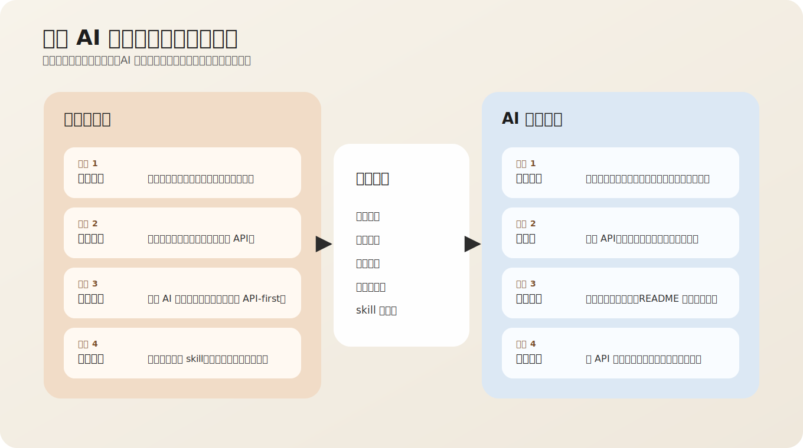
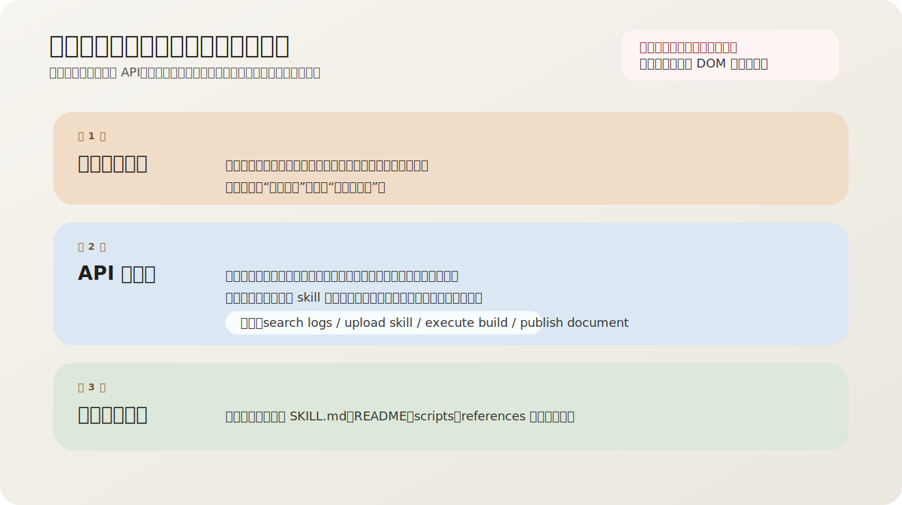
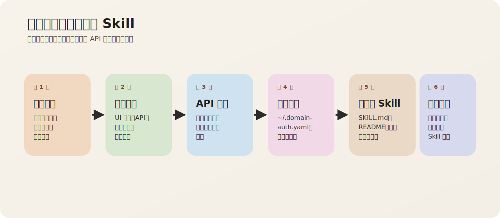
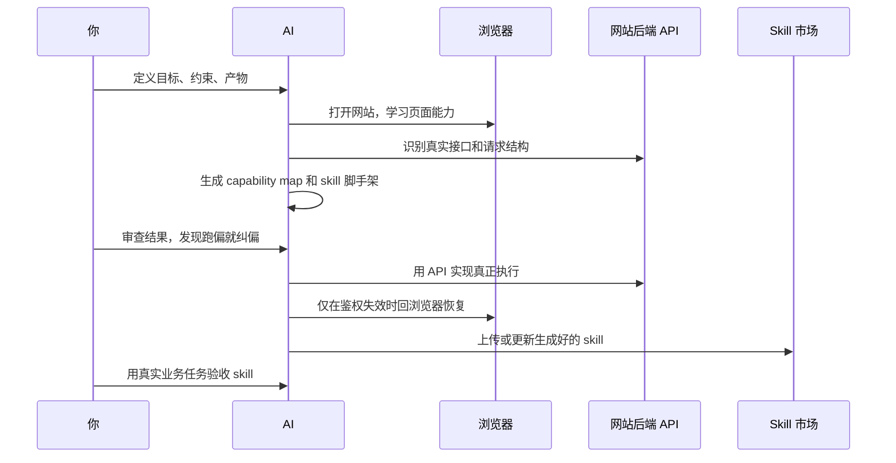
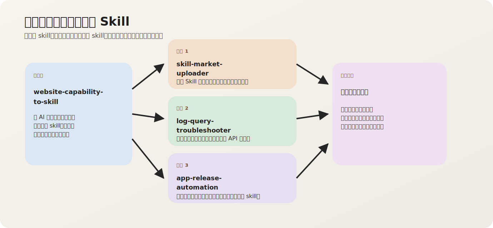
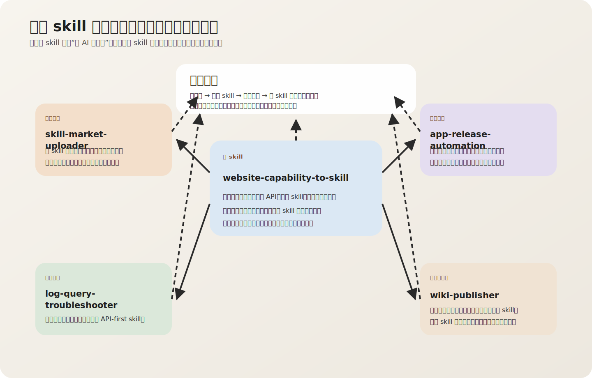
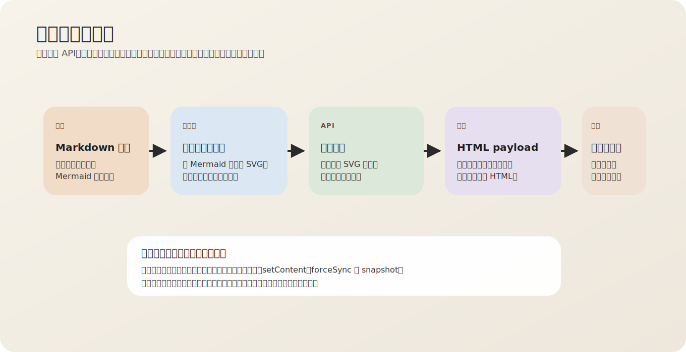
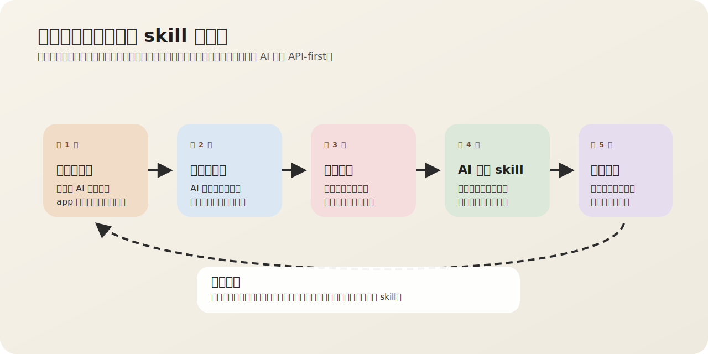
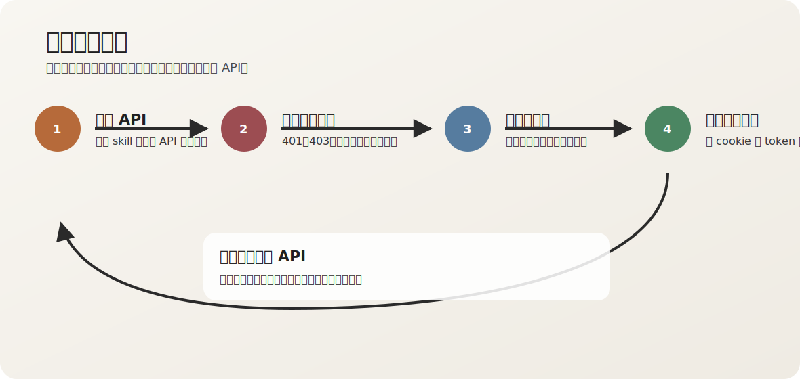

# 我是怎么让 AI 学会一个网站，再把它做成 skill 的

这篇文章复盘的是我在 `2026年3月5日` 做的一轮真实实战。我没有自己手工点
网页、抓包、敲命令，而是持续给 AI 下达目标、约束、纠偏指令，让 AI 先学习
网站能力，再把这些能力沉淀成一个可以重复调用、可维护、可上传的本地 skill。

这轮实践最初沉淀出了四个 skill：

- [`website-capability-to-skill`](https://github.com/JasirVoriya/voriya-skills)
- [`skill-market-uploader`](https://internal.example.com/agent-skills/tree/main/skill-market-uploader)
- [`log-query-troubleshooter`](https://internal.example.com/agent-skills/tree/main/log-query-troubleshooter)
- [`app-release-automation`](https://internal.example.com/agent-skills/tree/main/app-release-automation)

后来在把这篇文章真正发布到公司内部文档库的过程中，我又把文档库发布能力补
成了第五个 skill：

- [`wiki-publisher`](https://internal.example.com/agent-skills/tree/main/wiki-publisher)

最初这四个 skill 并不是四条彼此无关的支线。`app-release-automation` 也是沿着
`website-capability-to-skill` 这套学习 skill 和方法论做出来的。它和另外
几个 skill 一样，都是这轮实践的一部分。这也说明这套“人负责编排，AI 负责
执行”的方法，不只适用
于学网站，也能继续外延到内部平台的构建发布能力。

而 `wiki-publisher` 则把这套方法继续推进了一步：不只是学网站、不只是
上传 skill，而是让 AI 反过来学会公司文档库，并用自己生成出来的 skill 把
这篇教学博客发布到知识库里。

> 核心原则只有一句话：浏览器负责“学习能力”和“恢复鉴权”，API 负责“真正执行”。

如果你读完只想带走一件事，那就是这篇文章真正教你的不是“怎么点一个网站”，
而是“怎么一步步指挥 AI，把一个网站训练成可复用的 skill”。

## 我想解决的不是“自动点网页”

很多人一说“让 AI 操作网站”，第一反应是浏览器自动化。这个方向能做演示，
但很难做成稳定的工程能力，因为它高度依赖页面结构、按钮位置、前端实现和
当前会话状态。

我真正想做的是另一件事：把网站暴露出来的用户能力，反向整理成可调用的
API 工作流，然后再把这个工作流封装成 skill。这样做有三个直接收益：

- 执行稳定，因为真正跑的是接口，不是 DOM。
- 能长期复用，因为鉴权、重试、校验都能脚本化。
- 容易交付，因为最后可以上传到公司的 Skill 市场。

更准确地说，这次实践不是“我替 AI 操作网站”，而是“我在编排 AI 如何学习、
如何执行、以及什么时候必须纠偏”。真正的命令执行者是 AI，而我的角色更像
产品经理、架构师和验收者的结合体。

## 你在这件事里的真实角色

很多人第一次看这种流程，会误以为操作者的价值在于“会不会抓包”或者“会不会
写脚本”。其实不是。你在这套方法里的核心角色有三个。

- 你定义任务边界：告诉 AI 这次到底要学什么网站能力，不要泛化到哪里去。
- 你定义执行规则：告诉 AI 哪些动作可以做，哪些动作绝对不能做。
- 你负责验收和纠偏：当 AI 走向 UI 自动化、弱约束实现或一次性脚本时，把它
  拉回到 API-first 的正确轨道。

从这个角度说，你不是“AI 的使用者”，而是在设计一个面向 AI 的工作流。

如果把这个分工再压缩成一张图，会更容易看出这件事为什么不是“我把活外包给
AI”，而是“我在编排 AI 怎么做这件事”。



## 整体方法

这套方法并不复杂，本质上是“先观察，再抽象，最后产品化”。下面这张图就是
我这次工作的主流程。

在看主流程之前，先把一个最容易混淆的边界钉死：浏览器不是执行器，它只是整
个方法里的上游观察层和下游修复层。





从表面看，这是六个步骤；从人与 AI 协作的角度看，它其实是六个编排动作：

1. 我要求 AI 用浏览器打开目标网站，识别页面上的真实用户能力。
2. 我要求 AI 通过网络请求把这些能力映射成接口、请求结构和响应结构。
3. 我要求 AI 把映射结果写进 `capability-map`，形成可复用的能力说明。
4. 我要求 AI 给这个网站接上标准化鉴权生命周期，也就是 `~/.xxx-auth.yaml`。
5. 我要求 AI 生成站点专用 skill，包括 `SKILL.md`、脚本、参考文档和 README。
6. 我再要求 AI 用另一个 skill 把生成好的 skill 上传到公司的 Skill 市场。

如果你更习惯看协作视角，可以把这件事理解成下面这条序列：



## 我的方法论：不是教 AI 点按钮，而是持续约束它

这次最值得复用的，不是某一条命令，而是我和 AI 的协作方式。我的操作逻辑
大致可以总结成四个动作。

### 1. 先定义终局，不先定义点击路径

我给 AI 的不是“点哪个按钮”，而是最终想要的能力。比如：

- 学会一个网站的能力。
- 把能力转换成 skill。
- 最终执行必须走 API。
- 鉴权失效时再回到浏览器恢复。

这样做的好处是，AI 不会被当前页面流程绑死，而是会主动寻找更稳定的接口层
实现。

### 2. 先立规则，再让 AI 自主展开

我在任务开始就给出了几条不能违反的硬约束：

- 浏览器只是学习能力，不是最终执行工具。
- skill 必须用 API 调用的方式实现。
- 鉴权数据要落到用户主目录，命名由上下文决定。
- 文件失效后要自动回到浏览器重新获取。

这些约束很重要，因为它们决定了 AI 是在做一个 demo，还是在做一个可复用工
具。

### 3. AI 一旦跑偏，就立即纠偏

这次最典型的一次纠偏，就是日志平台日志查询。这里需要说清楚，问题不是在我
已经定义好这套方法论之后，AI 现场临时跑偏了，而是日志平台在更早之前就已
经做过一版。那一版还没有用 `website-capability-to-skill` 这个母 skill，也
还没有把“浏览器只负责学习，API 才负责执行”这套方法论沉淀下来，所以实现
天然更偏向网页操作。

后面当我拿真实任务去压它时，AI 复用了这条旧路径，还是走到浏览器查日志。
而我立刻指出“你还是在用浏览器去查日志，你得去调用接口查询日志”。这句话
看起来只是一次反馈，但本质上是在要求 AI 放弃旧实现，回到新的 API-first
执行模型。

这一类纠偏我做了很多次，典型包括：

- 发现上传接口可能有隐藏更新能力，就要求 AI 继续深挖。
- 发现技能命名不准确，就要求它重命名到更能表达“网站能力转 skill”。
- 发现缺 README，就要求它补齐可交付文档。
- 发现生成结果不够通用，就要求它用 `website-capability-to-skill` 继续重构。

### 4. 一次成功不算完成，能复用才算完成

我不是让 AI 帮我“完成一次任务”，而是要求它把一次性成功沉淀成一个可以反复
复用的 skill。也正因为这样，每轮任务的结束条件都不是“跑通了”，而是：

- 是否形成了 skill 目录。
- 是否具备稳定的脚本入口。
- 是否补齐了 README 和 `SKILL.md`。
- 是否接入了鉴权缓存和失效恢复。
- 是否已经上传到公司的 Skill 市场。

## 一步一步复现这套方法

如果你想亲自复现这套流程，最有效的方式不是记住所有命令，而是学会每一步该
怎么给 AI 下指令、看什么结果、在哪里纠偏。下面我按真实工作顺序拆给你。

## 第 0 步：先把任务说成“能力目标”

开始之前，你要先把需求从“操作动作”改写成“能力目标”。你越早这么做，AI 越
不容易跑偏。

错误说法通常像这样：

- 帮我打开这个网站。
- 帮我点一下上传。
- 帮我看下日志页。

更有效的说法应该像这样：

```text
我需要创建一个 skill。能力是：给你一个网址，你先用浏览器学习这个网址的能
力，最后把这些能力做成一个 skill。
要求：
1. 浏览器只是去学习网站内容，最终 skill 必须用 API 调用的方式去实现。
2. 如果鉴权失败，就去浏览器里找到鉴权所需数据，保存到用户主目录的
   ~/.xxx.yaml，后续从鉴权文件读取，失效后自动刷新。
```

这一步的目标很单纯：先把 AI 的执行边界框住。只要这一步说清楚，后面大量
无效探索就会消失。

## 第 1 步：让 AI 先学“母方法”，不要直接学业务站点

如果你的目标是长期复用，不要一上来就让 AI 给某个具体网站写一坨脚本。先让
它把“学习网站并生成 skill”这件事本身抽象出来。

我当时做的第一件事，就是先产出 `website-capability-to-skill`。你可以把这
一步理解成“先训练一个老师，再让老师去教具体站点”。

你可以这样给 AI 下指令：

```text
把“学习一个网站，再把它转换成 API-first skill”这件事本身做成一个 skill。
这个 skill 以后要能复用于其他站点。
```

这一步你要验收的不是业务功能，而是方法骨架：

- 有没有 `SKILL.md`
- 有没有统一脚手架
- 有没有通用 `auth_cache.py`
- 有没有 `capability-map` 模板

如果这些都没有，你后面每做一个网站都还会回到手工作坊模式。

## 先做一个“教 AI 学网站”的母 skill

如果每次遇到新网站都从零开始写脚本，效率会很差，所以我先把这套方法本身
抽成了一个母 skill，也就是 `website-capability-to-skill`。

这个 skill 规定了三条硬约束：

- 浏览器只用于能力学习和鉴权恢复。
- 业务执行必须走 API。
- 鉴权必须落到用户主目录，格式固定为 `~/.<site>-auth.yaml`。

它还提供了一个脚手架命令，用来快速生成站点 skill 的基本目录：

```bash
python3 scripts/bootstrap_site_skill.py \
  --url <target-url> \
  --output-root <skills-root>
```

脚手架生成的内容很克制，但足够实用：

- `SKILL.md`
- `agents/openai.yaml`
- `scripts/auth_cache.py`
- `references/capability-map.md`

这一步的意义，不是“立刻能跑业务”，而是把后续每个站点 skill 的结构统一掉。
只要骨架统一，后面的能力映射、鉴权修复和市场上传都能复用。

## 现在可以直接用 npx 安装这个母 skill

一开始我是在本地目录里反复打磨 `website-capability-to-skill`，但后来它已经
发到了 GitHub，所以不需要再手工拷贝目录。现在可以直接用 `npx skills add`
安装。

我实际验证过仓库可被识别，先看可安装 skill：

```bash
npx -y skills add JasirVoriya/voriya-skills --list
```

安装到 Codex：

```bash
npx -y skills add JasirVoriya/voriya-skills \
  --skill website-capability-to-skill \
  -a codex \
  -g \
  -y
```

安装到 Cursor：

```bash
npx -y skills add JasirVoriya/voriya-skills \
  --skill website-capability-to-skill \
  -a cursor \
  -g \
  -y
```

也就是说，这个母 skill 现在不只是我本地工作流的一部分，而是已经具备了直
接分发和安装的能力。

## 第 2 步：再让 AI 学具体网站，但只学“能力”，不学“页面动作”

当母 skill 有了以后，你再把具体网站交给 AI。这里最关键的一句话是：

> 不要让 AI 复述页面长什么样，要让它回答页面背后到底提供了哪些业务能力。

我当时给了两个具体网站：

- Skill 市场：`https://internal.example.com/skill-market`
- 日志平台：`https://internal.example.com/logs/query`

这一步你给 AI 的指令，要把“学习能力”说透。例如：

```text
学习一下这个网站，找出里面的核心能力。
注意：
1. 浏览器只用于学习页面和抓接口。
2. 最终 skill 仍然必须走 API，不要靠点按钮实现。
```

AI 在这一步要交付的，不应该只是截图或页面描述，而应该是下面这些东西：

- 页面上有哪些显式能力
- 每个能力对应哪个接口
- 接口方法、请求体、响应体分别是什么
- 哪些能力没有稳定 API，只能标记为 `unsupported-via-api`

这就是 `capability-map` 存在的意义。你后续所有实现和验收，都会围绕这份映射。

## 第 3 步：盯住“隐藏能力”，不要只接受 UI 明面能力

AI 第一次学到的，往往只是 UI 表面露出来的能力，但真正有价值的东西经常藏在
接口层。

这次最典型的例子，就是 Skill 市场的更新能力。页面上没有明显入口，但我怀疑
“同名 skill 应该存在更新接口”，于是继续要求 AI 往下挖。最后它在接口层确
认了：

- 创建：`POST /api/skills/manage`
- 更新：`PUT /api/skills/manage`

这一步的方法论很重要：如果你觉得某个能力在业务上应该存在，但 UI 里看不到，
不要立刻接受“没有”。先要求 AI 去看网络请求、看接口契约、看前端代码里有没
有隐藏路径。

你可以直接这么说：

```text
如果存在则使用更新的接口，同事说有更新的接口，但是我没在 UI 上面找到入口，
你来找找看看有没有。
```

很多真正提升效率的能力，都是这样从“页面没有”变成“接口其实有”。

## 第 4 步：从一开始就把鉴权生命周期做完整

只要一个 skill 未来要被重复使用，鉴权就不能临时拼。你要在最开始就要求 AI
把鉴权生命周期当成能力的一部分，而不是“失败了再说”。

我给 AI 的要求非常明确：

- 鉴权文件必须落到用户主目录。
- 文件名要根据上下文命名，不是写死成一个统一名字。
- 运行前先读鉴权文件。
- 调接口失败后再回浏览器刷新。
- 刷新后要写回 YAML，后续继续复用。

日志平台最后落地的是：

- `~/.log-platform-auth.yaml`

Skill 市场最后落地的是：

- `~/.skill-market-auth.yaml`

你可以把这一段理解成：浏览器不是执行器，而是“鉴权修理工”。平时不用它，
只有当会话坏掉时，才把它拉进链路修一次。

## 这次实践最初沉淀的四个 skill

这轮实践不是只做了一个技能，而是把一整套方法跑通了。四个 skill 都来自同
一套“先学习能力、再收敛成 API-first skill”的方法。把它们放在一起看，更
容易看出这套方法的边界和外延。



四个 skill 分别覆盖了不同层级：

| 层级 | 网站或场景 | 产出 skill | 作用 |
| --- | --- | --- | --- |
| 方法层 | 任意网站 | `website-capability-to-skill` | 教 AI 学网站、抽 API、生成站点 skill |
| 工具层 | `internal.example.com/skill-market` | `skill-market-uploader` | 上传和更新 skill 到公司市场 |
| 平台层 | 发布平台 | `app-release-automation` | 通过发布平台后端 API 完成构建、发布、环境和操作记录管理 |
| 业务层 | `internal.example.com/logs/query` | `log-query-troubleshooter` | 查日志、做分析、输出排障结论 |

这张图展示的是最初跑通的四个 skill。后来当我继续要求 AI 把“公司文档库发
文”也产品化时，又补出了 `wiki-publisher`，它相当于把这套方法从“生
成 skill”进一步延伸到了“发布知识资产”。

如果把后来补上的 `wiki-publisher` 也一起放进来，这五个 skill 的关
系会更清楚。它们不是五条散线，而是同一套方法长出来的一条生产链。



## 实战一：让 AI 学会公司的 Skill 市场

我先拿公司的 Skill 市场做练手，因为它本身就适合拿来验证“网站能力能否被
转成 skill”。

AI 在浏览器里学到的，不是页面长什么样，而是这些业务能力背后的 API 合同：

- `GET /api/get-login-user`
- `POST /api/skills/list`
- `POST /api/skills/detail`
- `POST /api/skills/manage`
- `PUT /api/skills/manage`

这里最关键的发现，不是上传接口，而是**隐藏的更新接口**。UI 页面里没有
明显的“更新 Skill”入口，但从接口层可以确认：

- 新增上传用 `POST /api/skills/manage`
- 已存在时覆盖更新用 `PUT /api/skills/manage`

这个发现直接决定了 `skill-market-uploader` 的上传策略：

1. 先尝试 `POST`。
2. 如果返回“该 skill 已存在”，自动回退到 `PUT`。
3. 如果你明确要求严格失败，就用 `--if-exists fail`。

换句话说，AI 不是学会了“点上传按钮”，而是学会了“如何稳定地创建或更新一
个 skill”。

最后并不是我手工执行了上传命令，而是我要求 AI 用这个 skill 完成上传。下面
这条命令，是 AI 在这轮对话里最终收敛出来的实际执行命令：

```bash
python3 scripts/skill_market_api.py \
  upload \
  --slug log-query-troubleshooter \
  --zip-file /path/to/project/artifacts/skill-zips/log-query-troubleshooter.zip
```

## 实战二：让 AI 学会发布平台的构建发布能力

第三个案例是发布平台。这里我让 AI 继续沿着同一个学习 skill 和方法论往
前走，最后产出了 `app-release-automation`。这个案例的目标，不是学 Skill 市场，
也不是查日志，而是把发布平台的构建、发布、环境管理和操作记录查询收敛成
一个可复用 skill。

它不是本文里“从网页学习能力”最纯粹的案例，因为发布平台这类内部平台更偏
后端 API、配置文件和安全规则驱动。但它仍然是按同一套思路做出来的：先让
AI 学清楚平台真正提供的能力边界，再把执行收敛成稳定的 API 脚本入口。

如果把这个过程拆开看，发布平台这个案例其实很适合拿来说明，遇到“不是典型网
页操作，而是平台型能力”时，你应该怎么继续指挥 AI。

### 1. 先把发布平台定义成“平台能力”，不是“代点发布按钮”

如果你一开始对 AI 说的是“帮我发版”，它很容易理解成去页面里找按钮、找表
单、找弹窗确认。但我真正要它学会的，不是某次发布流程，而是发布平台背后
稳定存在的这些能力：

- 读取应用和环境上下文。
- 触发构建。
- 查询构建状态和构建日志。
- 触发发布。
- 管理环境和查看操作记录。

这样一来，AI 要学的对象就从“一个页面流程”变成了“一个平台的能力模型”。

### 2. 先固定输入面，再让 AI 学能力

发布平台这个案例里，我先把输入面卡死，不让 AI 自己猜。因为只要输入面不稳，
后面所有脚本都会漂。

我让它固定两类输入：

- 项目侧输入放在 `<project-root>/app-info.yaml`
- 用户侧鉴权放在 `~/.release-platform-auth.yaml`

这一步非常关键。它的作用不是“多写两个文件”，而是告诉 AI：以后任何构建、
发布、环境管理动作，都必须先回到这两个稳定输入源，而不是从聊天上下文里临
时猜参数。

### 3. 让 AI 把平台能力抽成真正的 API 合同

等输入边界稳定以后，下一步不是急着写脚本，而是要求 AI 把发布平台的关键能力
抽成后端 API。最后它收敛出来的核心能力，大致就是：

- 应用信息查询：`GET /api/apps/context`
- 构建触发：`POST /api/build/execute`
- 发布触发：`POST /api/deploy/execute`
- 构建状态：`GET /api/build/status`
- 构建日志：`GET /api/build/logs`

这一步和 Skill 市场、日志平台本质上没有区别。你还是在要求 AI 回答同一个问
题：这个平台真正提供了哪些可复用能力，它们对应哪些稳定接口。

### 4. 再把能力收敛成可执行命令，而不是散落的调用片段

当 API 能力被抽出来以后，我没有停在“接口已经找到了”，而是继续要求 AI 把
这些能力收敛成可以稳定执行的命令入口。最后 `app-release-automation` 被整理成了
这些高频动作：

- `show-context`：先检查配置有没有解析对。
- `list-envs`：先确认应用和环境到底有哪些。
- `build-all-envs`：统一触发构建并轮询状态。
- `build-log`：构建失败时直接拉日志。
- `deploy`：按明确参数发起发布。
- `env-manage`：把环境管理也纳入同一个 skill。

你可以看到，这里不是“会几个接口”就结束了，而是把一组接口组织成了一个真
正可用的 release skill。

### 5. 最后把安全边界写进代码，而不是只写进提示词

发布平台这个案例还有一个特别值得写进博客的点，就是安全约束不能只靠人记。

我让 AI 不只是把“不要动生产”写进 `SKILL.md`，而是继续落实成代码里的保护：

- 生产相关环境默认拦截。
- 写操作必须走明确命令，不允许模糊调用。
- 鉴权失效时才刷新，不主动乱改。
- 构建失败时自动补构建日志，方便追根因。

这一步的价值在于，它把“经验”变成了“系统行为”。一旦 skill 交给别人用，
它仍然会按同样的约束运行，而不是依赖某个人记得住规则。

这个 skill 最后被收敛成了几个明确约束：

- 运行参数从 `<project-root>/app-info.yaml` 读取。
- 全局鉴权从 `~/.release-platform-auth.yaml` 读取，失效时才刷新。
- 能力覆盖构建、发布、环境管理、资源查看和操作记录查询。
- 生产环境相关动作有代码级保护，不只是写在提示词里。

这个案例很重要，因为它证明了你的方法论并不只会产出“学网站”的 skill。只
要你持续要求 AI 把能力边界、鉴权边界和安全边界都写进实现，它也能把内部平
台的构建发布流程产品化成团队可复用的 skill。

## 实战四：让 AI 学会公司文档库，并用它发布这篇文章

到这里，前面的几个案例已经证明了一件事：AI 可以学网站、学平台、学市场，
然后把能力沉淀成 skill。接下来我把这套方法再往前推一步，直接让 AI 学公司
内部文档库，并要求它用生成出来的 skill 把这篇博客发到知识库里。

这个案例很有价值，因为它不只是“再做一个 skill”。它实际上把前面所有能力
串成了一条闭环：

1. 先用 `website-capability-to-skill` 学文档库能力。
2. 再把学出来的能力沉淀成 `wiki-publisher`。
3. 再用 `wiki-publisher` 把这篇文章发布出去。
4. 最后再把 `wiki-publisher` 本身上传到公司的 Skill 市场。

这条链路如果只用文字讲，很容易觉得“还是在手工发文”。其实它已经被拆成一
条清晰的发布流水线了，前半段是 API，最后一小段才借助浏览器里的编辑器能力
真正落盘。



### 1. AI 先学文档库的能力边界

我给 AI 的要求并没有变，还是那句老规则：浏览器只负责学习和恢复鉴权，真正
的业务动作尽量走 API。

这类文档库里，AI 最终学出来的稳定能力主要是：

- 当前用户查询：`GET /api/user/profile`
- 节点详情：`GET /api/docs/node/{id}`
- 树信息：`GET /api/docs/tree/info`
- 子节点列表：`GET /api/docs/tree/children`
- 新建页面：`POST /api/docs/new`
- 附件上传：`POST https://internal.example.com/stream/api/file/attachment/upload/`

真正的难点出现在正文保存。AI 最后确认，文档库的正文并没有一个稳定纯 REST
的保存接口，而是走协同编辑通道和最终的 `snapshot` 机制。这意味着：

- 建页、查树、上传附件，可以走 API
- 正文最终落盘，需要借助页面内的编辑器 API

这就是为什么 `wiki-publisher` 仍然保留了一小段浏览器参与，但它保留的
不是“点按钮”，而是页面内正式存在的编辑器调用：
`setContent + forceSync + snapshot`

### 2. AI 把文档库能力收敛成了 `wiki-publisher`

当文档库的能力边界被确认以后，AI 没有停在“知道接口了”，而是继续把它收敛
成了一个完整 skill。这个 skill 最后被组织成几块：

- `scripts/wiki_api.py`：负责建页、查节点、上传附件、预处理 Markdown
- `scripts/auth_cache.py`：负责 `~/.wiki-auth.yaml`
- `scripts/save_auth_from_browser_values.py`：负责从浏览器会话回写鉴权
- `references/capability-map.md`：记录文档库能力和接口合同
- `references/browser-publish-playbook.md`：记录最终正文保存动作

后来我又继续要求 AI 把 Mermaid 图也变成真正的图片上传，而不是把源码块原样
贴到文档里。于是这个 skill 进一步补上了一个能力：在发布前先把
Mermaid 围栏代码块先本地渲染成 SVG，再和普通配图一样上传。

### 3. AI 用这个 skill 真正发布了这篇博客

这个 skill 最后不是停留在“理论上可用”，而是直接拿这篇博客自己验收自己。

AI 先把 Markdown 预处理成可发布内容：

```bash
python3 scripts/wiki_api.py \
  --base-url "https://internal.example.com/wiki" \
  prepare-markdown-publish \
  --file-id "sample-file-id" \
  --markdown-file "/path/to/project/articles/how-i-taught-ai-to-learn-a-website-and-build-a-skill.md" \
  --output-dir "/path/to/project/wiki-publisher/artifacts/wiki"
```

这一步会同时完成几件事：

- 识别文章里的本地图片
- 把 Mermaid 图先渲染成 SVG
- 上传所有图片附件
- 输出最终 HTML payload

然后 AI 再进入浏览器，只做最后一步正文落盘，把 HTML 注入编辑器并触发
`forceSync + snapshot`。这篇文章现在之所以已经在公司文档库里，就是因为这
条链路已经真实跑通了。

### 4. 我再让 AI 把这个 skill 本身发到 Skill 市场

这一步很重要，因为它说明 `wiki-publisher` 不是“为了发布这篇文章临时
拼出来的脚本”，而是一个已经完成产品化交付的 skill。

我继续要求 AI：

- 给 `wiki-publisher` 补齐 README
- 打包 zip
- 用 `skill-market-uploader` 校验并上传

最后这个 skill 也完成了市场发布：

- `slug`：`wiki-publisher`
- `仓库地址`：[内部仓库](https://internal.example.com/agent-skills/tree/main/wiki-publisher)

到这里，这套方法就多了一个新的落点：不只是让 AI 帮你做网站能力自动化，
还可以让 AI 帮你把知识资产真正发布出去。

## 第 5 步：把一次性结果强行沉淀成 skill

很多 AI 任务到“跑通一次”就停了，但这一步恰恰是你最该继续往前推的时候。
因为一次跑通，往往只是一个临时脚本；只有被收敛成 skill，才会变成团队资产。

这一阶段你要持续追问 AI：

- 有没有标准化命令入口
- 有没有 `SKILL.md`
- 有没有 README
- 有没有脚本和参考文档
- 命名是否准确表达能力边界

这次里我就做了几次典型推进：

- 要求 `skill-market-uploader` 补 README。
- 要求 `website-capability-to-skill` 重命名到更能体现“把网站能力转成 skill”。
- 要求 `log-query-troubleshooter` 增加 README。
- 要求所有技能最终都能上传到 Skill 市场。

这一步的本质，是把“代码文件”变成“产品化 skill 包”。

## 实战三：让 AI 学会日志平台的日志排障能力

第二个案例更有代表性，因为日志平台的页面很复杂，查询条件多、日志格式杂，
而且鉴权依赖浏览器登录态。如果这个场景也能做成 API-first skill，那这套
方法就算站住了。

这里有一个很重要的背景，需要单独说清楚。

日志平台 skill 不是从零开始、一次性按这套方法做对的。在我把
`website-capability-to-skill` 这套方法论沉淀出来之前，其实已经先做过一版
日志平台 skill。那一版更接近“用浏览器完成任务”的思路，所以日志查询会落到
网页操作上，而不是稳定的 API 执行链路。

也就是说，后面暴露出来的“为什么还在用浏览器查日志”这个问题，本质上不是
这套方法论本身失效，而是早期版本带着旧实现思路。真正重要的，是我后来没有
停在“能用就行”，而是继续要求 AI 用新的母 skill 和新的方法论把它重构掉。

AI 从日志查询页面里抽出来的关键能力是这些：

- 应用检索：`POST /api/apps/query`
- 日志查询：`POST /api/logs/search`
- IDC 获取：`GET /api/idcs`
- 标签读取：`GET /api/logs/tags`

这些能力最后被落成了 `log-query-troubleshooter`，而且不是简单查日志。
我把它做成了一个完整的排障链路：

- 先按 `appUk` 或 `appId` 找应用元数据。
- 再按时间窗口、环境、IDC、关键字或 `requestId` 查日志。
- 把原始响应转成 JSONL。
- 继续做日志级别分布、签名聚类和根因假设分析。
- 最后输出 Markdown 报告。

这里也一样。真正执行这条命令的是 AI，不是我手敲终端。我做的事情是不断给
它施加约束和纠偏，直到它把日志平台的能力收敛成一条稳定的一键排障命令：

```bash
python3 scripts/log_query_api.py \
  --base-url "https://internal.example.com" \
  investigate --app-uk "sample-app.java.service" \
  --hours 2 \
  --size 500 \
  --output-dir "artifacts/logs"
```

这条命令会同时产出三类文件：

- 原始接口响应：`*-raw.json`
- 标准化日志：`*.jsonl`
- 分析报告：`*-analysis.md`

而日志平台为什么后来会被重构得更稳，也可以用一张图解释清楚。重点不是“AI
第一次就做对”，而是“真实任务会强行把旧实现里的问题挤出来”。



## 第 6 步：一定要用真实任务验收 skill

skill 写出来以后，最危险的错觉就是“看起来已经完整了”。真正有效的验收方式，
是马上拿一个真实业务任务压它。

我当时就直接让 AI 去分析：

- `sample-app.java.service`

这一步不是为了“多做一个案例”，而是为了逼 skill 暴露问题。事实也确实如此：

- 早期那版日志平台 skill 仍然沿用了浏览器查日志的实现。
- 我立刻指出这违背了最初约束。
- 然后我继续要求 AI 用新的方法论重构 skill，把查询路径改成纯 API。

这说明真实任务的价值，不只是产出答案，更是逼出系统设计里的漏洞。

你可以把这一步理解成“上线前压测”。如果 skill 连真实任务都扛不住，那前面
所有漂亮文档都只是包装。

## 这类 skill 最容易做错的地方

真正让这次实践有教学价值的，不是“做出来了”，而是我确实踩了坑，然后把坑
补成了方法。

第一个坑，不是某一次执行时 AI 临时跑偏，而是日志平台这类 skill 在早期版本
里就已经带着“网页执行”的历史包袱。那时候我还没有先做
`website-capability-to-skill` 这个母 skill，也还没有把“浏览器只负责学习，
API 才负责执行”这套方法论沉淀下来，所以早期版本自然更容易落到网页操作。

后来当我用真实任务去压它时，这个历史问题就被暴露出来了：分析
`sample-app.java.service` 时，它还是走了浏览器查询。这不是因为当前方法
论无效，而是因为旧版本根本不是按这套方法构建的。后面我继续要求 AI 用新的
方法论重构，才把它真正收敛成纯 API 查询，浏览器只在鉴权失效时参与。

第二个坑，是把业务失败误判成鉴权失败。日志平台有些返回是 `success=false`，
但它并不一定是登录过期，也可能只是请求 payload 不兼容。这个问题后来通过
更严格的鉴权判断和业务错误分类修掉了。

第三个坑，是只做 happy path。日志平台的日志查询接口在不同环境里对 payload
字段比较敏感，所以我后来加了自适配重试逻辑。如果第一版 payload 因为解析
错误失败，就自动切换到更兼容的 realquery 风格 payload 再试一次。

第四个坑，是分析结果可能带出敏感信息。日志里常常夹带 token、cookie 或
AK/SK，所以分析脚本后来补了统一脱敏，把这些字段在报告样例里替换成
`<redacted>`。

这几个坑也说明一件事：你和 AI 的协作不是“一次提示词”，而是一个反复收敛的
过程。真正的能力，不是在第一轮提示里就写对，而是在每次跑偏时知道该往哪纠。

## 鉴权生命周期必须产品化

只要你把执行从浏览器切到 API，就绕不开鉴权生命周期。这个部分如果处理得
不好，skill 很快就会“第一次能跑，第二次失效”。

我这次把鉴权流程标准化成了一条固定闭环：



在这次实践里，我实际用到了两个鉴权缓存文件：

- `~/.skill-market-auth.yaml`
- `~/.log-platform-auth.yaml`

它们的规则完全一致：

- 每次 API 会话前先验证。
- 失败后去浏览器抓一条成功请求的 `Cookie` 或 token。
- 回写到 YAML。
- 权限固定为 `0600`。
- 重试 API，成功后浏览器退出执行链路。

这一步看起来像“工程细节”，但其实它决定了 skill 到底是 demo 还是工具。

## 第 7 步：把已经验证过的 skill 发到市场

只有当一个 skill 能被别人安装和复用，它才真正完成了从“个人工作流”到“团队
能力”的转换。

所以我最后没有停在本地目录，而是继续要求 AI：

- 给 skill 补齐 README
- 打包 zip
- 校验包结构
- 调 Skill 市场 API 上传
- 如果已存在则走更新接口

这一步做完以后，`log-query-troubleshooter` 才真正从“这次对话里的临时
产物”变成了“公司内部可复用 skill”。后来我又用同一套发布链路把
`wiki-publisher` 也发到了市场，说明这条交付流程本身也是可复用的。

如果你也想照着做，验收标准很简单：

- 本地能跑
- 文档完整
- 鉴权完整
- 上传成功
- 别人能再次调用

## 一个真实的验证结果

技能最终必须经得起真实任务验证，否则博客写得再漂亮也没有意义。这个回合
里，我让 AI 用修好的日志平台 skill 实际分析了 `sample-app.java.service`。

得到的结论并不戏剧化，但很真实：

- 样本里没有发现明确的 `error`。
- 主体日志都是 `info` 级别。
- 最新抽样里只有一条 `warn`，而且更像健康检查路由告警。
- 综合判断，这次查询没有发现明确异常。

这件事很重要，因为它证明了 skill 不只是“会调用接口”，还真的能把接口调用
结果转成一个靠谱的排障结论。

## 这轮实践最后沉淀了什么

从产出角度看，我最后得到的不只是几份脚本，而是一套“人负责编排，AI 负责
执行”的可复制方法。

沉淀下来的关键结果有这些：

- 一个母 skill：`website-capability-to-skill`
- 一个市场发布 skill：`skill-market-uploader`
- 一个平台发布 skill：`app-release-automation`
- 一个日志排障 skill：`log-query-troubleshooter`
- 一个文档库发布 skill：`wiki-publisher`
- 一个隐藏接口发现：Skill 市场支持 `PUT /api/skills/manage`
- 一套统一 auth 规范：`~/.<site>-auth.yaml`
- 一套统一产物结构：`SKILL.md + README + scripts + references`

最初那四个 skill 先完成了上传，后来我又把 `wiki-publisher` 补上并发
到了市场。到这篇文章真正发布到公司文档库时，这条链路已经沉淀成了五个可复
用 skill，说明这套方法从“学习网站”到“生成 skill”再到“市场分发”和“知
识库发布”都已经闭环了。

如果你想直接看仓库地址，这里可以直接打开：

- `website-capability-to-skill`：[GitHub 仓库](https://github.com/JasirVoriya/voriya-skills)
- `skill-market-uploader`：[内部仓库](https://internal.example.com/agent-skills/tree/main/skill-market-uploader)
- `log-query-troubleshooter`：[内部仓库](https://internal.example.com/agent-skills/tree/main/log-query-troubleshooter)
- `app-release-automation`：[内部仓库](https://internal.example.com/agent-skills/tree/main/app-release-automation)
- `wiki-publisher`：[内部仓库](https://internal.example.com/agent-skills/tree/main/wiki-publisher)

## 你可以直接照着用的指挥模板

如果你想把这套方法拿去教另一个网站，最简单的方式不是照抄所有细节，而是照
着下面这个指挥模板一步步发给 AI。

### 模板 1：先定义方法边界

```text
我要把一个网站的能力做成 skill。
要求：
1. 浏览器只用于学习页面和恢复鉴权。
2. 最终 skill 必须通过 API 调用实现。
3. 鉴权信息保存到 ~/.<site>-auth.yaml。
4. 如果鉴权失效，自动去浏览器重新获取并回写。
```

### 模板 2：让 AI 学具体网站

```text
学习这个网站的能力，不要只描述页面。
我要的是：
1. 可见能力列表
2. 每个能力对应的 API
3. 请求结构和响应结构
4. 哪些能力暂时无法 API 化
```

### 模板 3：当 AI 跑偏到浏览器执行时

```text
不对，你还是在用浏览器做业务执行。
浏览器只能用于学习和恢复鉴权，真正的业务动作必须改成 API 调用。
请修复 skill 的逻辑。
```

### 模板 4：把一次性结果沉淀成 skill

```text
把当前结果整理成完整 skill：
1. 补齐 SKILL.md
2. 补齐 README
3. 补齐 references
4. 如果需要，补脚本和鉴权缓存逻辑
```

### 模板 5：要求交付而不是实验

```text
把这个 skill 上传到公司的 Skill 市场。
如果 slug 已存在，则自动走更新接口。
```

## 如果你也想复用这套方法

如果你准备把另一个内部网站也做成 skill，可以直接照这个提示词开始。注意，
这里的重点不是让 AI 替你点页面，而是让它在你的约束下自己完成“学习网站、
抽取 API、生成 skill、修复偏差、沉淀文档”这条链路：

```text
用 website-capability-to-skill skill 分析 <网站URL>。
要求：
1. 浏览器只用于学习页面能力和恢复鉴权。
2. 最终所有业务执行必须走 API。
3. 鉴权缓存写入 ~/.<site>-auth.yaml。
4. 给我产出站点专用 skill、capability map、验证结果和 README。
5. 如果后续需要，直接用 skill-market-uploader 上传到公司的 Skill 市场。
```

你也可以把这套方法记成一句更短的话：

> 先让 AI 看懂网站，再让它忘掉网页，最后只留下 API 和 skill。

## 结语

这次实践给我的最大收获，不是“AI 又帮我写了几个脚本”，而是我把一种可复制
的工作方式跑通了。以后遇到新的后台、运维平台、日志平台、配置平台，我都可
以先问同一个问题：

这个网站真正提供了哪些能力，我能不能把它们变成一个 API-first skill？

如果答案是“能”，那它就不再只是一个网页，而会变成团队自己的自动化能力。
